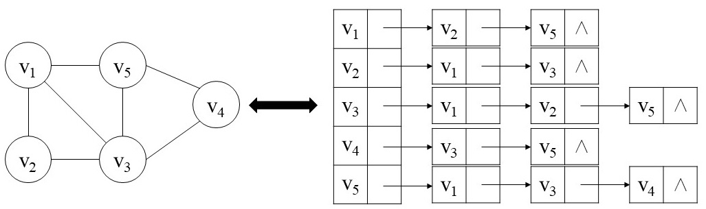

图由顶点集（VertexSet）和边集（EdgeSet）组成，可以将一个图记为 $G=(V,E)$。

# 1. 图的表示方法

## 1.1 邻接链表

适用场景：1）表示稀疏图；2）预先不知道图的顶点个数，图动态生成（如果此时使用邻接矩阵，每增加或者删除一个顶点都需要改变邻接矩阵的大小，效率很低）。

> 稀疏图：对于图 $G=(V,E)$，边的条数 $|E|$ 远小于 ${\lvert V \rvert}^2$ 

邻接链表：使用一维数组存储图中的所有顶点，每个顶点指向该顶点所有相邻结点构成的单链表的头结点。

```java

```

## 1.2 邻接矩阵

适用场景：一般用于表示稠密图或者需要快速判断两个结点之间是否有边连接时。

# 2. 广度优先搜索

给定图  $G=(V,E)$ 和一个起始结点 $S$，

> 广度优先搜索能够得到从结点 $S$ 到每个可到达结点的拒绝（最少的边数）
>


LeetCode相关题目：

