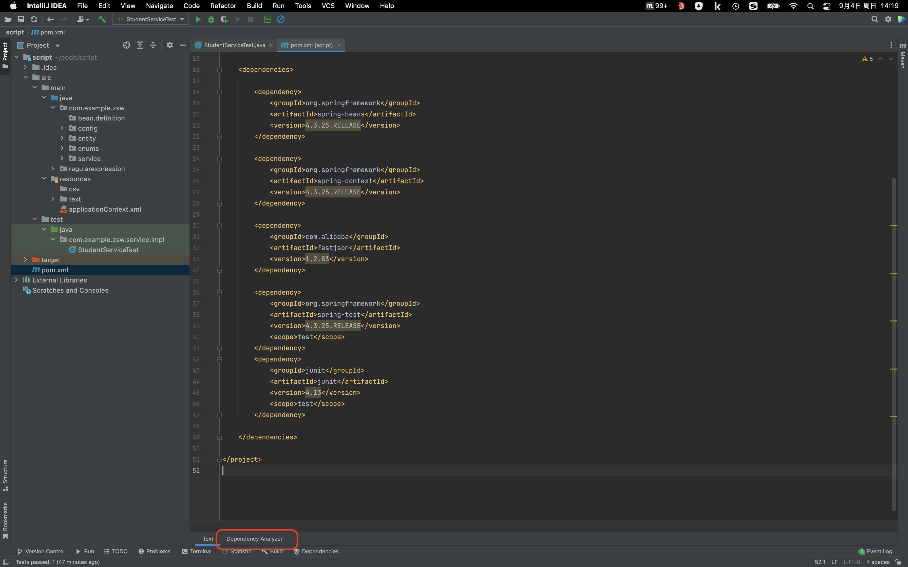
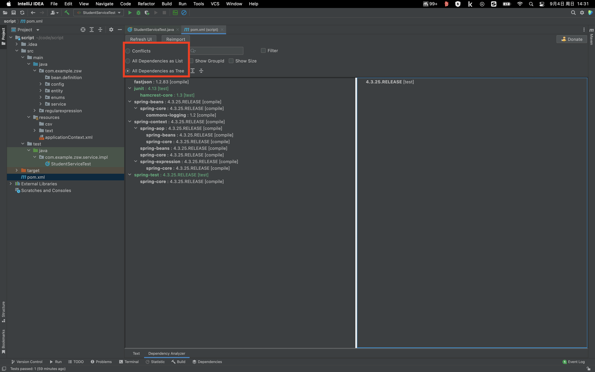

# Maven Helper 使用

第一步：下载 Maven Helper 插件

第二步：进入项目 pom.xml 文件中，在 pom.xml 文件左下角会有一个 “Dependency Analyzer” 选项

第三步，点击 “Dependency Analyzer” 选项

- Conflicts（查看冲突）
- All Dependencies as List（列表形式查看所有依赖）
- All Dependencies as Tree（树形式查看所有依赖）

