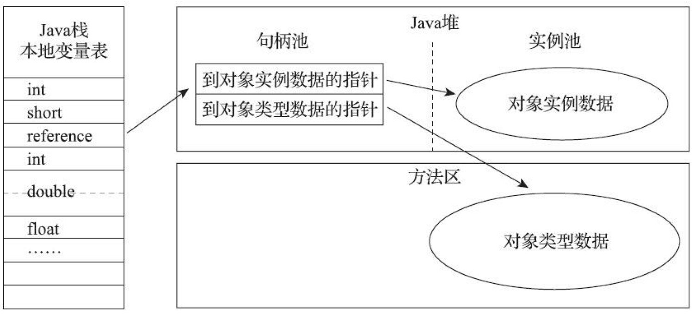
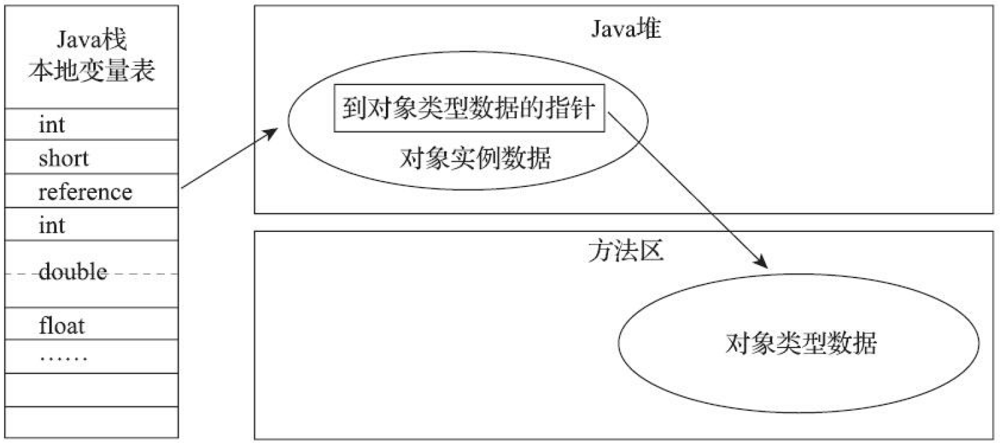

# HotSpot虚拟机对象

## 1. 创建对象过程

当虚拟机遇到一条字节码 new 指令时：

* **第一步：类加载**

  首先检查运行时常量池中是否存在该类的符号引用以及这个符号引用对应的类是否已被加载，如果没有，执行类加载；

* **第二步：为对象分配内存**

  对象所需的内存大小在类加载完成后便可完全确定；

  + 空间分配方式
    + 如果 Java 堆中的内存是规整的，已被使用的内存放在一边，空闲的内存放在另一边，中间使用一个指针作为分界点指示器，分配内存就是把指针向空闲空间方向移动一段与对象大小相等的距离，这种分配方式称为“**指针碰撞**”（Bump The Pointer）。
    + 如果 Java 堆中的内存不是规整的，已被使用的内存和空闲的内存相互交错在一起，虚拟机就必须维护一个列表，记录空闲的内存块。分配内存时从列表中找到一块足够大的内存块划分给对象，并更新列表。这种分配方式称为“**空闲列表**”（Free List）。
  + 分配空间实现线程安全方式（当对象A分配内存时还没对指针进行修改，对象B又同时使用了原来的指针分配内存）
    + 一种是对分配内存空间的动作进行同步处理——虚拟机采用CAS+失败重试的方式保证更新操作的原子性；
    + 一种是把内存分配的动作按照线程划分在不同的空间之中进行，即每个线程在Java堆中预先分配一小块内存，称为本地线程分配缓冲（Thread Local Allocation Buffer，TLAB），哪个线程要分配内存，就在其本地缓冲区中分配，只有本地缓冲区用完了，分配新的缓存区时才需要同步锁定。虚拟机是否使用TLAB，可以通过-XX：+/-UseTLAB参数来设定。

* **第三步：对象初始化**

  虚拟机将分配到的内存空间（不包括对象头）都初始化为默认值；

* **第四步：设置对象头**

  例如这个对象是哪个类的实例、如何才能找到类的元数据信息、对象的哈希码（实际上对象的哈希码会延后到真正调用Object::hashCode()方法时才计算）、对象的GC分代年龄等信息；

* **第五步：执行`<init>()`方法，初始化该对象**

## 2. 对象的内存布局

对象在堆内存中的存储布局可以划分为三个部分：**对象头**（Header）、**实例数据**（Instance Data）和**对齐填充**（Padding）；

> + 对象头
>   对象头存储两类信息：
>
>   + **Mark Word**，对象自身的运行时数据，如哈希码（HashCode）、GC分代年龄、锁状态标志、线程持有的锁、偏向线程ID、偏向时间戳等；
>
>     在32位或64位的虚拟机中分别为32个比特或64个比特；
>
>     对象需要存储的运行时数据很多，但对象头里的信息是与对象自身定义的数据无关的额外存储成本，考虑到虚拟机的空间效率，Mark Word被设计成一个有着动态定义的数据结构，以便在极小的空间内存储尽量多的数据，根据对象的状态（未锁定、轻量级锁定、重量级锁定、GC标记、可偏向）复用自己的存储空间。
>
>   + **类型指针**，即对象指向它的类型元数据的指针，在32位或64位的虚拟机中分别为32个比特或64个比特；Java虚拟机通过这个指针来确定该对象是哪个类的实例。并不是所有的虚拟机实现都必须在对象数据上保留类型指针，换句话说，查找对象的元数据信息并不一定要经过对象本身。
>
> + 实例数据
>   字段存储顺序会受到虚拟机分配策略参数（-XX：FieldsAllocationStyle参数）和字段在Java源码中定义顺序的影响。
>   HotSpot虚拟机默认的分配顺序为longs/doubles、ints、shorts/chars、bytes/booleans、oops（Ordinary Object Pointers，OOPs），相同宽度的字段总是被分配到一起存放，在父类中定义的变量会出现在子类之前。
>
> + 对齐填充
>
>   不一定存在；起着占位符的作用；HotSpot虚拟机的自动内存管理系统要求对象起始地址必须是8字节的整数倍，也就是说任何对象的大小都必须是8字节的整数倍。对象头部分是8字节的倍数（1倍或者2倍），因此，如果对象实例数据部分没有对齐的话，就需要通过对齐填充来补全。

## 2.3 对象的访问定位

**主流的访问方式有句柄和直接指针两种**：

+ 句柄
  堆中划分一块内存作为句柄池，reference存储对象的句柄地址，句柄存储对象实例数据与其类型数据的地址信息；
  

+ 直接指针
  reference存储堆中对象的地址；
  

使用句柄访问的优点：reference中存储的是稳定句柄地址，在对象被移动（垃圾收集时移动对象是非常普遍的行为）时只会改变句柄中的实例数据指针，而reference本身不需要被修改；

使用直接指针的优点：不需要多一次间接访问的开销；HotSpot使用该方式进行对象访问；