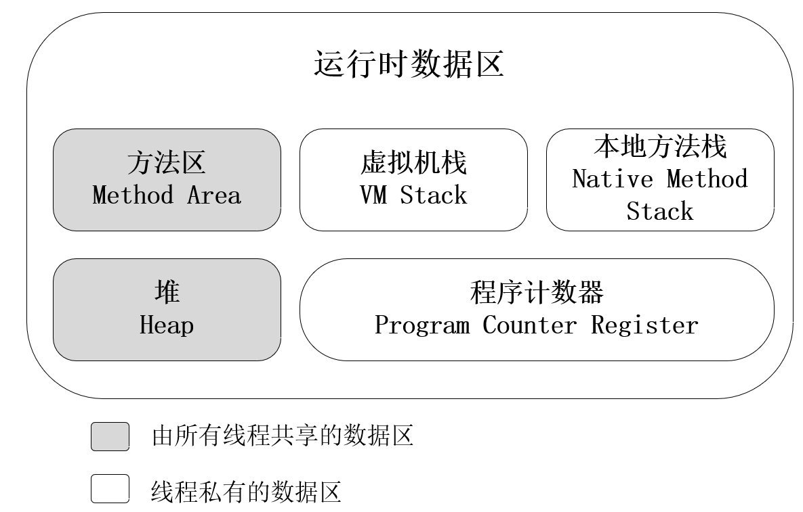
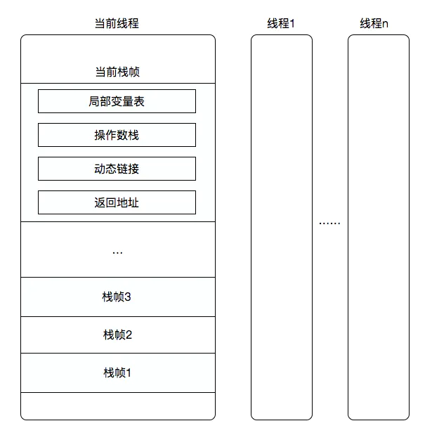

# JAVA内存区域

## 1. 内存泄漏与内存溢出

+ 内存泄漏（memory leak）
  指程序在使用内存后，无法释放已申请的内存空间；
  一次内存泄露的危害可以忽略，但内存泄露的堆积最终会导致内存溢出；
+ 内存溢出（out of memory）
  指程序在申请内存时，没有足够的内存空间供其使用；

## 2. 运行时数据区域

在程序执行的过程中，JVM 将其管理的内存区域划分为 5 个不同的数据区域：

+ 程序计数器
+ 虚拟机栈
+ 本地方法栈
+ 堆
+ 方法区

每个线程都有独立的程序计数器、虚拟机栈、本地方法栈，所有线程共享父进程的堆和方法区；

### 2.1 程序计数器

线程私有，生命周期与线程相同；

存储当前线程执行的字节码指令的地址；

程序计数器作用：

+ JVM 通过改变计数器的值来选取下一条需要执行的字节码指令；
+ 多线程通过CPU时间片轮转执行，当时间片结束时未执行完的线程将被挂起，当该线程再次获得时间片时，通过程序计数器恢复到正确的执行位置；

唯一一个 **不存在 OutOfMemoryError 异常** 的运行时数据区域；

> 当线程执行 Java 方法时，程序计数器存储正在执行的字节码指令的地址；
>
> 当线程执行本地（Native）方法时，程序计数器的值为空（Undefined）；

### 2.2 虚拟机栈

线程私有，生命周期与线程相同；

虚拟机栈 **描述的是 Java 方法执行的内存模型**：每个方法在执行时都会在虚拟机栈中创建一个栈帧，用于存储局部变量表、操作数栈、动态链接、方法返回地址等信息；每一个方法从调用到执行结束的过程，就对应着一个栈帧在虚拟机栈中从入栈到出栈的过程；

Java 虚拟机规范允许 Java 虚拟机栈被实现为固定大小，也允许实现为动态扩展和收缩；

> 注：HotSpot 虚拟机的栈容量是不可以动态扩展的；

在《Java虚拟机规范》中，对这个内存区域规定了两种异常：

+ StackOverflowError 异常：如果线程请求分配的栈容量大于 Java 虚拟机栈所允许的最大容量将抛出该异常；
+ OutOfMemoryError 异常：如果 Java 虚拟机栈容量可以动态扩展，如果扩展时无法申请到足够的内存会抛出 该异常；

> <u>**栈帧结构**</u>（需要修正）
>
> 栈帧存储了方法的局部变量表、操作数栈、动态链接和方法返回地址等信息；
>
> + 局部变量表
>
>   局部变量表存放了编译期可知的各种基本数据类型、对象引用和 returnAddress 类型，其中64位长度的long和double类型的数据会占用两个变量槽，其余的数据类型只占用一个；
>
>   注：returnAddress类型：指向字节码指令（不明白是干啥的）；
>
>   局部变量表的容量以变量槽（Slot）为最小单位， Java 虚拟机规范中没有明确规定每个 Slot 所占据的内存空间大小；
>
> + 操作数栈
>
>   操作数栈，主要用于保存计算过程的中间结果，同时作为计算过程中变量临时的存储空间；
>    当一个方法刚开始执行时，其操作数栈是空的，在方法执行的过程中，通过字节码指令从局部变量表或者对象实例字段中复制常量或者变量值到操作数栈中；
>
> + 动态链接
>
>   每个栈帧都包含一个指向运行时常量池中该栈帧所属方法的引用，包含这个引用的目的是为了支持方法调用过程中的动态连接；
>
>   Java 源文件被编译成字节码文件后，所有的变量和方法引用都作为 **符号引用**（symbolic Reference）保存在 class文件的常量池里；
>
>   字节码中的方法调用指令以常量池中指向方法的符号引用为参数；这些符号引用之后会转换为调用方法的直接引用；
>
>   将符号引用转换为调用方法的直接引用分为两种：
>
>   + 静态链接：当一个字节码文件被加载 JVM 时，如果被调用的目标方法在编译期可知，且运行期保持不变时，这种情况下会将符号引用转换为直接引用，称之为静态链接；
>    + 动态链接：如果被调用的方法在编译期无法被确定下来，也就是说，只能够在程序运行期将调用的方法的符号引用转换为直接引用，由于这种引用转换过程具备动态性，因此也被称之为动态链接；
>
> + 方法返回地址
>
>   方法返回地址用于存储调用该方法的上级方法的程序计数器中的值，当方法运行结束后，根据方法返回地址中的值返回到方法被调用的位置；
>
> 

### 2.3 本地方法栈

与虚拟机栈的作用非常相似，区别是虚拟机栈为 Java 方法服务，本地方法栈为本地（Native）方法服务。

本地方法栈也会在栈深度溢出或者栈扩展失败时分别抛出 StackOverflowError 和 OutOfMemoryError 异常。

注：HotSpot 虚拟机中并不区分虚拟机栈和本地方法栈；

### 2.4 堆

虚拟机启动时创建，所有线程共享；

**堆的唯一目的就是存放对象实例**；

> Java对象是否都是在堆内存中创建？
>
> 传统的JVM：对于 java 源代码，首先经过 javac 编译成 java 字节码，然后通过 java 将字节码解释成对应的机器指令；（执行速度必然会比直接执行可执行的二进制字节码慢很多）
>
> 为了解决这种效率问题，出现了 **JIT（Just In Time ，即时编译）技术**；
>
> JIT 技术：执行 Java 代码时可以采用“解释执行”和“编译执行”两种方式，如果采用编译执行方式，就会用到 JIT。JIT 编译启动时，程序还是通过 JVM 解释执行的，但是如果在代码运行的过程中发现，某个方法或**某一段代码执行的特别频繁**，就会被标记为热点代码，将其发送给 JIT 编译器，JIT编译器会将其编译为本地机器码，保存起来，以备下次使用。
>
> 目前主要的热点代码识别方式是热点探测，HotSpot虚拟机中采用的是基于计数器的热点探测：虚拟机会为每个方法或代码块创建一个计数器，统计其执行的次数，当执行此时超过设定的阈值，JVM就认为这是个热点代码，将其发送给JIT，触发JIT编译。JIT在编译热点代码前，会对其字节码进行缓存， 并进行各种优化，比如锁消除、锁膨胀、方法内联、空值检查消除、类型检查消除、公共子表达消除、**逃逸分析**等。
>
> 逃逸分析（Escape Analysis） - 分析对象的动态作用域。假如我们在一个方法内定义了一个对象，如果它被作为参数传递到其他地方，被本方法外的方法引用，这就就叫做方法逃逸。
>
> 某个对象如果没有发生方法逃逸，那么它的生命周期则始于方法调用，卒于方法结束，那么此时它就是方法内的局部变量，而堆内存是线程间共享的，如果将它分配到堆中，方法结束后，它将不在被任何对象所引用，还需要GC进行回收，很不划算，于是 JIT就会将其分配到方法的栈帧中，这就是栈上分配。
>
> 在HotSpot中，栈上分配并不是直接在方法的栈帧中放入一个对象，它是通过标量替换的方式存储的，即将对象分解成组成对象的若干个成员变量，这些变量是无法再分解的更小的数据，叫做标量，然后用这些标量来代替之前的对象，这就叫标量替换。通过标量替换，原本的一个对象，被替换成多个成员变量。而原本需要在堆上分配的内存，也就不再需要了，完全可以在本地方法栈中完成对成员变量的内存分配。
> 参考博客：https://blog.csdn.net/wtmdcnm/article/details/104921377

Java 堆的容量可以被设置为固定的，也可以是动态扩张或收缩的；

如果在 Java 堆中没有空闲内存分配给对象实例，并且堆也无法再扩展时，Java 虚拟机将会抛出 OutOfMemoryError 异常；

堆是垃圾回收器管理的主要区域，现代垃圾回收器大都采用分代收集算法，其主要的思想是针对不同类型的对象采取不同的垃圾回收算法，根据对象的存活周期，将堆内存分为新生代和老年代；

### 2.5 方法区

用于存储 **已被虚拟机加载** 的类型信息、常量、静态变量、即时编译器编译后的代码等数据；

> 参考博客：https://www.cnblogs.com/ruoli-0/p/14275977.html#_label4
>
> + 类型信息（类 class、接口 interface、枚举 enum、注解 annotation）
>
>   + 类型的完整有效名称（全名=包名.类名）
>   + 直接父类的完整有效名称（ interface 和 java.lang.Object 除外)
>   + 类型的修饰符
>   + 类型实现接口的一个有序列表
>
> + 域信息
>
>   JVM 必须在方法区中保存类型的所有域的相关信息以及域的声明顺序；
>
>   域的相关信息包括：域名称、域类型、域修饰符；
>
> + 方法信息
>
>   方法名称、方法的返回类型、方法参数的数量和类型、方法的修饰符、方法的字节码、异常表
>
> + 静态变量
>
>   基本数据类型的静态变量会在方法区开辟空间，并将对应的值存储在方法区，引用类型的静态变量只存储引用地址；

方法区的容量可以是固定的，也可以是动态扩张或收缩的；

方法区的大小决定了 JVM 可以加载多少个类，如果JVM加载了太多的类，导致方法区的内存空间不满足内存分配请求，Java 虚拟机将抛出 OutOfMemoryError 异常；

> 导致方法区溢出的常见情况：
>
> + 加载大量的第三方的 jar 包
> + Tomcat 部署的工程过多（30 -- 50个）
> + 大量动态的生成反射类

#### 方法区的演进

JDK 1.8 之前，使用永久代实现方法区，这样使得 HotSpot 的垃圾收集器能够像管理 Java 堆一样管理这部分内存，省去专门为方法区编写内存管理代码的工作；但是这种设计导致 Java 程序更容易发生内存溢出；

JDK 1.7 时，将存储在永久代的字符串常量池、静态变量转移到了堆中；

JDK 1.8 中，完全摒弃了永久代，使用元空间（Metaspace）实现方法区；

#### 元空间

元空间并不在虚拟机中，而是使用本地内存；

> 为什么使用元空间代替永久代？
>
> + 为永久代设置空间大小是很难确定的
>
>   在某些场景下，如果动态加载类过多，容易产生方法区的oom；如web工程中，因为功能点比较多，在运行过程中，要不断动态加载很多类；
>
> + 对永久代进行调优是很困难的
>
>   《Java虚拟机规范》中提到可以不要求虚拟机在方法区中实现垃圾收集，因为对这个区域的回收效果比较难令人满意，尤其是类型的卸载，条件相当苛刻。
>
>   方法区的垃圾收集主要回收两部分内容：常量池中废弃的常量和不再使用的类型。

注：使用元空间代替永久代，正常的动态创建新类型已经很难使虚拟机产生方法区的溢出异常；

#### 运行时常量池

方法区的一部分；

用于存放编译期生成的各种字面量和对类型、方法等的符号引用；

> 字面量：如文本字符串、被声明为final的常量值等；
>
> 符号引用：类和接口的权限定名、字段的名称和描述符等；

### 2.6 直接内存（Direct Memory）

不是 JVM 运行时数据区域的一部分，属于**堆外内存**；

在JDK 1.4中新增 NIO（New Input/Output）类，引入了一种基于通道（Channel）与缓冲区（Buffer）的I/O方式，它可以使用Native函数库**直接分配堆外内存**，然后通过一个存储在Java堆里面的DirectByteBuffer对象作为这块内存的引用进行操作。这样能在一些场景中显著提高性能，因为避免了在Java堆和Native堆中来回复制数据。

直接内存的分配不会受到 Java 堆大小的限制，但是受到本机总内存大小的限制，如果本机内存没有足够的空间分配给直接内存，将导致内存溢出；