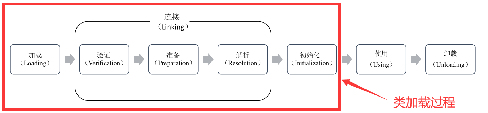

# 虚拟机类加载机制

Java 语言既具有编译型语言的特征，也具有解释型语言的特征；

Java 程序的执行过程分为两个阶段：

+ 编译阶段：Java 源程序经编译器编译生成字节码文件（.class文件，字节码文件与平台无关）；
+ 解释执行阶段：由类加载器将字节码文件加载到 JVM 中，由 JVM 解释执行；

## 1. 类加载过程

JVM 的类加载分为 5 个阶段：加载、验证、准备、解析、初始化；

+ 加载

  通过类的全限定名将该类的字节码文件读入方法区；

  在堆中创建一个代表这个类的 java.lang.Class 对象；

  > 系统可能在第一次使用某个类时加载该类，也可能采用预加载机制来加载某个类；

+ 验证

  检查加载的 class 文件的正确性；

+ 准备

  为类中的静态变量分配内存空间并设置静态变量初始值；

  > 初始值指不同数据类型的默认值；

+ 解析

  将常量池中的符号引用转换为直接引用；

  符号引用就是使用一组符号来描述所引用的目标，直接引用就是直接指向目标的指针或一个间接定位到目标的句柄。

+ 初始化

  对静态变量进行初始化；

## 2. 类加载器

JVM 提供了 3 种类加载器，分别是启动类加载器、扩展类加载器和应用程序类加载器，还有一种是用户自定义类加载器；

+ 启动类加载器(Bootstrap ClassLoader)

  用于加载 java 核心类库；

+ 扩展类加载器(extensions class loader)

  用于加载 Java 扩展类；

+ 应用程序类加载器（system class loader）

  根据 Java 应用的类路径（CLASSPATH）来加载 Java 类；

  程序中默认的类加载器，一般来说，Java应用的类都是由它来完成加载；

+ 用户自定义类加载器

  通过继承 java.lang.ClassLoader 实现自定义的类加载器；

## 3. 双亲委派机制

一个类加载器在收到类加载请求后不会自己去加载这个类，而是把该类加载请求向上委派给其父类去完成，其父类在接收到该类加载请求后又会将其委派给自己的父类，以此类推，这样所有的类加载请求都被向上委派到启动类加载器中；若父类加载器在接收到类加载请求后发现自己也无法加载该类，则父类会将该信息反馈给子类并向下委派子类加载器加载该类，直到该类被成功加载，若找不到该类，则 JVM 会抛出 ClassNotFoud 异常；

### 双亲委派机制的优点

+ 避免类的重复加载；
+ 保护程序安全，防止核心 API 被随意篡改；

### 如何判断两个 Class 对象是否相等

对于任意类，都必须由加载这个类的类加载器和这个类的完整类名一起确立其在jvm 中的唯一性；

在JVM中，即使两个类对象（Class对象）来源同一个Class文件，被同一个虚拟机所加载，但只要加载它们的ClassLoader实例对象不同，那么这两个类对象就是不相等的；

### 打破双亲委派机制

+ 为什么打破

  默认的类加载器无法加载两个相同类库的不同版本；

+ 如何打破

  双亲委派机制是在ClassLoader类的loadClass()中实现的，如果我们不想使用系统自带的双亲委派模型，只需要重新实现ClassLoader的loadClass()方法即可；