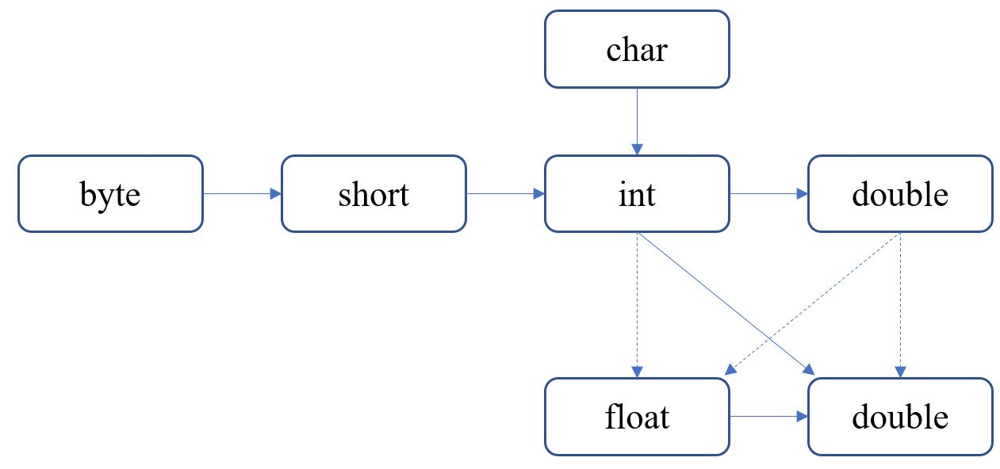

# 一、Java概述

## 1.分清 JDK 与 JRE

`JDK（Java Development Kit）`：Java开发工具包，提供了Java的开发环境（如编译器等工具）和运行环境（如JVM等）、许多Java工具（jdk安装目录下的bin目录下的可执行程序，如javac、java等）和Java基础类库。

`JRE（Java Runtime Environment）`：Java程序的运行环境，包括Java虚拟机（JVM）、Java核心类库和支持文件。

> 如果只是运行Java程序，可以只安装JRE ，无须安装JDK

## 2. Java版本

```bash
# 命令行查看java版本
$ java -version
java version "1.8.0_231"
Java(TM) SE Runtime Environment (build 1.8.0_231-b11)
Java HotSpot(TM) 64-Bit Server VM (build 25.231-b11, mixed mode)
```

2014年03，Java8发布，在这之前，Java保持三年一次发布的更新频率。从2017年9月发布Java 9开始，Oracle每6个月就会发布一个新版本的JDK，具体来说是每年的三月和九月。

长期支持版本：Oracle不愿意在发布每一个新版本后同样支持每个旧版本，所以提供了长期支持版本（Long Term Support release，LTS），如JDK7、JDK8、JDK11、JDK17。

> java版本官网信息：https://dev.java/download/releases/

### 1）JDK8的新特性

+ 语言层面
  + 增加了 Lambda 表达式和方法引用
  + 为接口增加了默认方法（default method）
+ 集合方面
  + 新增 Stream 库，用于对集合进行批量操作
  + HashMap 性能改进

> JDK8 官网文档：https://docs.oracle.com/javase/8/
>
> JDK8 API文档：https://docs.oracle.com/javase/8/docs/api/index.html
>
> JDK8 新特性：https://www.oracle.com/java/technologies/javase/8-whats-new.html

## 3. 程序注释

Java存在三种类型的注释：

+ 单行注释

  ```java
  // 单行注释
  ```

+ 多行注释

  ```java
  /*
   good
   good
   study
   */
  ```

+ 文档注释

  如果编写Java源代码时添加了文档注释，可以通过JDK提供的 javadoc 工具将源代码中的文档注释生成一份API文档。

  ```java
  /**
   * 向某人问好
   * @param name
   */
  public void sayHello(String name) {
      System.out.println(name + "," + "hello");
  }
  ```

  ```bash
  # javadoc命令用法
  javadoc [options] [packagenames] [sourcefiles] [@files]
  
  # 常用选项：
  	-d <directory>	指定生成的API文档存储的目录
  	-sourcepath <pathlist>	指定查找源文件的位置
  	-subpackages <subpkglist>	指定要递归加载的子程序包
  	-encoding <name>	源文件编码名称
  	-docencoding <name>	指定输出的字符编码
  	
  # 示例：
  javadoc -d F:\Blogs\docs\notes\Java\LearnJava\javadoc -encoding utf-8 -docencoding utf-8 HelloWorld.java
  
  javadoc -d F:\Blogs\docs\notes\Java\LearnJava\javadoc -encoding utf-8 -docencoding utf-8 -sourcepath F:\Blogs\docs\notes\Java\LearnJava\src\main\java -subpackages test
  ```

# 二、数据类型

Java是一门强类型语言，强类型包含两方面的含义：所有的变量必须先声明，后使用；指定类型的变量只能接收类型与之匹配的值。

> 强类型语言可以在编译时进行严格的语法检查，从而减少编程错误

Java 语言支持的数据类型分为两类：基本数据类型、引用数据类型；

## 2.1 基本数据类型

Java 有 8 种基本数据类型，其中包括 4 种整型（byte、short、int、long）、2种浮点类型（float、double）、字符类型（char）、布尔类型（boolean）；

### 2.1.1 整型

Java提供了 4 种整型。

|       | 占用空间 |            表示数范围             |
| :---: | :------: | :-------------------------------: |
| byte  |  1 字节  |           $[-128,127]$            |
| short |  2 字节  |         $[-32768,32767]$          |
|  int  |  4 字节  | $[-2147483648, 2147483647(21亿)]$ |
| long  |  8字节   |       $[2^{-31},2^{31}-1]$        |

备注：

+ 整型的存储空间大小与运行 Java 代码的机器无关（C 或者 C++ 中，int 和 long 等类型的大小与机器相关，如 int 在 16 位的处理器上占用两个字节，在 32 位处理器上占用 4 字节）；

+ Java 没有无符号（unsigned）数据类型；

+ Java 中整数值默认为 int 类型，如果将一个超出 int 类型表示范围的整数赋值给 long 类型变量，程序将会报错，Java 不会自动把这个整数值当成 long 类型来处理；如果需要把一个整数值当成 long 类型来处理，应在这个整数值后增加 `l` 或者 `L` 作为后缀；

  ```java
  // 将数值 2^31 赋值给long类型变量
  // 下行代码报错
  // long num = 2147483648; 
  // 正确做法，加后缀
  long num = 2147483648L;
  ```

+ Java 中整型值一般有四种进制表示方式：二进制、八进制、十进制、十六进制；

  使用二进制表示时：使用 `0b` 或 `0B` 前缀；

  使用八进制表示时：使用 `0` 前缀；（因为容易混淆，所以一般不使用八进制）

  使用十六进制表示时：使用 `0x`或 `0X` 前缀；

  ```java
  // 二进制
  int num1 = 0B1111;
  // 十六进制
  int num2 = 0X11;
  ```

+ 从 Java7 开始，为了方便阅读，可以为数字字面量加下划线；

  ```java
  int num = 13_3281_0869;
  ```

### 2.1.2 浮点型

浮点类型用于表示有小数部分的数值。

Java 有两种浮点类型：单精度浮点类型（float）和双精度浮点类型（double）。

**Java 浮点数默认为 double 类型**，如果希望将一个浮点数当成 float 类型处理，应该在这个浮点数加后缀 `f` 或 `F`。

Java 浮点数遵循 IEEE 754 标准。

|      |                  float                   |                  double                   |
| :--: | :--------------------------------------: | :---------------------------------------: |
| 长度 |                  4字节                   |                   8字节                   |
| 组成 | 符号位（1位）+ 指数（8位）+ 尾数（23位） | 符号位（1位）+ 指数（11位）+ 尾数（52位） |

Java 存在三个特殊的浮点数值：正无穷大、负无穷大和非数（NaN），用于表示溢出或出错的情况。

> 一个浮点数除以0将得到正无穷大或负无穷大。
>
> ```java
> double num = 1.0/0;
> System.out.println(num);    // Infinity
> // Double类提供了方法可以判断double类型变量是否为无穷大
> System.out.println(Double.isInfinite(num));
> double num2 = -1.0/0;
> System.out.println(num);    // Infinity
> ```
>
> 浮点数 0.0 除以 0 将得到非数 NaN；
>
> ```java
> double num3 = 0.0/0;
> System.out.println(num3);   // NaN
> System.out.println(Double.isNaN(num3)); // true
> ```
>
> 与float和double类型分别对应的包装类Float、Double中分别定义了三个常量用于表示正无穷大、负无穷大和非数：POSITIVE_INFINITY、NEGATIVE_INFINITY、NaN。

float、double 类型的浮点数容易引起误差 （有些浮点数使用二进制无法准确表示），**如果在数值计算中不允许有任何舍入误差，应该使用 BigDecimal 类**；

```java
// 浮点数计算引发误差
System.out.println(2 - 1.1);      // 0.8999999999999999

BigDecimal decimal = new BigDecimal(2);
// 使用BigDecimal类中参数类型为double的构造器存在一定的不可预知性
// 如下所示，并没有创建一个值为1.1的BigDecimal实例，所以不推荐使用该构造器
BigDecimal decimal2 = new BigDecimal(1.1);
System.out.println(decimal2.toString());    
// 1.100000000000000088817841970012523233890533447265625
BigDecimal res = decimal.subtract(decimal2);
System.out.println(res.toString());     
// 0.899999999999999911182158029987476766109466552734375

// 推荐使用参数类型为字符串的构造器
BigDecimal decimal3 = new BigDecimal("2");
// 如下创建了一个值为1.1的BigDecimal实例
BigDecimal decimal4 = new BigDecimal("1.1");
System.out.println(decimal4.toString());    // 1.1
BigDecimal res2 = decimal3.subtract(decimal4);
System.out.println(res2);     // 0.9
```

### 2.1.3 字符类型

char 类型通常用于表示单个字符，占两个字节。

char 类型值有两种表示方式：

+ 单个字符，如 `'A'`；

  > 注：`'A'` 与 `"A"` 是不一样的，前者表示一个字符，后者表示含有一个字符的字符串；

+ 字符的Unicode值，如 `'\uXXXX'`；

```java
char sex = '男';
// '男'的Unicode值表示形式
char sex2 = '\u7537';
```

#### 字符编码

| 常见编码方式 | 介绍                                                         |
| ------------ | ------------------------------------------------------------ |
| ASCII        | 单字节编码方案；<br />对128个字符进行了编码（包括26个小写字母、26个大写字母、10个数字、32个符号、33个控制代码和一个空格）<br />实际只使用了一个字节的后7位。 |
| ANSI         | 为使计算机支持更多语言，在ASCII编码的基础上，使用0x80~0xFFFF 编码其他字符。不同的国家和地区制定了不同的标准，不同ANSI编码之间互不兼容。<br />在简体中文Windows操作系统中，ANSI编码即GBK编码（一种双字节编码方式）。 |
| Unicode      | 被称为统一码，也被称为万国码；<br />一开始使用两个字节对世界上各种语言的所有字符进行编码；<br />随着字符的增多，2个字节无法满足对所有的字符进行编码，Unicode将字符分为17组编排，0x0000至0x10FFFF，每组称为平面（code plane）,每个面拥有65536个码点（code point），码点采用十六进制书写，并加上前缀U+，例如U+0041就是拉丁字母A的码点。第一个平面称为基本的多语言平面（basic multilingual plane)，码点从U+0000到U+FFFF，其中包括经典的Unicode编码。其余的16个平面从U+10000到U+10FFFF，其中包括一些辅助字符（supplementary character)。<br />**Unicode只规定了每个字符的编码，但没有规定如何存储对应的编码**，如使用两个字节还是四个字节，如果统一使用四个字节存储所有的字符，会造成空间上的极大浪费。<br />Unicode字符编码查询：https://unicode-table.com/cn/ |

+ Unicode编码方案的实现

  + UTF-8  

    一种可变长的Unicode编码方式，使用1-4个字节表示一个字符。

    编码规则：

    + 对于使用单个字节表示的字符，第一位设为 0，后面的 7 位对应这个字符的 Unicode码点，兼容 ASCII 码；

    + 对于使用多个字节（N）表示的字符，第一个字节的前N位都为1，剩余N-1个字节的前两位都设为10，剩下的二进制位使用这个字符的 Unicode 码点来填充。

      ```java
      // "汉"的Unicode码点0x6c49
      // 0x6c49二进制表示
      110_1100_0100_1001
      // utf-8编码：使用三个字节表示
      11100110 10110001 10001001
      ```


### 2.1.4 布尔类型

boolean 类型有两种取值：true、false；

> 在C++中，数值可以代替boolean值，如值 0 相当于布尔值 false ，非 0 值相当于布尔值 true，Java不支持这种机制。 

> Java规范并没有强制指定boolean类型的变量所占用的内存空间，虽然boolean类型的变量或值只要1位即可保存，但由于大部分计算机在分配内存时允许的最小内存单元是字节，因此boolean类型的变量一般占用1个字节。

## 2.2 数值类型之间的转换

将一种数值类型转换为另一种数值类型存在两种方式：自动类型转换（隐式转换）和强制类型转换。

### 2.2.1 自动类型转换

自动类型转换：将一种基本类型的值直接赋值给另一种基本类型的变量。

如下图所示，实线箭头表示自动转换过程中不存在信息的丢失，虚线箭头表示可能存在精度的损失。



```java
int n = 1_2345_6789;
float f = n;
System.out.println(f);  // 1.23456792E8,精度损失
```

> 字符型转换为整型：char型字符或char型变量可以直接赋值给 int 型变量
>
> ```java
> int num = 'a';
> System.out.println(num);
> char letter ='b';
> num = letter;
> System.out.println(num);
> ```

### 2.2.2 强制类型转换

如果需要把上图中箭头结尾的类型转换为箭头开始的类型，需要进行强制类型转换。

```java
// 强制类型转换语法格式：
(type)变量
    
// 强制类型转换示例
int num = 300;
// 300的二进制形式：1_0010_1100
// 转换为Byte类型时会将原来的数进行截断，即得到0010_1100
byte num2 = (byte)num;
System.out.println(num2); // 44

// int型变量强制转换为char类型
int num = 97;
char letter = (char)num;
// 可以将一个（不超过char范围）数字直接赋值给一个char型变量
char letter = 98;
```

### 2.2.3 表达式类型自动提升

当一个算术表达式中包含多个基本类型的值时，整个算术表达式的数据类型将发生自动提升。

Java定义了如下的自动提升规则：

+ 所有的byte类型、short类型和char类型将被提升到int类型；

+ 整个算术表达式的数据类型自动提升到与表达式中最高等级操作数同样的类型。

```java
Short num = 1;
num = num + 1;	//报错，int无法转换为java.lang.Short，右侧表达式中num类型自动提升为int
```

# 三、运算符

## 3.1 运算符

+ **算术运算符**

  ```
  +	加法运算符
  -	减法运算符
  *	乘法运算符
  /	除法运算符（如果除法运算符的两个操作数都是整数类型，则除数不可以是0，否则会抛出异常；如果除法运算符的两个操作数至少有一个是浮点数，此时允许除数是0，结果为正无穷大或负无穷大或非数NaN）
  %	求余运算符（求余运算的结果不一定总是整数，它的计算结果是使用第一个操作数除以第二个操作数，得到一个整除的结果后剩下的值就是余数）
  ++	自加
  --	自减
  ```

  Java 没有提供其他复杂的算术运算符，如果需要完成乘方、开方等运算，可借助于 `java.lang.Math` 类中提供的方法完成。

+ **位运算符**

  ```
  &	按位与，当两位同时为1时返会1，其余都为0
  |	按位或，只要有一位为1就返回1
  ~	按位非，单目运算符，将操作数的每个位（包括符号位）全部取反
  ^	按位异或，当两位相同时返回0，不同时返回1
  <<	左移运算符，将操作数的二进制码整体左移指定位数，左移后右边空出来的位以0填充
  >>	右移运算符，将操作数的二进制码右移指定位数后，左边空出来的位以原来的符号位填充
  >>>	无符号右移运算符，将操作数的二进制码右移指定位数后，左边空出来的位总是以0填充
  ```

  ```java
  /*
   * 左移运算符示例
   * 5的二进制形式：0000_0000 0000_0000 0000_0000 0000_0101
   * 整体左移两位：0000_0000 0000_0000 0000_0000 0001_0100，转换为十进制即为20
   * -5的二进制形式（使用补码表示）：1111_1111 1111_1111 1111_1111 1111_1011
   * 整体左移两位：1111_1111 1111_1111 1111_1111 1110_1100，转换为十进制即为-20
   */
  System.out.println(5 << 2);     // 输出20
  System.out.println(-5 << 2);    // 输出-20
  ```

  ```java
  /*
   * 右移运算符示例
   */
  System.out.println(5 >> 2);     // 输出1
  System.out.println(-5 >> 2);    // 输出-2
  System.out.println(-5 >>> 2);   // 输出1073741822
  ```

  > 进行移位运算时需要遵循如下规则：
  >
  > + 对于byte、short、char类型的操作数，进行移位运算时首先会自动类型转换为int类型后再移位；
  >
  >   ```java
  >   byte num = 127;
  >   System.out.println(num << 1);   // 输出254
  >   ```
  >
  > + 对于int类型的整数进行移位运算时，如果移动的位数大于32，需要对移动的位数对32进行求余；
  >
  >   ```java
  >   int num = 127;
  >   System.out.println(num << 33);   // 输出254
  >   ```
  >
  > + 对于long类型的整数进行移位运算时，如果移动的位数大于64，需要对移动的位数对64进行求余；

+ **比较运算符**

  ```
  >
  >=
  <
  <=
  ==
  !=
  ```

  > ==：如果进行比较的两个操作数都是数值类型，即使它们的数据类型不相同，只要它们的值相等，也将返回true。例如97=='a'返回true，5.0==5也返回true；

+ **逻辑运算符**

  ```
  &&	与，两个操作数都为true时返回true，否则返回false
  &	不短路与，作用与&&相同，但不会短路
  ||	或，只要两个操作数中有一个是true，返回true
  |	不短路或，作用与||相同，但不会短路
  !	非，单目运算符，操作数为true时返回false，操作数为false时返回true
  ^	异或，当两个操作数不同时返回true
  ```

  > &&与&区别：&&先计算左边的操作数，如果左边的操作数为false，直接返回false，不会计算右边的操作数，&一定会计算左右两边的操作数。
  >
  > ```java
  > /*
  >  * &&与&区别
  >  */
  > int a = 10;
  > int b = 20;
  > if(a < 10 && b++ > 10) {
  >     System.out.println("hello");
  > }
  > System.out.println(b);  // 输出20
  > if(a < 10 & b++ > 10) {
  >     System.out.println("hello");
  > }
  > System.out.println(b);  // 输出21
  > ```

+ **三目运算符**

  ```java
  // 三目运算符语法格式
  // 如果布尔表达式值为true，执行代码块1，值为false时执行代码块2
  布尔表达式 ? 代码块1 : 代码块2;
  ```
  
  ```java
  /*
   * 三目运算符示例
   */
  int i = 0;
  i += i < 10 ? 1 : 0;
  System.out.println(i);  // 输出1
  ```

## 3.2 instanceof 运算符

```java
// 当对象是指定类或其子类所创建的对象时，返回true；否则，返回false
// 当对象为 null 时，返回 null
obj instance of class
```

## 3.3 运算符优先级

| 运算符优先级 | 运算符                           | 运算符说明         |
| ------------ | -------------------------------- | ------------------ |
| 1            | ++、--、~（按位非）、!（条件非） | 单目运算符         |
| 2            | (type)                           | 强制类型转换运算符 |
| 3            | *、/、%                          | 乘法/除法/求余     |
| 4            | +、-                             | 加法/减法          |
| 5            | <<、>>、>>>                      | 移位运算符         |
| 6            | <、<=、>=、>、instanceof         | 关系运算符         |
| 7            | ==、!=                           | 等价运算符         |
| 8            | &                                | 按位与             |
| 9            | ^                                | 按位异或           |
| 10           | \|                               | 按位或             |
| 11           | &&                               | 条件与             |
| 12           | \|\|                             | 条件或             |
| 13           | 三目运算符                       |                    |
| 14           | =、+=、-=、.......               | 赋值运算符         |

# 四、流程控制

不论是哪一种编程语言，都会提供两种基本的流程控制结构：分支结构和循环结构。其中分支结构用
于根据条件来选择性地执行某段代码，循环结构则用于根据循环条件重复执行某段代码。

## 4.1 分支结构

Java 提供了 if 和 switch 两种分支结构。

if 语句使用布尔表达式或布尔值作为分支条件来进行分支控制。

```java
int grade = 80;
if (grade < 60) {
    System.out.println("不及格");
} else if (grade < 80) {
    System.out.println("及格");
} else if (grade < 90) {
    System.out.println("良好");
} else {
    System.out.println("优秀");
}
```

switch 语句由一个控制表达式和多个case标签组成，其中**控制表达式的数据类型只能是byte、short、int、char、枚举类型、String类型（Java7 引入），不能是boolean类型**。

Switch语句将控制表达式的值与case标签依次进行比较，当控制表达式的值与case标签相匹配时，执行该case标签下的代码块。每个case标签的代码块结尾都有一条break语句，表示执行完代码块后直接跳出switch语句，如果删除该break语句，程序不会再比较控制表达式的值与后面的case标签是否相等，会直接执行之后的代码块，直到遇到break语句或switch语句结束为止。

switch语句可以包含一个default分支，当控制表达式的值与任何case标签后的值都不相等时，执行default后的代码块，default分支不需要 break 语句。

```java
String str = "good";
switch (str) {
    case "fail": {
        System.out.println("不及格");
        break;
    }
    case "pass": {
        System.out.println("及格");
        break;
    }
    case "good": {
        System.out.println("良好");
        break;
    }
    default: {
        System.out.println("优秀");
    }
}
```

## 4.2 循环结构

Java提供了三种循环结构：while、do while、for。

+ while循环

  ```java
  初始化语句
  while(循环条件) {	// 循环条件用于控制是否执行循环体
      循环体			// 循环条件满足时重复执行的代码块
      迭代语句	   // 控制循环条件中的变量，使得循环在合适的时候结束
  }
  ```

+ do while循环

  与while循环不同，do while循环先执行循环体然后再判断循环条件

  ```java
  初始化语句
  do {
      循环体
      迭代语句
  } while(循环条件);
  ```

+ for循环

  ```java
  for (初始化语句; 循环条件; 迭代语句) {
      循环体
  }
  ```

Java 提供了break语句和continue语句控制程序的循环结构，其中break语句用于结束循环，continue语句用于跳过本次循环。

# 五、数组

## 5.1 数组

数组用于存储同一类型的多个元素。

+ 声明数组变量

  ``` java
  // 方式一
  type[] 数组名;
  // 方式二（不推荐使用）
  type 数组名[];
  ```

+ 初始化数组

  数组只有在初始化后才能使用。

  初始化有两种方式：静态初始化、动态初始化。

  ```java
  // 静态初始化：给出数组包含的所有元素
  arrayName = new type[]{elementl, element2, ...}
  // 注：只有在声明数组变量的同时进行数组初始化才可以使用简化的静态初始化
  type[] arrayName = {elementl, element2, ...}
  
  // 动态初始化：指定数组长度，此时系统会自动为数组元素分配初始值
  // 注：数组长度不要求必须是常量
  arrayName = new type[n];
  ```

  > 动态初始化分配初始值规则：
  >
  > + 数组元素类型是整数类型（byte、short、int和long)，初始值是0；
  > + 数组元素类型是浮点类型（float、double)，初始值为0.0；
  > + 数组元素类型是字符类型（char)，初始值为’\u0000’；
  > + 数组元素类型是布尔类型(boolean)，初始值是false；
  > + 数组元素的类型是引用类型(类、接口和数组)，初始值是null；

## 5.2 遍历数组

```java
// 方式一：for循环
int[] nums = new int[]{1, 2, 3, 4, 5, 6,};
for (int i = 0; i < nums.length; i++) {
    System.out.println(nums[i]);
}

// 方式二：foreach循环
for (int num : nums) {
    System.out.println(num);
}
```

## 5.3 复制数组

+ System.arraycopy() 方法

  ```java
  /**
    * 将指定源数组中从指定位置开始的length个元素复制到目标数组的指定位置；
    * 如果src和dest引用同一个数组，其本质是将该数组从srcPos位置开始的length个元素先复制到一个临时数组中，然后再将临时数组中的元素复制到dest数组中；
    * 
  
       */
  public static native void arraycopy(Object src,  int  srcPos,
                                      Object dest, int destPos,
                                      int length);
  ```

+ object.clone() 方法

  该方法用于复制整个数组。

  ```java
  int[] nums = new int[]{1, 2, 3, 4, 5, 6,};
  int[] nums2;	// 此时新数组不需要进行初始化
  nums2 = nums.clone();
  ```

+ Arrays.copyOf() 方法

  ```java
  /**
    * copyOf()方法底层通过调用System.arraycopy()方法实现
    * 如果源数组的长度小于新数组的长度，使用默认值进行填充
    * @param original		复制的源数组
    * @param newLength	新数组的长度
    */
  public static int[] copyOf(int[] original, int newLength) {
      int[] copy = new int[newLength];
      System.arraycopy(original, 0, copy, 0,
                       Math.min(original.length, newLength));
      return copy;
  }
  ```

+ for循环

> 经初步验证，System类的arraycopy()方法效率永远最高，Object类clone()方法和Arrays类的copyOf()效率差不多，当需要复制的元素个数较小时，for循环最差，但超过一定数量时，for循环效率接近System类arraycopy()，Object类clone()方法和Arrays类的copyOf()效率很差。

## 5.4 多维数组

+ 声明二维数组

  ```java
  type[][] arrayName;
  ```

+ 初始化二维数组

  + 静态初始化：

    ```java
    int[][] nums = {
        {1, 2, 3},
        {4, 5, 6},
        {7, 8, 9}};
    int[][] nums2 = {
        {1},
        {4, 5},
        {7, 8, 9}};    // 每行的长度可以不相同
    ```
    
  + 动态初始化：

    ```java
  arrayName = new type[len1][len2];
    
    // 初始化一个不规则的二维数组：
    // 首先指定所含行数
  arrayName=new type[len1][];
    // 然后对每一行分配其各自的长度：
  for (int i = 0; n <= len1; i++)
    {
        arrayName[i] = new int[len2];
    }
    ```


## 5.5 Arrays 工具类

### 5.5.1 数组排序

Arrays工具类对于各种类型的数组都提供了两种方法用于数组排序。

```java
// 对整个数组进行升序排列
void sort(int[] a)
// 对数组的指定范围（从索引fromIndex到toIndex，其中不包含toIndex）进行升序排列
void sort(int[] a, int fromIndex, int toIndex)
```

Java8 增强了Arrays工具类，利用多CPU并行计算的能力，增加了并行排序方法。

> 实现：将源数组分解为多个子数组，然后对子数组分别进行排序，最后将有序的子数组进行合并

```java
void parallelSort(int[] a)
void parallelSort(int[] a, int fromIndex, int toIndex)
```

```java
/**
  * 排序性能测试
  */
public static void sortTest() {
    int n = 100_0000;
    int[] nums = new int[n];
    // 使用随机数填充数组
    Random random = new Random();
    for (int i = 0; i < n; i++) {
        nums[i] = random.nextInt();
    }
    int[] nums2 = Arrays.copyOf(nums, n);
    // 使用sort方法进行排序
    long time = System.currentTimeMillis();
    Arrays.sort(nums);
    long time2 = System.currentTimeMillis();
    System.out.println("sort方法使用时间：" + (time2 - time));
    // 使用parallelSort进行排序
    long time3 = System.currentTimeMillis();
    Arrays.parallelSort(nums2);
    long time4 = System.currentTimeMillis();
    System.out.println("parallelSort方法使用时间：" + (time4 - time3));
}

// 测试结果：经初步测试，当数组长度大于10万后，可以考虑使用并行排序
```

Arrays工具类可以通过指定一个比较器对数组进行排序。

```java
void sort(T[] a, Comparator<? super T> c)
void sort(T[] a, int fromIndex, int toIndex, Comparator<? super T> c)
```

```java
// 按照字符串的长度进行排序
String[] strs = {"stephen", "klay", "draymond", "andre"};
Arrays.sort(strs, new Comparator<String>() {
    @Override
    public int compare(String str1, String str2) {
        return str1.length() - str2.length();
    }
});
```

### 5.5.2 元素查找

Arrays工具类对于各种类型的数组都提供了两种方法用于数组元素二分查找。

在调用该方法查找指定元素前，需要先对数组进行排序。

```java
int binarySearch(int[] a, int key)
int binarySearch(int[] a, int fromIndex, int toIndex, int key)
```

### 5.5.3 判断数组是否相同

```java
// 两个数组包含相同的元素时返回true
boolean equals(int[] a, int[] a2)
```

### 5.5.4 填充数组

```java
void fill(int[] a, int val)
void fill(int[] a, int fromIndex, int toIndex, int val)
```

### 5.5.5 将数组转换为列表

```java
List<T> asList(T... a)
```

> 注：Arrays工具类自定义了一个内部类：ArrayList，用于实现列表操作，这个列表实现为一个固定大小的列表，不允许进行添加元素和删除元素操作。
>
> 对列表的修改会传递到数组。

```    java
/**
  * 将数组转换为列表测试
  */
public static void arrayToListTest() {
    String[] strs = {"stephen", "klay", "draymond", "andre"};
    List<String> list = Arrays.asList(strs);
    list.set(1, "thompson");
    System.out.println(Arrays.toString(strs));  // 输出[stephen, thompson, draymond, andre]
}
```

### 5.5.6 将数组转换为steam

```java
Stream<T> stream(T[] array)
Stream<T> stream(T[] array, int startInclusive, int endExclusive)
```


