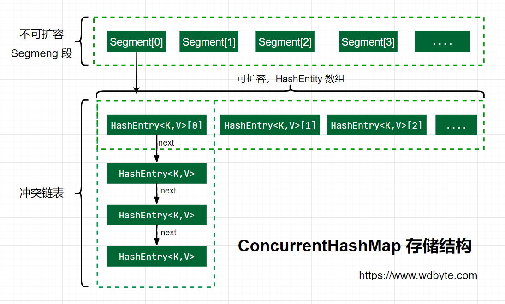

# 5. 集合

Java 有四种集合：

**Set 集合**：存储的元素是无序的、不可重复的

**List 集合**：存储的元素是有序的、可重复的

**Map 集合**：存储键值对；

**Queue 集合**：队列集合；


## 5.1 集合与数组的区别

长度区别：集合的长度可变，数组的长度固定；

元素类型区别：集合只能存储引用类型数据，数组既可以存储基本类型数据，也可以存储引用类型数据；

元素类型是否唯一：不使用泛型的集合可以存储不同类型的数据，数组只能存储同一种类型的数据；


## 5.2 List 接口

### 5.2.1 ArrayList 和 LinkedList 区别

 **底层实现**：ArrayList 基于数组实现，LinkedList 基于双向链表实现；

**插入或删除性能**：ArrayList 基于数组实现，在数组中间插入或删除元素需要对其他元素进行移位，效率低；LinkedList 基于双向链表实现，插入或者删除元素效率高；

**是否支持快速随机访问**（即使用索引快速获取元素）：ArrayList 可以使用索引快速访问元素；

需要快速访问集合元素时，使用 ArrayList ；需要频繁插入或删除元素时，使用 LinkedList ；


### 5.2.2 Arraylist 和 Vector 的区别

都是基于数组实现；

Arraylist 不是线程安全的，Vector 是线程安全的（基于 synchronized 实现线程安全）；


### 5.2.3 ArrayList 扩容机制

ArrayList 使用数组存储集合元素；

```java
transient Object[] elementData;
```

当使用无参构造器创建 ArrayList 对象时，会先将底层数组初始化为一个空数组；当第一次插入元素时，才会将数组扩容为默认容量10或者需要的最小容量；

```java
private static final Object[] DEFAULTCAPACITY_EMPTY_ELEMENTDATA = {};
public ArrayList() 
{
        this.elementData = DEFAULTCAPACITY_EMPTY_ELEMENTDATA;
}
```

之后对 ArrayList 进行插入操作时，需要先判断底层数组是否有足够的空间用于插入，如果有，插入元素；

如果没有足够的空间，需要对底层数组进行扩容，首先尝试1.5倍扩容，如果1.5倍扩容后还小于插入需要的最小容量，将数组扩容为需要的最小容量；然后将源数组中的元素复制到新数组中；


## 5.4 快速失败和安全失败

 java.util 包下的集合类就都是快速失败的；而 java.util.concurrent 包下的类都是安全失败的；

**快速失败和安全失败都是相对迭代器而言的；**

**快速失败**

在使用**迭代器遍历集合**时，迭代器直接访问集合中的元素，如果遍历期间存在其他线程对集合进行了修改（增加、删除、修改），或者当前线程对集合进行了修改（调用 iterator.remove() 方法除外），都会让当前线程抛出ConcurrentModificationException 异常，遍历失败；

在对集合进行增删改操作时会改变 modCount 的值；每当迭代器使用 hashNext()/next() 遍历下一个元素之前，都会检测 **modCount** 变量是否为 expectedModCount 值，是的话就继续遍历；否则抛出异常，终止遍历；

**安全失败**

采用安全失败机制的集合容器，在遍历时不是直接访问集合中的元素，而是先复制原有集合内容，在拷贝的集合上进行遍历。由于迭代时是对原集合的拷贝进行遍历，所以在遍历过程中对原集合所作的修改并不能被迭代器检测到，故不会抛 ConcurrentModificationException 异常；


# 三、集合

## 3.1 Map<K,V> 集合

Map 集合用于存储键值对；

### 3.1.1 遍历 Map 集合

+ 通过 `entrySet()` 方法遍历

  ```java
  Map<Integer, String> map = new HashMap<>();
  map.put(1, "语文");
  map.put(2, "数学");
  map.put(3, "英语");
  Set<Map.Entry<Integer, String>> entrySet = map.entrySet();
  for (Map.Entry<Integer, String> entry : entrySet) {
      System.out.printf("%d:%s%n", entry.getKey(), entry.getValue());
  }
  ```

+ 通过 `keySet()` 方法遍历

  ```java
  Map<Integer, String> map = new HashMap<>();
  map.put(1, "语文");
  map.put(2, "数学");
  map.put(3, "英语");
  Set<Integer> keySet = map.keySet();
  for (int key : keySet) {
      System.out.printf("%d:%s%n", key, map.get(key));
  }
  ```

+ Java 8 新增方法 `forEach(BiConsumer<? super K,? super V> action)` 

  ```java
  Map<Integer, String> map = new HashMap<>();
  map.put(1, "语文");
  map.put(2, "数学");
  map.put(3, "英语");
  map.forEach((k, v) -> {
      System.out.printf("%d:%s%n", k, v);
  });
  ```


### 3.1.2 HashMap

+ Map 接口基于哈希表的实现；
+ 允许 key 为 null；

#### put 方法

```java
	/**
     * @param hash 待插入键值对key的哈希值
     * @param key	待插入键值对key值
     * @param value	待插入键值对value值
     * @param onlyIfAbsent 只有当key不存在时再插入键值对
     * @param evict if false, the table is in creation mode.
     * @return previous value, or null if none
     */
final V putVal(int hash, K key, V value, boolean onlyIfAbsent,
               boolean evict) {
    Node<K,V>[] tab; Node<K,V> p; int n, i;
    // 第一步：判断底层数组是否初始化：创建hashmap实例时并不会对底层数组初始化，只有在第一次调用put方法插入键值对时才会对底层数组进行初始化
    if ((tab = table) == null || (n = tab.length) == 0)
        n = (tab = resize()).length;
    // 第二步：通过key的哈希码计算得到键值对在数组中的插入位置，判断当前位置是否已经插入过键值对，如果没有，直接将键值对插入到当前位置
    if ((p = tab[i = (n - 1) & hash]) == null)
        tab[i] = newNode(hash, key, value, null);
    else {
        // 第三步：如果当前位置已经插入了键值对，比较待插入键值对的key值是否与当前位置的键值对相同，如果相同，使用新值覆盖旧值
        Node<K,V> e; K k;
        if (p.hash == hash &&
            ((k = p.key) == key || (key != null && key.equals(k))))
            e = p;
        // 第四步：判断当前位置是否已经转化为红黑树，如果是，向红黑树中插入键值对
        else if (p instanceof TreeNode)
            e = ((TreeNode<K,V>)p).putTreeVal(this, tab, hash, key, value);
        else {
            // 第五步：遍历链表，遍历的过程中查找是否有与待插入键值对key相同的键值对，如果有，使用新值覆盖旧值；如果链表中不存在键相同的键值对，插入到链表的尾部，插入后需要判断链表长度是否大于等于8，如果是，将链表转换为红黑树；
            for (int binCount = 0; ; ++binCount) {
                if ((e = p.next) == null) {
                    p.next = newNode(hash, key, value, null);
                    if (binCount >= TREEIFY_THRESHOLD - 1) // -1 for 1st
                        treeifyBin(tab, hash);
                    break;
                }
                if (e.hash == hash &&
                    ((k = e.key) == key || (key != null && key.equals(k))))
                    break;
                p = e;
            }
        }
        if (e != null) { // existing mapping for key
            V oldValue = e.value;
            if (!onlyIfAbsent || oldValue == null)
                e.value = value;
            afterNodeAccess(e);
            return oldValue;
        }
    }
    ++modCount;
    // 如果插入了新的键值对，需要判断当前hashmap的容量是否大于阈值，如果大于，对底层数组进行扩容；
    if (++size > threshold)
        resize();
    afterNodeInsertion(evict);
    return null;
}
```

#### resize 扩容

```java
/**
 * 用于数组初始化时或者map集合键值对个数超过阈值（容量*负载因子）
 */
final Node<K,V>[] resize() {
    Node<K,V>[] oldTab = table;
    int oldCap = (oldTab == null) ? 0 : oldTab.length;
    int oldThr = threshold;
    int newCap, newThr = 0;
    // oldCap > 0说明是因为当前map集合键值对个数超过阈值需要扩容
    if (oldCap > 0) {
        // 如果源数组容量已经最大，只需将阈值设置为最大
        if (oldCap >= MAXIMUM_CAPACITY) {
            threshold = Integer.MAX_VALUE;
            return oldTab;
        }
        // 新数组容量扩充为原来的两倍，阈值也扩充为两倍
        else if ((newCap = oldCap << 1) < MAXIMUM_CAPACITY &&
                 oldCap >= DEFAULT_INITIAL_CAPACITY)
            newThr = oldThr << 1; // double threshold
    }
    else if (oldThr > 0) // initial capacity was placed in threshold
        newCap = oldThr;
    else {               // zero initial threshold signifies using defaults
        newCap = DEFAULT_INITIAL_CAPACITY;
        newThr = (int)(DEFAULT_LOAD_FACTOR * DEFAULT_INITIAL_CAPACITY);
    }
    if (newThr == 0) {
        float ft = (float)newCap * loadFactor;
        newThr = (newCap < MAXIMUM_CAPACITY && ft < (float)MAXIMUM_CAPACITY ?
                  (int)ft : Integer.MAX_VALUE);
    }
    threshold = newThr;
    @SuppressWarnings({"rawtypes","unchecked"})
    Node<K,V>[] newTab = (Node<K,V>[])new Node[newCap];
    table = newTab;
    if (oldTab != null) {
        for (int j = 0; j < oldCap; ++j) {
            Node<K,V> e;
            if ((e = oldTab[j]) != null) {
                oldTab[j] = null;
                if (e.next == null)
                    newTab[e.hash & (newCap - 1)] = e;
                else if (e instanceof TreeNode)
                    ((TreeNode<K,V>)e).split(this, newTab, j, oldCap);
                else { // preserve order
                    Node<K,V> loHead = null, loTail = null;
                    Node<K,V> hiHead = null, hiTail = null;
                    Node<K,V> next;
                    do {
                        next = e.next;
                        if ((e.hash & oldCap) == 0) {
                            if (loTail == null)
                                loHead = e;
                            else
                                loTail.next = e;
                            loTail = e;
                        }
                        else {
                            if (hiTail == null)
                                hiHead = e;
                            else
                                hiTail.next = e;
                            hiTail = e;
                        }
                    } while ((e = next) != null);
                    if (loTail != null) {
                        loTail.next = null;
                        newTab[j] = loHead;
                    }
                    if (hiTail != null) {
                        hiTail.next = null;
                        newTab[j + oldCap] = hiHead;
                    }
                }
            }
        }
    }
    return newTab;
}
```

#### 构造器

```java
// 底层数组默认的初始化大小,使用无参构造器创建的 hashmap使用该默认值
static final int DEFAULT_INITIAL_CAPACITY = 1 << 4; // aka 16
// 默认的负载因子
static final float DEFAULT_LOAD_FACTOR = 0.75f;
// hashmap.size 大于该值时，需要对底层数组进行扩容(threshole = capacity * load factor)
int threshold;    
// 哈希表的负载因子    
final float loadFactor;

public HashMap()
{
    this.loadFactor = DEFAULT_LOAD_FACTOR; // all other fields defaulted
}

public HashMap(int initialCapacity)
{
    this(initialCapacity, DEFAULT_LOAD_FACTOR);
}

/**
 * 如果指定了初始容量，底层数组容量初始化为大于等于指定容量的最小的 2 的幂次方
 */
public HashMap(int initialCapacity, float loadFactor)
{
    if (initialCapacity < 0) throw new IllegalArgumentException("Illegal initial capacity: " + initialCapacity);
    if (initialCapacity > MAXIMUM_CAPACITY) initialCapacity = MAXIMUM_CAPACITY;
    if (loadFactor <= 0 || Float.isNaN(loadFactor))
        throw new IllegalArgumentException("Illegal load factor: " + loadFactor);
    this.loadFactor = loadFactor;
    // 将阈值设置为大于等于指定容量的最小2的幂次
    this.threshold = tableSizeFor(initialCapacity);
}
```

#### JDK 1.7 与 1.8 区别

|                        | 1.7       | 1.8              |
| ---------------------- | --------- | ---------------- |
| 底层数据结构           | 数组+链表 | 数组+链表+红黑树 |
| 哈希冲突时节点插入位置 | 头插法    | 尾插法           |

**注：HashMap 1.8中，当链表长度大于等于8时，会将链表转换为红黑树，从而提高查找或插入效率；转换为红黑树之前，会先判断当前数组的长度是否小于 64，如果是会选择先进行数组扩容，而不是转换为红黑树；**

> JDK 1.7 因为使用了头插法，并发 rehash 时可能会造成元素之间形成一个循环链表；JDK 1.8 使用尾插法解决了这个问题；
>
> + 单线程下 rehash 过程： 
>
>   
>
> + 并发情况下造成元素之间形成循环链表的rehash过程：
>
>   ```java
>   // hashmap 1.7 rehash 过程
>   for (int j = 0; j < src.length; j++) 
>   {
>       Entry<K,V> e = src[j];
>       if (e != null) 
>       {
>           src[j] = null;
>           do 
>           {
>               Entry<K,V> next = e.next;	// 1.
>               int i = indexFor(e.hash, newCapacity);
>               e.next = newTable[i];
>               newTable[i] = e;
>               e = next;
>           } while (e != null);
>       }
>   }
>   ```
>
>   假设两个线程同时进行rehash，一个线程在执行到1处被挂起，该线程此时已经保存了源数组当前位置的第一个键值对和其后一个键值对的引用；另一个线程开始执行，并完成了源数组到新数组的rehash过程；第一个线程再次获得机会执行；
>
>   


#### 容量为什么是 2 的幂次方

+ 位运算速度比求余运算快

  插入或者查询键值对时，首先需要通过键 key 的哈希码求出键值对在哈希表中的插入位置，如果哈希表容量为 2 的幂次方，就可以通过位运算 hash & (n-1) 求出键值对在哈希表中的存储位置，位运算比求余运算快；

#### Hashtable

Hashtable 也实现了 Map 接口，用于存储键值对；

HashMap 与 Hashtable 区别：

+ 底层数据结构：Hashtable 没有链表转化为红黑树的操作；
+ 线程安全：Hashtable 基于 Synchronized 实现了线程安全；
+ 是否允许键值对为 null：Hashmap允许key和value为null，Hashtable不允许使用null作为key和value；
+ 初始容量大小和每次扩充容量大小：
  + 使用无参构造器创建 hashtable 时，数组的初始容量为 11；使用有参构造器创建hashtable时，数组的初始容量为指定的容量；当数组存储的键值对的个数超过 threshold，会对底层数组进行扩容，每次扩容为 2n+1 ；


### 3.1.3 ConcurrentHashMap

+ 不允许键值对为 null；

#### size 方法

```java
public int size() {
    long n = sumCount();
    return ((n < 0L) ? 0 :
            (n > (long)Integer.MAX_VALUE) ? Integer.MAX_VALUE :
            (int)n);
}

final long sumCount() {
    CounterCell[] as = counterCells; CounterCell a;
    long sum = baseCount;
    if (as != null) {
        for (int i = 0; i < as.length; ++i) {
            if ((a = as[i]) != null)
                sum += a.value;
        }
    }
    return sum;
}
```


#### JDK 1.7 与 1.8 区别


### 

#### 5.3.2.1 ConcurrentHashMap 1.7 与 1.8 区别

|                  | 1.7                                                          | 1.8                                                          |
| ---------------- | ------------------------------------------------------------ | ------------------------------------------------------------ |
| 底层数据结构     | **Segment 数组 + HashEntry 数组 + 链表**                     | **数组+链表+红黑树**                                         |
| 实现线程安全方式 | 分段锁：Segment 继承了 ReentrantLock，访问每个分段的数据需要获得 Segment 锁； | synchronized 和 CAS：**Synchronized 只会对链表或红黑树的首节点加锁**； |

> JDK 1.7 中，ConcurrnetHashMap 有多个 Segment 组成，每个 Segment 包含一个 HashEntry 数组，HashEntry 数组用于存储键值对，使用链地址法解决哈希冲突；创建 ConcurrnetHashMap 实例时，Segment 的个数一旦**初始化就不能改变**，默认 Segment 的个数是 16 个，所以 ConcurrentHashMap 默认支持最多 16 个线程并发访问；
>
> JDK 1.7 中 ConcurrnetHashMap 结构如下所示：
>
> 
>
> JDK1.8 中，ConcurrentHashMap 由 **数组+链表+红黑树** 实现；与 JDK 1.8 版本的HashMap 结构相同，只是增加了同步机制用于实现线程安全；
>
> 


#### 5.3.2.2 ConcurrentHashMap put 方法过程

1. 第一步：检查键值对是否为 null，为 null 则抛出异常；（ConcurrentHashMap不允许键值对为 null）
2. 第二步：计算出待插入键值对键 key 的哈希码；
3. 第三步：判断底层数组是否被初始化，如果没有初始化，进行初始化；
4. 第四步：根据键的哈希值计算得到键值对在底层数组中的插入位置，判断当前位置是否已经插入了键值对，如果没有，通过 CAS 将键值对插入到当前位置；
5. 第五步：使用 synchronized 对当前位置的首节点加锁，然后将键值对插入到链表或者红黑树中；

```java
final V putVal(K key, V value, boolean onlyIfAbsent) {
        if (key == null || value == null) throw new NullPointerException();
        int hash = spread(key.hashCode());
        int binCount = 0;
        //for循环，一直尝试，直到put成功
        for (Node<K,V>[] tab = table;;) {
            Node<K,V> f; int n, i, fh;
            //tab未初始化，先初始化tab
            if (tab == null || (n = tab.length) == 0)
                tab = initTable();
            else if ((f = tabAt(tab, i = (n - 1) & hash)) == null) {//对应的bucket上还没有元素
                //采用CAS尝试PUT元素，如果此时没有其它线程操作，这里将会PUT成功
                if (casTabAt(tab, i, null,
                        new Node<K,V>(hash, key, value, null)))
                    break;                   // no lock when adding to empty bin
            }
            else if ((fh = f.hash) == MOVED)//如果tab正在扩容
                tab = helpTransfer(tab, f);
            else {//bucket上已经存在元素
                V oldVal = null;
                //只针对头节点同步，不影响其他bucket上的元素，提高效率
                synchronized (f) {
                    //同步块内在做一次检查
                    if (tabAt(tab, i) == f) {//说明头节点未发生改变，如果发生改变，则直接退出同步块，并再次尝试
                        if (fh >= 0) { //哈希值大于0 说明是tab[i]上放的是链表 因为对于红黑树而言 tab[i]上放的是TreeBin一个虚拟的节点 其哈希值固定为-2
                            binCount = 1;
                            for (Node<K,V> e = f;; ++binCount) {
                                //查询链表，如果存在相同key，则更新，否则插入新节点
                                K ek;
                                if (e.hash == hash &&
                                        ((ek = e.key) == key ||
                                                (ek != null && key.equals(ek)))) {
                                    oldVal = e.val;
                                    if (!onlyIfAbsent)
                                        e.val = value;
                                    break;
                                }
                                Node<K,V> pred = e;
                                if ((e = e.next) == null) {
                                    pred.next = new Node<K,V>(hash, key,
                                            value, null);
                                    break;
                                }
                            }
                        }
                        else if (f instanceof TreeBin) {//如果是红黑树，则以红黑树的方式插入
                            Node<K,V> p;
                            binCount = 2;
                            if ((p = ((TreeBin<K,V>)f).putTreeVal(hash, key,
                                    value)) != null) {
                                oldVal = p.val;
                                if (!onlyIfAbsent)
                                    p.val = value;
                            }
                        }
                    }
                }
                //判断链表是否需要转成树
                //值得注意的一点是，这段代码并未在同步块中，应该也是出于效率考虑
                if (binCount != 0) {
                    if (binCount >= TREEIFY_THRESHOLD)
                        treeifyBin(tab, i);
                    if (oldVal != null)
                        return oldVal;
                    break;
                }
            }
        }
        addCount(1L, binCount);
        return null;
    }
```


#### 5.3.2.3 扩容过程

当 ConcurrentHashMap 添加了元素之后，需要通过addCount()更新元素的个数；

如果此时键值对的个数达到了扩容阈值(sizeCtl)，那么将进行resize()操作；

```java
private final void addCount(long x, int check) {
    // CounterCell数组用于统计size
    CounterCell[] as; long b, s;
    
    // 更新size
    if ((as = counterCells) != null ||
        !U.compareAndSwapLong(this, BASECOUNT, b = baseCount, s = b + x)) 
    {
        CounterCell a; long v; int m;
        boolean uncontended = true;
        if (as == null || (m = as.length - 1) < 0 ||
            (a = as[ThreadLocalRandom.getProbe() & m]) == null ||
            !(uncontended =
              U.compareAndSwapLong(a, CELLVALUE, v = a.value, v + x))) 
        {
            fullAddCount(x, uncontended);
            return;
        }
        if (check <= 1)
            return;
        s = sumCount();
    }
    if (check >= 0) {
        Node<K,V>[] tab, nt; int n, sc;
        while (s >= (long)(sc = sizeCtl) && (tab = table) != null &&
               (n = tab.length) < MAXIMUM_CAPACITY) {
            int rs = resizeStamp(n);
            if (sc < 0) {
                if ((sc >>> RESIZE_STAMP_SHIFT) != rs || sc == rs + 1 ||
                    sc == rs + MAX_RESIZERS || (nt = nextTable) == null ||
                    transferIndex <= 0)
                    break;
                if (U.compareAndSwapInt(this, SIZECTL, sc, sc + 1))
                    transfer(tab, nt);
            }
            else if (U.compareAndSwapInt(this, SIZECTL, sc,
                                         (rs << RESIZE_STAMP_SHIFT) + 2))
                transfer(tab, null);
            s = sumCount();
        }
    }
}
```


# 六. 集合

Java 有四种集合：

+ Set        代表元素无序、元素不重复的集合
+ List       代表元素有序、元素可重复的集合
+ Map     代表具有映射关系（key-value）的集合
+ Queue     队列集合

java 集合框架接口和常用类：


## 1. Collection<E> 接口

定义了对于集合的通用操作；

所有的Collection接口实现类（通过Collection子接口间接实现）应该提供两个构造函数：

+ 无参数构造函数，用于创建一个空集合；
+ 具有 Collection 类型参数的构造函数，用于创建一个与参数Collection具有相同元素的新集合，`Xxx(Collection<? extends E> c)`；

## 2. 遍历集合元素

### 1）使用 Iterable<T> 接口的默认方法forEach

Collection 接口继承了 Iterable 接口；

Iterable 接口提供了一个默认方法：

```java
default void forEach(Consumer<? super T> action)
// 注：Consumer 为一个函数式接口，包含一个抽象方法：void accept(T t)，执行给定操作但不返回值
```

使用 forEach() 方法遍历集合时，程序会依次将集合元素传给 Consumer 接口的 accept(T t) 方法的形参，然后对每个元素执行给定操作，直到处理完Iterable所有元素或操作抛出异常为止；

```java
ArrayList<String> list = new ArrayList<>();
list.add("小橘子");
list.add("娄大");
list.add("小可爱");
list.forEach(str -> System.out.println(str));
```

### 2）使用Iterator<T>接口

Iterator 接口提供了两个方法遍历集合：hasNext()、next()；

```java
ArrayList<String> list = new ArrayList<>();
list.add("小橘子");
list.add("娄大");
list.add("小可爱");
Iterator<String> iterator = list.iterator();
while (iterator.hasNext())
{
    System.out.println(iterator.next());
}
```

### 3）使用foreach 循环

```java
ArrayList<String> list = new ArrayList<>();
list.add("小橘子");
list.add("娄大");
list.add("小可爱");
for(String str : list)
    System.out.println(str);
```

## 3. Set 接口

包含不重复元素的集合；

允许包含 null 元素；（有些实现禁止 null 元素）

### 1）通用方法

+ 将 Set 集合转换为数组

  ```java
  // 两个重载方法
  Object[] toArray()	//返回一个Object类型数组，如果使用数组元素，需要对每一个元素强制类型转换
  T[] toArray(T[] a)	//返回一个 T 类型数组，如果参数指定的数组能够容纳 Set 集合的所有元素，就使用该数组保存 Set 集合中的所有对象，如果参数指定的数组长度大于 Set 集合的大小，那么数组的剩余空间全部赋值为 null 值；如果参数指定的数组长度小于 Set 集合的大小，返回一个新的能够容纳 Set 集合中所有元素的数组。
  ```

  ```java
  HashSet<String> hashSet = new HashSet<>();
  hashSet.add("花");
  hashSet.add("有");
  hashSet.add("重");
  hashSet.add("开");
  hashSet.add("日");
  String[] strs = hashSet.toArray(new String[0]);
  String[] strs2 = hashSet.toArray(new String[hashSet.size()]);
  ```

### 2）HashSet 类

基于哈希表实现（**哈希表为 HashMap 实例**）；

不保证迭代顺序（也不能保证顺序随时间保持不变）；

允许null 元素；

**遍历集合需要的时间与HashSet实例的大小(元素的数量)加上后台HashMap实例的“容量”(桶的数量)的总和成比例。因此，如果迭代性能很重要，那么不要将初始容量设置得太高(或者负载因子太低)；**

实现不同步，可以调用`Collections.synchronizedSet`方法包装集合进而实现同步：

```
Set s = Collections.synchronizedSet(new HashSet(...));
```

+ 构造器

  ```java
  public HashSet()  //创建一个空的Set集合，底层哈希表默认初始容量为16，装填因子为0.75
  public HashSet(int initialCapacity, float loadFactor)
  ```

### 3）LinkedHashSet 类

与 HashSet 唯一的区别：维护了一个双向链表，链表确定了迭代的顺序，也就是元素插入顺序；

由于维护链表的额外开销，性能可能略低于HashSet，但有一个例外：迭代 LinkedHashSet 需要的时间与集合的大小成比例，而不管其容量如何；

### 4）SortedSet 接口

对集合中的元素进行排序；

元素使用自然排序（natural ordering）或者通过提供一个比较器（Comparator）进行排序；

集合的迭代器将按元素升序顺序遍历集合；

Set 集合以 equals() 方法为基础定义，SortedSet 集合以compare()或compareTo()方法为基础定义，所以需要让 equals() 方法返回值与 compare() 方法返回值保持一致；

+ 获取子集

  ```java
  SortedSet<E> subSet(E fromElement, E toElement)
  //返回元素 fromElement(包含)与 toElement（不包含）之间元素组成的子集视图，对子集视图的更改将体现在集合中，对集合的更改也会反映在子集视图中；
  // 该方法获取的子集区间为半开区间，包括低端点，不包括高端点，可以对其进行扩展
  // 全开区间：SortedSet<String> sub = s.subSet(low+"\0", high);
  // 全闭区间：SortedSet<String> sub = s.subSet(low, high+"\0");
  ```

### 5）TreeSet 类

实现非同步，可以调用`Collections.synchronizedSortedSet`  方法实现同步：

```java
SortedSet s = Collections.synchronizedSortedSet(new TreeSet(...));
```

### 6）各Set 实现类的性能分析

HashSet 的性能总是比 TreeSet 好(特别是最常用的添加、查询元素等操作)，因为TreeSet 需要额外的红黑树算法来维护集合元素的次序。只有当需要一个保持排序的Set 时，才应该使用TreeSet，否则都应该使用HashSet。

HashSet还有一个子类：LinkedHashSet，对于普通的插入、删除操作，LinkedHashSet 比 HashSet 要略微慢一点，这是由维护链表所带来的额外开销造成的，但由于有了链表，遍历LinkedHashSet会更快；

## 4. List 接口

用于表示元素有序、可重复的集合；

List 集合中每个元素都有自己的索引，可以通过索引来操作集合；

List 接口提供了一个特殊的迭代器：ListIterator，相比于Iterator接口，增加了元素插入与替换、双向访问的功能；

不同的 List 实现对其包含的元素可能有限制，例如，禁止 null 元素；

### 1）ListIterator 接口

可以从前后两个方向遍历列表，在迭代过程中可以修改列表，可以获取迭代器在列表中的当前位置；

ListIterator本身不表示集合元素，可以将其理解为一个光标，它的位置总是处于调用previous()返回的元素和调用next()返回的元素之间，长度为n的列表的迭代器有n+1个光标位置，如下面的符号(^)所示：

```
^ Element(0) ^ Element(1) ^ Element(2) ^ ... ^ Element(n-1)
```

+ 向后遍历：hasNext() 和 next()

+ 向前遍历：hasPrevious() 和 previous()

+ 返回当前游标之前元素或者后面元素的索引：previousIndex()、nextIndex()

+ remove()

  正向遍历时从列表中删除光标左侧的元素；

  反向遍历时从列表中删除光标右侧的元素；

  注：在调用next()或previous()方法后没有调用add()方法的情况下该方法才能被调用一次；

+ set(E e)

  正向遍历时使用指定的值替换光标左侧的元素；

  反向遍历时使用指定的值替换光标右侧的元素；

  注：只有在调用next()或previous()方法后remove()和add(E)都没有调用的情况下才能调用；

+ add(E e)

  正向遍历时将指定的元素插入光标的左侧，反向遍历时将元素插入光标的右侧（可以多次调用）；

### 2）ArrayList 类

表示一个容量可变的数组（即动态数组）；

允许元素值为null；

每个 ArrayList 实例都有一个容量，容量是用于存储列表元素的底层数组的大小；

当元素被添加到 ArrayList 中并且ArrayList已满时，它的容量会自动增长，在原有的容量基础上 **1.5 倍扩容**；

该类提供了特定的用于操作 ArrayList 容量的方法：

```java
ensureCapacity(int minCapacity)
// 如果要添加许多元素到ArrayList中，应该在插入元素之前使用该方法设置ArrayList实例的容量，这可能会减少重新分配数组大小的次数
trimToSize()
// 将 ArrayList 的容量调整为当前列表的实际存储大小，应用程序可以使用此操作最小化ArrayList实例的存储大小
```

实现非同步，可以调用 `Collections.synchronizedList` 方法实现同步：

```java
List list = Collections.synchronizedList(new ArrayList(...));
```

+ 优点

  实现了一个动态数组；可以使用索引访问列表元素；

  缺点：对数组插入和删除元素的操作其效率比较低。如果数组存储的元素数比较多，又经常需要在中间位置插入、删除元素，应该使用LinkedList。

+ 构造器

  ```java
  public ArrayList()
  // JDK8中，当使用 ArrayList() 无参构造器创建 ArrayList 实例时，该实例的初始默认容量不再是10，而是初始化为0，等到第一次使用add()方法添加元素时再初始化为10
  ```

### 3）Vector类

ArrayList 和 Vector是 List 接口的两个典型实现，都是基于数组实现，ArrayList 和 Vector 类都封装了一个动态的、大小允许再分配的Object[]数组；

ArrayList 是线程不安全的，Vector是线程安全的，但是一般不使用Vector类，Vector类有很多缺点。


## 5. Queue 接口

Queue 接口提供了两种形式的插入、移除、访问元素的方法：一种是操作失败后抛出异常，另一种是操作失败后返回一个特殊值（null或false）；

|      | 抛出异常  | 返回特殊值                                   |
| ---- | --------- | -------------------------------------------- |
| 插入 | add(e)    | offer(e)   注：队列空间已满插入失败返回false |
| 删除 | remove()  | poll()       注：队列为空删除失败返回null    |
| 访问 | element() | peek()     注：队列为空检索失败返回null      |

典型的队列按照FIFO（先进先出）的方式对元素排序，优先级队列通过一个指定的优先级策略进行排序，栈按照LIFO（后进先出）的方式对元素排序；

队列实现通常不允许插入 null 元素，尽管有些实现（如LinkedList）不禁止插入空元素，即使在允许插入 null 元素的实现中，也不应该将null插入到队列中，因为 null 被 poll 方法用作删除失败的返回值，以指示队列不包含任何元素；

### 1）优先权队列PriorityQueue

### 2）Deque 接口

表示双端队列，在队列的两端都可以进行插入和删除操作；


当 Deque 作为栈使用时，在 deque 头部插入元素或者删除元素（**当需要一个栈时，使用该接口优于使用 Stack 类**）；Deque 接口中定义了对于栈的几个操作方法，这些方法与Deque 方法等价；

| Stack方法 | 等价的Deque方法 |
| --------- | --------------- |
| push(e)   | addFirst(e)     |
| pop()     | removeFirst()   |
| peek()    | getFirst()      |

### 3）ArrayDeque 类

Deque 接口基于动态数组的实现类，没有容量限制；

不允许 null 元素；

当把该类作为栈来使用时，效率高于Stack，作为队列来使用时，效率高于LinkedList。

### 4）LinkedList 类

List 接口和 Deque 接口基于双向链表的实现；

允许 null 元素；（不应该将null插入到队列中，因为 null 被 poll 方法用作删除失败的返回值）

可以作为List集合、双端队列、栈；

**ArrayList 的性能比 LinkedList 的性能要好，因此大部分时候都应该考虑使用ArrayList**；


## 6. Map<K,V> 接口

表示具有映射关系的集合；

key 值不能重复，每个 key 只能映射到一个 value；

Map 接口提供了三个**集合视图**：所有 key 值组成一个 Set 集合，所有 value 值组成一个 Collection 集合，所有key-value 对组成一个 set 集合；

JDK8 增加了很多修改映射值（即修改指定key值的value）的方法

```java
default V getOrDefault(Object key, V defaultValue)
//如果 map 集合中存在指定 key 值的映射（不管是否是null），返回 key 映射的 value 值；如果不存在返回给定的默认值
default V putIfAbsent(K key, V value)
// 如果不存在指定key值的映射(或者与null映射)，则将其映射到value值并返回null，否则返回当前value值
default V compute(K key, BiFunction<? super K,? super V,? extends V> remappingFunction)
// 计算指定key值（不管源集合中是否已存在该key值对应的映射）的映射值，如果函数返会null，这对映射将会从集合中移除或者不会添加到集合中；

default V computeIfAbsent(K key, Function<? super K,? extends V> mappingFunction)
// 如果不存在指定key值的映射(或者与null映射)，使用函数计算该key的映射值并将其添加到集合中，如果函数返回Null，不会添加；
default V computeIfPresent(K key,
BiFunction<? super K,? super V,? extends V> remappingFunction)
// 如果集合中存在指定key的映射且映射值不为Null，使用函数计算该key值对应的新映射值；
default V merge(K key, V value,
BiFunction<? super V, ? super V,? extends V> remappingFunction)
// 如果不存在指定key值的映射(或者与null映射)，将它与给定非null value值映射，否则，用给定重新映射函数的结果替换关联值，如果函数返回Null则删除。
default boolean replace(K key, V oldValue, V newValue)
// 仅当指定key值映射到oldValue时才使用newValue代替；
default V replace(K key, V value)
// 仅当指定key值存在时将其映射值使用value代替；
default boolean remove(Object key, Object value)
// 仅当指定key值映射到指定value时才将其删除；
default V putIfAbsent(K key, V value)
// 如果不存在指定key值的映射(或者与null映射)，将它与给定value值映射，否则返回已经映射的value值；
default void replaceAll(BiFunction<? super K,? super V,? extends V> function)
// 对所有key值，使用函数计算的值替换它的映射值；
default void forEach(BiConsumer<? super K,? super V> action)
//遍历map集合，对每个键值对执行函数操作
```

### 1）遍历 Map 集合

+ 使用forEach方法遍历集合

  ```java
  Map<Integer, String> map = new HashMap<>();
  map.put(521, "lou");
  map.put(13, "yu");
  map.put(14, "shuang");
  map.forEach((k, v) -> System.out.println(k));
  ```

+ 对 Set<Map.Entry<K,V>> 进行遍历

  ```java
  Map<Integer, String> map = new HashMap<>();
  map.put(521, "lou");
  map.put(13, "yu");
  map.put(14, "shuang");
  Set<Map.Entry<Integer, String>> set = map.entrySet();
  for (Map.Entry<Integer, String> entry : set)
  {
  System.out.println(entry.getKey());
  }
  ```

+ 对keySet集合进行遍历

### 2）HashMap<K,V> 类

Map 接口基于哈希表的实现；

允许 null 作为 key 值或者 value 值；

不能确定迭代顺序；

实现非同步，可以通过调用`Collections.synchronizedMap`实现同步；

```java
Map m = Collections.synchronizedMap(new HashMap(...));
```

迭代 HashMap 所需的时间与其容量（桶空间的数量）和大小（键值对的数量）之和成正比。所以，如果迭代性能比较重要，最好不要将初始容量设置的太大或负载因子设置的过小。

HashMap的实例有两个影响其性能的参数：初始容量和装填因子。装填因子用于衡量什么时候HashMap的容量会被自动增加。当HashMap的大小达到容量和负载因子的乘积时，HashMap将会rehash（内部数据结构将会重新构建），rehash之后HashMap的容量大约是之前的两倍；

### 1）哈希表

HashMap 中解决哈希冲突的方法是：链地址法；


