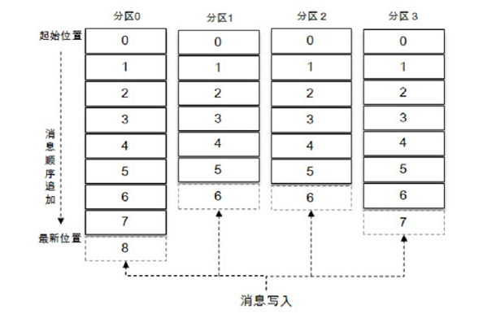

# 特别备注

+ 学习资料

  + 《深入理解Kafka：核心设计与实践原理》

    > 微信读书：https://weread.qq.com/web/reader/e9a32a0071848698e9a39b8kc81322c012c81e728d9d180

  + 官方文档：https://kafka.apache.org/documentation/
  
  + Kafka 问答网站：https://www.orchome.com/kafka/index
  
  + 李志涛博客：https://blog.csdn.net/lizhitao/article/details/39499283


# Kafka定位

分布式消息系统

分布式流式处理平台

# 一、Kafka体系架构

一个典型的 Kafka 体系架构包括若干 Producer、若干Broker、若干 Consumer，以及一个ZooKeeper集群。


+ Producer（生产者）：负责创建消息，然后将其发送到Broker。

+ Consumer（消费者）：从Broker订阅并消费消息。

+ Broker（服务器代理节点）：Broker可以简单地看作一个独立的Kafka服务节点或Kafka服务实例。

+ ZooKeeper：负责集群元数据的管理、控制器的选举等操作。

  > ZooKeeper是一个开源的分布式协调服务，分布式应用程序可以基于ZooKeeper实现诸如数据发布/订阅、负载均衡、命名服务、分布式协调/通知、集群管理、Master选举、配置维护等功能。

## 1. 主题

主题（Topic）：Kafka中的**消息以主题为单位进行归类**，生产者负责将消息发送到特定的主题，发送到Kafka集群中的**每一条消息都要指定一个主题**，消费者通过订阅主题进行消费。

## 2. 分区

分区（Partition）：主题可以进一步细分为多个分区，同一主题下的不同分区包含的消息是不同的，**分区在存储层面可以看作一个可追加的日志文件**，消息在被追加到分区日志文件的时候都会分配一个特定的偏移量（offset），offset是消息在分区中的唯一标识。



每一条消息被发送到broker之前，会根据分区规则选择存储到哪个具体的分区。

在创建主题的时候可以通过指定的参数来设置分区的个数，也可以在主题创建完成之后去修改分区的数量，通过增加分区的数量可以实现水平扩展。

### 2.1 多副本

Kafka 为分区引入了多副本（Replica）机制，通过增加副本数量可以提升容灾能力。

同一分区的不同副本中保存的是相同的消息，在某一时刻，副本之间的消息可能存在差别。

副本之间是**“一主多从**”的关系，其中**leader副本负责处理读写请求**，follower副本只负责与leader副本的消息同步。**副本处于不同的broker中**，当leader副本出现故障时，从follower副本中重新选举新的leader副本对外提供服务，从而实现故障的自动转移。


Kafka 消费端也具备一定的容灾能力。Consumer 使用拉（Pull）模式从服务端拉取消息，并且**保存消费的具体位置**，当消费者宕机后恢复上线时可以根据之前保存的消费位置重新拉取需要的消息进行消费。

分区中的所有副本统称为AR（Assigned Replicas）。所有与leader副本保持一定程度同步的副本（包括leader副本在内）组成ISR（In-Sync Replicas）。**消息会先发送到leader副本，然后follower副本才能从leader副本中拉取消息进行同步**，同步期间内follower副本相对于leader副本而言会有一定程度的滞后。

> 可忍受的滞后范围可以通过参数进行配置。

与leader副本同步滞后过多的副本组成OSR（Out-of-Sync Replicas）。leader副本负责维护和跟踪ISR集合中所有follower副本的滞后状态，当follower副本落后太多或失效时，leader副本会把它从ISR集合中剔除。如果OSR集合中有follower副本“追上”了leader副本，那么leader副本会把它从OSR集合转移至ISR集合。默认情况下，当leader副本发生故障时，**只有在ISR集合中的副本才有资格被选举为新的leader**，而在OSR集合中的副本则没有任何机会。

### 2.2 HW与LEO

HW（High Watermark，高水位）：标识了一个特定的消息偏移量（offset），消费者只能拉取到这个offset之前的消息。

LEO（Log End Offset）：标识当前日志文件中下一条待写入消息的offset。

对于某个分区来说，其在ISR集合中的每个副本都会维护自身的LEO，而**ISR集合中最小的LEO即为该分区的HW**。

# Windows安装Kafka

第一步：安装Zookeeper

第二步：安装Kafka

第三步：测试

1. 运行Zookeeper：打开CMD 输入命令 `zkServer`；（测试过程中不能关闭该CMD窗口）

2. 运行Kafka：在D:\kafka\kafka_2.13-3.1.0主目录下打开一个cmd窗口，输入命令：（测试过程中不能关闭该CMD窗口）

   ```bash
   start bin\windows\kafka-server-start.bat config\server.properties
   ```

3. 创建topic：在D:\kafka\kafka_2.13-3.1.0主目录下重新打开一个cmd窗口，输入以下命令创建一个topic；

   ```bash
   bin\windows\kafka-topics.bat --create --bootstrap-server localhost:9092 --replication-factor 1 --partitions 1 --topic kafka-test
   
   # 输出Created topic kafka-test.表示创建成功
   # --topic指定了所要创建主题的名称
   # --replication-factor 指定了副本因子
   # --partitions 指定了分区个数
   # --create是创建主题的动作指令
   ```

4. 查看已创建的topic

   ```bash
   bin\windows\kafka-topics.bat --list  --bootstrap-server localhost:9092
   ```

5. 新建生产者Producer：在D:\kafka\kafka_2.13-3.1.0主目录下重新打开一个cmd窗口，输入以下命令

   ```bash
   bin\windows\kafka-console-producer.bat --broker-list localhost:9092 --topic kafka-test
   
   # --broker-list指定了连接的Kafka集群地址
   # --topic指定了发送消息的主题
   ```

6. 新建消费者Consumer：在D:\kafka\kafka_2.13-3.1.0主目录下重新打开一个cmd窗口，输入以下命令

   ```bash
   bin\windows\kafka-console-consumer.bat --bootstrap-server localhost:9092 --topic kafka-test --from-beginning
   
   # --bootstrap-server指定了连接的Kafka集群地址
   # --topic指定了消费者订阅的主题
   ```

7. 生产者输入消息，消费者能很快获得。


