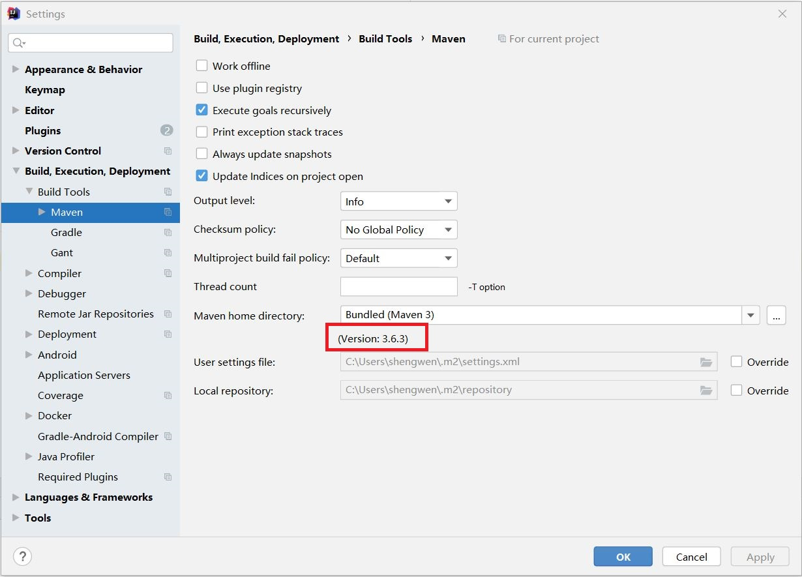

# 特别备注

+ 学习方式
  + 《Maven实战》许晓斌
  + Maven中文手册：https://www.dba.cn/book/maven/

# 一、Maven功能

Maven是一个开源的**项目管理工具**，**负责项目构建、项目依赖管理、项目信息管理**。

+ 项目构建：Maven作为一个项目构建工具，可以帮助开发者自动化构建过程（从源代码编译、运行单元测试、生成文档、到最后的打包和部署），开发者只需要输入简单的命令（如 `mvn clean install`），Maven就会自动进行项目构建。
+ 项目依赖管理：几乎任何Java应用都会使用一些第三方的开源类库，这些类库都可通过依赖的方式引入到项目中来。Maven提供了一个中央仓库，引入一个坐标系统标识每一个Java类库，只要提供一组坐标Maven能够找到一个唯一的Java类库并帮助开发者自动下载。
+ 项目信息管理：管理项目信息（包括项目描述、开发者列表、版本控制系统地址），通过Maven自动生成的站点，以及一些已有的插件，我们还能够轻松获得项目文档、测试报告、静态分析报告、源码版本日志报告等。

Maven由Java语言编写，所以安装Maven前需要配置Java环境。

# 二、Maven本地仓库

Windows系统中位置：`C:\Users\用户名\.m2\repository`

# 三、Maven项目目录结构

```
- src
  - main						
    - java			-- 存放项目的Java源代码
    - resources		-- 存放项目相关的资源文件（配置文件）
  - test
    - java			-- 存放项目的测试 Java 源代码
    - resources		-- 存放运行测试代码时所依赖的资源文件

- target			-- 项目编译后产生该目录，主要存放编译后的.class文件

- pom.xml			-- Maven项目的核心配置文件，定义项目的基本信息，声明项目依赖
```

## 1. pom.xml

 Maven项目的核心配置文件，定义项目的基本信息，声明项目依赖。

### 1.1 定义项目基本信息

```xml
<groupId>cn.edu</groupId>
<artifactId>learn</artifactId>
<version>0.0.1-SNAPSHOT</version>
<name>learn</name>
<description>learn Spring Boot</description>
```

+ groupId：定义项目属于哪个组，这个组往往和项目所在的组织或公司存在关联。
+ artifactId：定义当前Maven项目在组中唯一的ID
+ version：指定项目当前的版本，其中，SNAPSHOT意为快照，说明该项目还处于开发中，是不稳定的版本。
+ name：声明一个对于用户更为友好的项目名称，这个不是必须的

### 1.2 声明项目依赖

```xml
<dependencies>
    
    <dependency>
        <groupId>org.springframework.boot</groupId>
        <artifactId>spring-boot-starter-web</artifactId>
    </dependency>

    <dependency>
        <groupId>org.springframework.boot</groupId>
        <artifactId>spring-boot-starter-test</artifactId>
        <scope>test</scope>
    </dependency>

</dependencies>
```

+ dependencies：该元素下可以包含多个dependency元素，每个dependency元素表示项目的一个依赖。
+ dependency：每个依赖可以由一组Maven坐标唯一表示。
+ scope：表示依赖范围，为test表示该依赖只对测试有效；如果不声明依赖范围，那么默认值就是compile，表示该依赖对主代码和测试代码都有效。

> 第四章会有更详细的依赖声明介绍

## 2. src/main/java

Maven项目默认的Java源代码目录。

项目中Java类的包都应该基于项目的groupId和artifactId，如`package cn.edu.learn.config;`

# 四、Maven依赖管理

## 1. Maven坐标

Maven通过引入 **坐标系统** 唯一标识每一个Java类库。

Maven坐标的元素包括groupId、artifactId、version、packaging、classifier。

+ groupId：定义当前Maven项目隶属的实际项目，Maven项目和实际项目不一定是一对一的关系，如对于SpringFramework这一实际项目，其对应的Maven项目会有很多，如spring-core、spring-context等，即一个实际项目往往会被划分成很多子项目。groupId一般由项目隶属的组织或公司+实际项目名一起定义。

  ```xml
  <groupId>org.springframework.boot</groupId>
  ```

+ artifactId：定义实际项目中的一个Maven项目（模块），一般推荐的做法是使用实际项目名称作为artifactId的前缀。

  ```xml
  <artifactId>spring-boot-starter-web</artifactId>
  ```

+ version：定义Maven项目当前所处的版本。

+ packaging：（可选）定义Maven项目的打包方式，当不定义packaging的时候，Maven会使用默认值jar。

## 2. 声明项目依赖

每一个依赖声明可以包含如下元素：

```xml
<dependency>
    <groupId>...</groupId>
    <artifactId>...</artifactId>
    <version>...</version>
    <type>...</type>
    <scope>...</scope>
    <optional>...</optional>
    <exclusions>
        <exclusion>
            <groupId></groupId>
            <artifactId></artifactId>
        </exclusion>
    </exclusions>
</dependency>
```

+ groupId、artifactId和version：依赖的基本坐标；

  > maven项目的pom.xml有些依赖为什么可以不写版本号？
  >
  > **因为该pom.xml中定义了parent标签**，spring-boot-starter-parent为我们提供常用jar包版本，其实不是不用指定，是人家为我们指定好了。
  >
  > ```xml
  > <parent>
  >     <groupId>org.springframework.boot</groupId>
  >     <artifactId>spring-boot-starter-parent</artifactId>
  >     <version>2.5.5</version>
  >     <relativePath/> <!-- lookup parent from repository -->
  > </parent>
  > ```

+ type：依赖的类型，对应于项目坐标定义的packaging，省略时默认值为jar；

+ scope：依赖的范围；

+ optional：标记依赖是否可选；

+ exclusions：用来排除传递性依赖；


# Maven 常用命令

```bash
# Maven最主要的命令
mvn clean compile
mvn clean test
mvn clean package
mvn clean install
```

+ clean

  清除 target 目录，即将项目之前编译生成的class文件删除。

+ compile

  编译项目Java源代码，生成 target 目录，源代码经编译生成的class文件都存在于`target/classes`目录中。

+ test

  在Maven执行测试（test）之前，它会先自动执行项目主资源处理、主代码编译、测试资源处理、测试代码编译等工作。

+ package

  用于对项目进行打包。

+ install

  将当前项目生成的jar包，发布到Maven本地仓库中，供其他项目使用。


# IDEA中使用Maven

## 1. IDEA中查看Maven版本




# IDEA 构建 Maven + SpringBoot 项目生成的文件

## .idea 文件夹

存放项目的配置信息，包括数据源，类库，项目字符编码，历史记录，版本控制信息等；

## .mvn 文件夹

存放 mvnw 相关文件（如 maven-wrapper.properties 文件）；

## .gitignore

分布式版本控制系统 git 的配置文件，意思为忽略提交；

## mvnw

全名为 maven wrapper；

作用是在 maven-wrapper.properties 文件中记录你要使用的 maven 版本，当用户执行 mvnw clean 命令时，发现当前用户的 maven 版本和期望的版本不一致，那么就下载期望的版本，然后用期望的版本来执行mvn命令；

## mvnw.cmd

执行 mvnw 命令的cmd入口；


