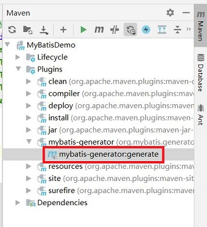
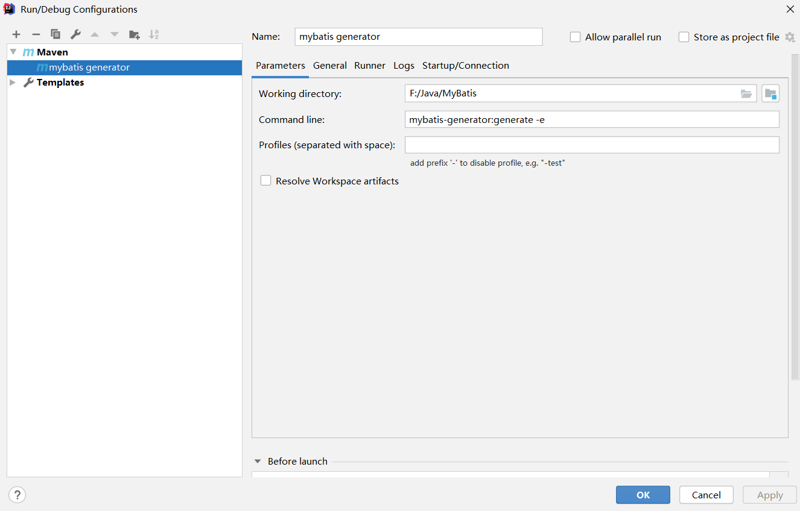

# IDEA配置自动生成MyBatis映射文件

## 方式一：使用Maven导入MyBatis自动生成插件

第一步：`pom.xml` 中添加依赖与插件

```xml
<dependency>
    <groupId>org.mybatis.generator</groupId>
    <artifactId>mybatis-generator-core</artifactId>
    <version>1.3.7</version>
</dependency>
```

```xml
<build>
    <plugins>
        <plugin>
            <groupId>org.mybatis.generator</groupId>
            <artifactId>mybatis-generator-maven-plugin</artifactId>
            <version>1.3.2</version>
            <configuration>
                <verbose>true</verbose>
                <overwrite>true</overwrite>
            </configuration>
        </plugin>
    </plugins>
</build>
```

> MyBatis Generator官方文档：https://mybatis.org/generator/index.html

第二步：在 `resources` 资源文件夹下创建 `generatorConfig.xml`

```xml
<?xml version="1.0" encoding="UTF-8"?>
<!DOCTYPE generatorConfiguration
        PUBLIC "-//mybatis.org//DTD MyBatis Generator Configuration 1.0//EN"
        "http://mybatis.org/dtd/mybatis-generator-config_1_0.dtd">

<generatorConfiguration>
    <!-- 指定数据库驱动jar包地址 -->
    <classPathEntry
            location="C:/Users/shengwen/.m2/repository/mysql/mysql-connector-java/8.0.23/mysql-connector-java-8.0.23.jar"/>
    <!-- 一个数据库一个context -->
    <context id="test" targetRuntime="MyBatis3">

        <!-- 注释 -->
        <commentGenerator>
            <!-- 是否生成注释时间戳-->
            <property name="suppressDate" value="true"/>
            <!-- 是否去除自动生成的注释 -->
            <property name="suppressAllComments" value="true"/>
        </commentGenerator>

        <!-- 数据库连接 -->
        <jdbcConnection driverClass="com.mysql.cj.jdbc.Driver"
                        connectionURL="jdbc:mysql://localhost:3305/sakila?useSSL=false&amp;serverTimezone=GMT"
                        userId="root"
                        password="123456">
        </jdbcConnection>

        <!-- 类型转换 -->
        <javaTypeResolver>
            <!-- 是否使用bigDecimal，false可自动转化以下类型（Long, Integer, Short, etc.） -->
            <property name="forceBigDecimals" value="false"/>
        </javaTypeResolver>

        <!-- 生成实体类地址 -->
        <javaModelGenerator targetPackage="org.example.entity" targetProject=".\src\main\java">
            <!-- 是否在当前路径下新加一层schema，eg：false路径cn.edu.bupt.test.pojo，true:cn.edu.bupt.test.pojo.[schemaName] -->
            <property name="enableSubPackages" value="false"/>
            <!-- 是否针对string类型的字段在set的时候进行trim调用 -->
            <property name="trimStrings" value="true"/>
        </javaModelGenerator>

        <!-- 生成XML映射文件的包名和位置-->
        <sqlMapGenerator targetPackage="mapper" targetProject=".\src\main\resources">
            <property name="enableSubPackages" value="false"/>
        </sqlMapGenerator>

        <!-- 生成DAO接口的包名和位置-->
        <javaClientGenerator type="XMLMAPPER" targetPackage="org.example.dao" targetProject=".\src\main\java">
            <property name="enableSubPackages" value="false"/>
        </javaClientGenerator>

        <!-- 指定自动生成的数据表,可以有多个table -->
        <!-- tableName是数据库中的表名或视图名 domainObjectName是实体类名-->
        <table tableName="customer" domainObjectName="Customer"
               enableCountByExample="false"
               enableUpdateByExample="false"
               enableDeleteByExample="false"
               enableSelectByExample="false"
               selectByExampleQueryId="false">
        </table>

    </context>
</generatorConfiguration>
```

第三步：启动 mybatis-generator 生成MyBatis映射文件

+ 方式一：点击如下按键




+ 方式二：在 IDEA 中添加一个 mybatis generator maven 插件启动选项，点击【Run】，选择【Edit Configuration… 】，点击加号"+"添加，选择maven，填写名称(这里用mybatis generator)，命令行：mybatis-generator:generate -e；

  最后执行该配置。

  

