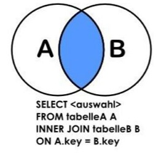
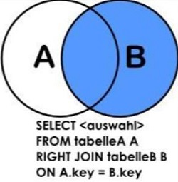
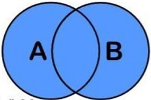

# 特别备注

+ 可以使用 **`help 命令`** 查询命令的详细信息；


# 一、SQL 语句分类

+ DDL：数据定义语言

  > 用于定义数据库对象，如数据库、表等

+ DCL：数据控制语言

  > 用于创建数据库用户、控制数据库的访问权限

+ DML：数据操纵语言

  > 用于对数据库表中的数据进行增删改

+ DQL：数据查询语言

  > 用于查询数据库中表的记录


# 二、MySQL 服务器

```mysql
-- 启动MySQL服务器  
	net start mysql
	
-- 连接MySQL服务器
	mysql -h 地址 -P 端口 -u 用户名 -p密码
	
-- 显示MySQL运行的线程  
	SHOW PROCESSLIST;
	
-- 查询MySQL系统变量
	SHOW [GLOBAL | SESSION] VARIABLES LIKE '系统变量名';
	-- 示例
	SHOW VARIABLES LIKE 'innodb_data_file_path';
```


# 三、数据库相关操作

+ 创建数据库

  ```mysql
  -- 语法格式
  CREATE DATABASE [IF NOT EXISTS] db_name [数据库选项]
  
  -- 数据库选项：
  	[DEFAULT] {
          CHARACTER SET [=] charset_name
        | COLLATE [=] collation_name
  	}
  ```

+ 其他

  ```mysql
  -- 查看已有数据库  
  	SHOW DATABASES;
  	
  -- 使用数据库
  	USE 数据库名;
  	
  -- 检索数据库中已有的数据表
  	SHOW TABLES;
  	SHOW TABLES[ LIKE 'pattern']
  	
  -- 查看当前数据库
  	SELECT DATABASE();
  	
  -- 显示用户名
  	SELECT user();
  	
  -- 显示数据库版本
  	SELECT version();
  	
  -- 修改数据库的选项信息
  	ALTER DATABASE 库名 选项信息
  	
  -- 删除数据库
  	DROP DATABASE[ IF EXISTS] 数据库名
  ```


# 四、数据表操作

## 1. 创建数据表

```mysql
-- 语法格式
CREATE [TEMPORARY] TABLE [IF NOT EXISTS] tbl_name
    (create_definition,...)
    [table_options]
    [partition_options]

-- TEMPORARY ：临时表，会话结束时表自动消失

-- create_definition中可以定义以下几部分：
-- 1.列定义
col_name data_type [NOT NULL | NULL] [DEFAULT default_value] [AUTO_INCREMENT] [UNIQUE [KEY]] [[PRIMARY] KEY]
-- 2.索引定义
KEY [index_name] [index_type] (key_part,...)
      [index_option] ...
      -- index_type: USING {BTREE | HASH}
      -- key_part: col_name
-- 3.主键定义
PRIMARY KEY [index_type] (key_part,...)
-- 4.外键定义
FOREIGN KEY [index_name] (col_name,...) reference_definition
	-- reference_definition 定义如下：
	REFERENCES tbl_name (key_part,...)
      [MATCH FULL | MATCH PARTIAL | MATCH SIMPLE]
      [ON DELETE RESTRICT | CASCADE | SET NULL | NO ACTION | SET DEFAULT]
      [ON UPDATE reference_option]
    -- reference_option
    RESTRICT | CASCADE | SET NULL | NO ACTION | SET DEFAULT
    
-- table_options可以定义如下部分：
ENGINE [=] engine_name
[DEFAULT] CHARACTER SET [=] charset_name
```

> 创建表示例：
>
> ```mysql
> CREATE TABLE `customer` (
>   `customer_id` smallint(5) unsigned NOT NULL AUTO_INCREMENT,
>   `store_id` tinyint(3) unsigned NOT NULL,
>   `first_name` varchar(45) NOT NULL,
>   `last_name` varchar(45) NOT NULL,
>   `email` varchar(50) DEFAULT NULL,
>   `address_id` smallint(5) unsigned DEFAULT NULL,
>   `active` tinyint(1) DEFAULT '1',
>   `create_date` datetime NOT NULL DEFAULT CURRENT_TIMESTAMP,
>   `last_update` timestamp NOT NULL DEFAULT CURRENT_TIMESTAMP ON UPDATE CURRENT_TIMESTAMP,
>   PRIMARY KEY (`customer_id`),
>   KEY `idx_fk_store_id` (`store_id`),
>   KEY `idx_fk_address_id` (`address_id`),
>   KEY `idx_last_name` (`last_name`),
>   CONSTRAINT `fk_customer_address` FOREIGN KEY (`address_id`) REFERENCES `address` (`address_id`) ON UPDATE CASCADE,
>   CONSTRAINT `fk_customer_store` FOREIGN KEY (`store_id`) REFERENCES `store` (`store_id`) ON UPDATE CASCADE
> ) ENGINE=InnoDB AUTO_INCREMENT=635 DEFAULT CHARSET=utf8mb4;
> ```

## 2. 复制表（创建表的另一种形式）

+ 场景一：复制表结构及其数据到新表

  ```mysql
  CREATE TABLE new_table AS SELECT * FROM old_table;
  -- 注：这种方式只是依据查询结果新建表，所以复制的新表没有主键、索引等信息。
  ```

+ 场景二：只复制表结构到新表

  ```mysql
  -- 方式一：使用LIKE关键字，这种方法会将主键、索引等信息一直复制
  CREATE TABLE [IF NOT EXISTS] new_table LIKE old_table;
  
  -- 方式二：不复制主键、索引等系信息
  CREATE TABLE new_table as SELECT * FROM old_table WHERE 1=2;
  ```

## 3. 删除表

```mysql
-- 删除一个或多个表
DROP TABLE [IF EXISTS] tbl_name [, tbl_name] 
```

## 4. 清空表

```mysql
TRUNCATE [TABLE] tbl_name
```

## 5. 查看表结构

```mysql
-- 方式一：以SQL语句的形式呈现
	SHOW CREATE TABLE 表名
	
-- 方式二：以表格的形式呈现
	DESC|DESCRIBE|EXPLAIN 表名
	SHOW COLUMNS FROM 表名
```

## 6. 修改表结构（ALTER）

```mysql
-- 语法格式
ALTER TABLE tbl_name
    [alter_option [, alter_option] ...]
```

+ 场景一：增加新字段

  ```mysql
  -- alter_option：
  ADD [COLUMN] col_name column_definition
          [FIRST | AFTER col_name]
  -- 默认将新增字段设置为数据表的最后列，FIRST作用是将新增字段设置为表的第一个字段，AFTER是将新增字段添加到指定字段后面
  ```

+ 场景二：增加新索引

  ```mysql
  -- alter_option：
  ADD {INDEX | KEY} [index_name]
          [index_type] (key_part,...) 
  -- index_type:
      USING {BTREE | HASH}
  -- key_part:
      col_name [(length)] [ASC | DESC]    
  ```

+ 场景三：创建主键

  ```mysql
  -- alter_option：
  ADD PRIMARY KEY [index_type] (key_part,...)
  ```

+ 场景四：新增外键

  ```mysql
  -- alter_option：
  ADD FOREIGN KEY
      [index_name] 
      (col_name,...)
      reference_definition
  ```

+ 其他场景

  ```mysql
  -- 修改表名
  	RENAME TO new_tbl_name
  	
  -- 修改字段数据类型
  	MODIFY COLUMN col_name column_definition
  
  -- 修改字段
  	CHANGE COLUMN old_col_name new_col_name column_definition
  ```

## 7. 外键（未修订）

被引用的表称为父表，引用的表称为子表；

与主键约束一起使用，为两个表的数据建立连接，保证两个表中数据的一致性和完整性；

**InnoDB 存储引擎在外键建立时会自动对该列增加一个索引**；

创建外键规则：

- 主表必须已经存在于数据库中，或者是当前正在创建的表。如果是后一种情况，则主表与从表是同一个表，这样的表称为自参照表，这种结构称为自参照完整性；
- **必须为主表定义主键**；
- 外键中列的数目必须和主表的主键中列的数目相同；

对于参照完整性约束，外键能起到很好的作用，但导入数据时，外键约束的检查会花费大量时间；可以通过命令在导入数据前关闭外键的检查：

```sql
SET foreign_key_checks = 0;
-- 导入数据后再设置为1
```

+ 创建外键

  有两种方式创建外键：一种是创建表时创建外键，另一种是表创建后通过 ALTER TABLE 创建外键；

  ```sql
  -- 创建表时创建外键
  [CONSTRAINT 外键名]					-- 为外键约束定义名称,如果省略，MySQL将自动生成一个名称
  FOREIGN KEY 字段1 [,字段2,...]) 	
  REFERENCES 主表(字段1 [,...])
  ON DELETE action	-- 定义当父表中的记录被删除时，子表的记录怎样执行操作。
  ON UPDATE action	-- 定义当父表中的记录更新时，子表中的记录会怎样执行操作
  
  -- 通过 ALTER TABLE 创建外键
  -- 添加外键约束的前提：从表中外键列中的数据必须与主表中主键列中的数据一致或者是没有数据
  ALTER TABLE 表名 ADD 
  CONSTRAINT 外键名
  FOREIGN KEY (字段1 [,...])
  REFERENCES 主表(字段1 [,...])
  ON DELETE action
  ON UPDATE action
  ```

+ 删除主键

  ```sql
  ALTER TABLE table_name 
  DROP FOREIGN KEY 外键名;
  ```

  


# 五、数据查询（select）

```mysql
-- 语法格式
SELECT
	[ALL | DISTINCT | DISTINCTROW ]		-- 默认为ALL,查询全部记录；
    select_expr [, select_expr ...]
    [FROM table_references]
    [WHERE where_condition]
    [GROUP BY {col_name | expr | position}, ... [WITH ROLLUP]]
    [HAVING where_condition]
    [ORDER BY {col_name | expr | position}
      [ASC | DESC], ... [WITH ROLLUP]]
    [LIMIT {[offset,] row_count | row_count OFFSET offset}]
```

> + `DISTINCT` ：用于查询列中不重复的字段值；
>   + 如果查询的列具有 NULL 值，将保留一个 NULL 值；
>   + 不能部分使用 DISTINCT，DISTINCT 关键字应用于全部列而不仅是前置他的列，如 `DISTINCT 字段1,字段2,...` 表示使用多个列的组合确定是否重复；
>   + 可以将聚合函数（例如 `SUM`、 `AVG`、`COUNT`）和 DISTINCT 配合使用，如：`SELECT COUNT(DISTINCT vend_id) FROM products;`
> + `select_expr`
>   + 可以使用 `*` 表示所有字段
>   + 一个或者多个字段
>   + 可以使用表达式（计算公式、函数调用）
>   + 可以使用 `AS` 关键字为每个 `select_expr` 设置别名

## 1. where 子句

where 子句用于设置查询条件。

查询条件可以使用多个操作符组合实现，MySQL 支持以下操作符：

+ 比较操作符

  ```mysql
  =
  <>或!=	-- 不等号有两种表示方式
  <
  <=
  >
  >=
  ```

  注：使用等号操作符匹配字符串时不区分大小写，如 'zhu' 与 'Zhu' 相等。

+ 逻辑操作符

  用于连接多个查询条件

  ```mysql
  ADD
  OR
  [NOT] BETWEEN 起始值 AND 终止值	-- 用于查找指定范围内的记录
  ```

  ```mysql
  -- 使用BETWEEN查询时间范围
  SELECT * 
  FROM 
  	k_student 
  WHERE 
  	create_time  between 
  	'2022-06-29 00:00:00' and 
  	'2019-06-29 23:59:59';    
  ```

+ IN 操作符

  用于判断指定的值是否与列表中的某个值匹配。

  ```mysql
  -- 示例
  SELECT 
      officeCode, city, phone, country
  FROM
      offices
  WHERE
      country IN ('USA' , 'France');
      
  -- IN操作符配合子查询一起使用
  SELECT 
  	name, sex, age
  FROM 
  	students
  WHERE 
  	uid IN (SELECT uid FROM user);
  ```

+ LIKE 关键字

  用于匹配字符串；

  匹配规则：

  + `%` ：匹配0个或者多个任意字符
  +  `_` ：匹配单个字符

  ```mysql
  -- 示例
  SELECT 
  	name, sex, age
  FROM 
  	students
  WHERE 
  	name LIKE 'Zhu%';
  ```

  > 注：LIKE 关键字匹配字符时不区分大小写；
  >
  > 尽量少使用这种方式进行查询，花费时间比较长。

+ 正则表达式

  配合关键字 `REGEXP` 使用；

  ```mysql
  -- 语法格式
  WHERE 匹配的列 REGEXP 正则表达式
  ```

  ```mysql
  -- 正则表达式书写规则：
  .		匹配除 "\n" 之外的任意单个字符
  |		或，满足其中一个即可
  []		匹配括号内包含的任意单个字符，可以配合^一起使用，如[^123]表示匹配方括号中未包含的任意单个字符
  [A-Z]	匹配任何大写字母
  [a-z]	匹配任何小写字母
  [0-9]	匹配从0到9的任何数字
  -- 匹配字符类	
  [:alnum:] 	任意字母和数字（同[a-zA-Z0-9]）
  [:alpha:] 	任意字符（同[a-zA-Z]）
  [:blank:] 	空格和制表（同[\\t]）
  [:cntrl:] 	ASCII控制字符（ASCII 0到31和127）
  [:digit:] 	任意数字（同[0-9]）
  [:graph:] 	与[:print:]相同，但不包括空格
  [:lower:] 	任意小写字母（同[a-z]）
  [:print:] 	任意可打印字符
  [:punct:] 	既不在[:alnum:]又不在[:cntrl:]中的任意字符
  [:space:] 	包括空格在内的任意空白字符（同[\\f\\n\\r\\t\\v]）
  [:upper:] 	任意大写字母（同[A-Z]）
  [:xdigit:] 	任意十六进制数字（同[a-fA-F0-9]）
  -- 匹配多个字符
  * 		匹配前面的子表达式零次或多次
  + 		匹配前面的子表达式一次或多次
  ? 		匹配前面的子表达式零次或一次
  {n} 	指定匹配的次数
  {n,} 	指定匹配的次数不少于指定数目
  {n,m} 	指定匹配的次数的范围（m不超过255）
  -- 定位符
  ^		匹配字符串的开始位置
  $		匹配字符串的结束位置
  [[:<:]]		匹配单词的开头
  [[:>:]]		匹配单词的结尾
  -- 注：如果要匹配上述特殊字符，使用转移字符转义，MySQL使用两个反斜杠\\进行转义
  ```

  > <span style="color:red;font-weight:bold">LIKE 关键字和 REGEXP 关键字区别：</span>
  >
  > + LIKE 将带有通配符的字符串与整个列值进行匹配，整个列值需要匹配带有通配符的字符串才能被检索出来；
  > + REGEXP 是对列值的子串进行匹配，只要该列值的某一个连续子串匹配该正则表达式就会被检索出来；

+ NULL 值检查

  ```mysql
  IS NOT NULL
  IS NULL
  ```

## 2. GROUP BY 子句

根据一个或者多个列将查询数据分为多个逻辑组，以便能对每个组进行聚集计算；

```mysql
-- 语法格式
SELECT 
	col_name, function(col_name)
FROM 
	table_name
WHERE 
	col_name operator value
GROUP BY 
	col_name;
```

+ 使用 `WITH ROLLUP`

  使用 `WITH ROLLUP` 关键字，可以实现在分组统计数据基础上再进行相同的统计；

  ```mysql
  SELECT
  	country_id,
  	COUNT( country_id ) as city_count
  FROM
  	city 
  WHERE
  	country_id BETWEEN 50 
  	AND 55 
  GROUP BY
  	country_id WITH ROLLUP;
  
  -- 查询结果
  +------------+------------+
  | country_id | city_count |
  +------------+------------+
  |         50 |         31 |
  |         51 |          2 |
  |         52 |          2 |
  |         53 |          1 |
  |         54 |          2 |
  |         55 |          1 |
  |       NULL |         39 |
  +------------+------------+
  ```

## 3. HAVING 子句

`HAVING` 子句配合 `GROUP BY` 子句一起使用，用来对分组进行过滤。

> `HAVING` 子句与 `WHERE` 子句功能、用法相同，但存在以下几点差异：
>
> + WHERE 用于过滤数据行，而 HAVING 用于过滤分组；
> + WHERE 查询条件中不可以使用聚合函数，而 HAVING 查询条件中可以使用聚合函数；
> + WHERE 在数据分组前进行过滤，而 HAVING 在数据分组后进行过滤；
> + **WHERE 根据数据表中的字段直接进行过滤，而 HAVING 是根据前面已经查询出的字段进行过滤**；

```mysql
-- 示例
SELECT
	country_id,
	COUNT( country_id ) AS city_count 
FROM
	city 
WHERE
	country_id BETWEEN 50 
	AND 55 
GROUP BY
	country_id 
HAVING
	city_count > 10;
```

## 4. MySQL 子查询

子查询指可以将一个查询语句嵌套在另一个查询语句中，可以进行多层嵌套。

子查询必须放置于括号中。

+ 子查询一般出现在 WHERE 子句中

  ```mysql
  -- 语法格式
  WHERE <表达式> <操作符> (子查询)
-- 操作符可以是比较运算符和 IN、NOT IN、EXISTS、NOT EXISTS 等关键字
  ```
  
  ```mysql
  -- 示例
  SELECT
  	city 
  FROM
  	city 
  WHERE
  	country_id = ( SELECT country_id FROM country WHERE country = 'China' );
  ```
  
+ 子查询出现在 FROM 子句中

  将子查询返回的结果集用作临时表，**必须给子查询结果取个别名**；

  ```mysql
  SELECT
  	MAX( count ) 
  FROM
  	( 
           SELECT 
              COUNT( city ) AS count 
           FROM 
              city 
           GROUP BY 
              country_id 
      ) AS city_count;
  ```

> + 子查询的功能也可以通过表联结完成，但是子查询会使 SQL 语句更容易阅读和编写；
> + 一般来说，表联结（内联结和外联结等）都可以用子查询替换，但反过来却不一定，有的子查询不能用表联结来替换。

## 5. 联结查询（JOIN）

联结查询即联结多个数据表并从中查询数据。

联结查询可以分为如下三类：

+ INNER JOIN（内连接，或等值连接）：获取两个表中字段匹配关系的记录；
+ LEFT JOIN（左连接）：获取左表所有记录，即使右表没有对应匹配的记录；
+ RIGHT JOIN（右连接）：与 LEFT JOIN 相反，用于获取右表所有记录，即使左表没有对应匹配的记录。

> MySQL 官方只提供了上述三种联结方式，但是可以通过拓展达到其他联结的效果。

### 1）笛卡尔积：CROSS JOIN

笛卡尔积就是将 A 表的每一条记录与 B 表的每一条记录拼在一起。

如果 A 表有 n 条记录，B 表有 m 条记录，笛卡尔积产生的结果就会产生 n*m 条记录。

笛卡尔积可以通过以下方式实现：

```mysql
-- 方式一：
SELECT * FROM tbl_A CROSS JOIN tbl_B;

-- 方式二：
SELECT * FROM tbl_A INNER JOIN tbl_B;
```

```mysql
-- 示例
mysql> select * from students;
+------------+--------+------+------+----------+
| student_id | name   | age  | sex  | class_id |
+------------+--------+------+------+----------+
|          1 | 张三   |   10 | 男   | 1        |
|          2 | 李四   |    9 | 女   | 2        |
|          3 | 王五   |   11 | 男   | 3        |
|          4 | 朱六   |   10 | 女   | 1        |
|          5 | 马七   |   11 | 男   | 2        |
+------------+--------+------+------+----------+
5 rows in set (0.00 sec)

mysql> select * from teachers;
+------------+--------------+----------+
| tecaher_id | teacher_name | class_id |
+------------+--------------+----------+
|          1 | 牛二         | 1        |
|          2 | 胡三         | 2        |
|          3 | 图四         | 4        |
+------------+--------------+----------+
3 rows in set (0.00 sec)

mysql> select * from students cross join teachers;
+------------+--------+------+------+----------+------------+--------------+----------+
| student_id | name   | age  | sex  | class_id | tecaher_id | teacher_name | class_id |
+------------+--------+------+------+----------+------------+--------------+----------+
|          1 | 张三   |   10 | 男   | 1        |          1 | 牛二         | 1        |
|          1 | 张三   |   10 | 男   | 1        |          2 | 胡三         | 2        |
|          1 | 张三   |   10 | 男   | 1        |          3 | 图四         | 4        |
|          2 | 李四   |    9 | 女   | 2        |          1 | 牛二         | 1        |
|          2 | 李四   |    9 | 女   | 2        |          2 | 胡三         | 2        |
|          2 | 李四   |    9 | 女   | 2        |          3 | 图四         | 4        |
|          3 | 王五   |   11 | 男   | 3        |          1 | 牛二         | 1        |
|          3 | 王五   |   11 | 男   | 3        |          2 | 胡三         | 2        |
|          3 | 王五   |   11 | 男   | 3        |          3 | 图四         | 4        |
|          4 | 朱六   |   10 | 女   | 1        |          1 | 牛二         | 1        |
|          4 | 朱六   |   10 | 女   | 1        |          2 | 胡三         | 2        |
|          4 | 朱六   |   10 | 女   | 1        |          3 | 图四         | 4        |
|          5 | 马七   |   11 | 男   | 2        |          1 | 牛二         | 1        |
|          5 | 马七   |   11 | 男   | 2        |          2 | 胡三         | 2        |
|          5 | 马七   |   11 | 男   | 2        |          3 | 图四         | 4        |
+------------+--------+------+------+----------+------------+--------------+----------+
15 rows in set (0.01 sec)
```

### 2）INNER JOIN（可以省略 INNER，效果一样）

`INNER JOIN` 就是从笛卡尔积中挑出 ON 子句条件成立的记录。



```mysql
-- 示例
SELECT
	s.student_id,
	s.name AS student_name,
	s.class_id,
	t.teacher_name 
FROM
	students s
	INNER JOIN teachers t ON s.class_id = t.class_id;
-- 查询结果如下：
+------------+--------------+----------+--------------+
| student_id | student_name | class_id | teacher_name |
+------------+--------------+----------+--------------+
|          1 | 张三         | 1        | 牛二         |
|          2 | 李四         | 2        | 胡三         |
|          4 | 朱六         | 1        | 牛二         |
|          5 | 马七         | 2        | 胡三         |
+------------+--------------+----------+--------------+
```

### 3）左连接：LEFT JOIN

先从笛卡尔积中挑出ON子句条件成立的记录，然后加上左表中剩余的记录。


```mysql
SELECT
	s.student_id,
	s.NAME AS student_name,
	s.class_id,
	t.teacher_name 
FROM
	students s
	LEFT JOIN teachers t ON s.class_id = t.class_id;
-- 查询结果如下：
+------------+--------------+----------+--------------+
| student_id | student_name | class_id | teacher_name |
+------------+--------------+----------+--------------+
|          1 | 张三         | 1        | 牛二         |
|          4 | 朱六         | 1        | 牛二         |
|          2 | 李四         | 2        | 胡三         |
|          5 | 马七         | 2        | 胡三         |
|          3 | 王五         | 3        | NULL         |
+------------+--------------+----------+--------------+
```

### 4）右连接：RIGHT JOIN

先从笛卡尔积中挑出ON子句条件成立的记录，然后加上右表中剩余的记录。



```mysql
SELECT
	s.student_id,
	s.NAME AS student_name,
	s.class_id,
	t.teacher_name 
FROM
	students s
	RIGHT JOIN teachers t ON s.class_id = t.class_id;
-- 查询结果如下：
+------------+--------------+----------+--------------+
| student_id | student_name | class_id | teacher_name |
+------------+--------------+----------+--------------+
|          1 | 张三         | 1        | 牛二         |
|          2 | 李四         | 2        | 胡三         |
|          4 | 朱六         | 1        | 牛二         |
|          5 | 马七         | 2        | 胡三         |
|       NULL | NULL         | NULL     | 图四         |
+------------+--------------+----------+--------------+
```

### 5）外连接：OUTER JOIN

从笛卡尔积中挑出ON子句条件成立的记录，然后加上左表中剩余的记录，最后加上右表中剩余的记录。

MySQL 不支持 OUTER JOIN ，但可以通过对左连接和右连接的结果做UNION操作来实现。



```mysql
SELECT
	s.student_id,
	s.NAME AS student_name,
	s.class_id,
	t.teacher_name 
FROM
	students s
	LEFT JOIN teachers t ON s.class_id = t.class_id 
UNION
SELECT
	s.student_id,
	s.NAME AS student_name,
	s.class_id,
	t.teacher_name 
FROM
	students s
	RIGHT JOIN teachers t ON s.class_id = t.class_id;
-- 查询结果如下：
+------------+--------------+----------+--------------+
| student_id | student_name | class_id | teacher_name |
+------------+--------------+----------+--------------+
|          1 | 张三         | 1        | 牛二         |
|          4 | 朱六         | 1        | 牛二         |
|          2 | 李四         | 2        | 胡三         |
|          5 | 马七         | 2        | 胡三         |
|          3 | 王五         | 3        | NULL         |
|       NULL | NULL         | NULL     | 图四         |
+------------+--------------+----------+--------------+
```

### 6）联结拓展

左表中除去ON子句条件成立的记录后剩下的部分。


```mysql
SELECT
	s.student_id,
	s.NAME AS student_name,
	s.class_id,
	t.teacher_name 
FROM
	students s
	LEFT JOIN teachers t ON s.class_id = t.class_id 
WHERE
	t.teacher_name IS NULL;
-- 查询结果如下：
+------------+--------------+----------+--------------+
| student_id | student_name | class_id | teacher_name |
+------------+--------------+----------+--------------+
|          3 | 王五         | 3        | NULL         |
+------------+--------------+----------+--------------+
```

## 6. 联合查询（UNION）

联合查询用于将多条 SELECT 语句的查询结果合并为单个查询结果集。

```mysql
-- 语法格式
SELECT ...
UNION [ALL | DISTINCT]
SELECT ...
```

> 注：
>
> + 每个 SELECT 查询语句必须包含相同的列、表达式或者聚集函数；
> + 列数据类型必须兼容：类型不必完全相同，但必须是DBMS可以隐含地转换的类型；
> + `ALL` 表示返回所有结果集，包含重复数据；`DISTINCT` 表示删除结果集中重复的数据，默认情况下 UNION 操作符已经删除了重复数据，所以可以省略；
> + 对组合查询结果排序：在最后一条 SELECT 查询语句后使用 ORDER BY 语句；

```mysql
SELECT vend_id, prod_id, prod_price
FROM products
WHERE prod_price <= 5
UNION
SELECT vend_id, prod_id, prod_price
FROM products
WHERE vend_id IN (1001, 1002);

-- 完成相同工作的WHERE子句
SELECT vend_id, prod_id, prod_price
FROM products
WHERE prod_price <= 5
	OR vend_id IN (1001, 1002);
```

## 7. 计算字段

存储在数据库中的数据一般不是应用程序所需要的格式。为了满足应用程序需要的格式，我们需要将数据库中的数据进行转换、计算或者格式化，这些**经过加工的数据就叫做计算字段**。

计算字段可以看作数据表中新增的一列，但计算字段并不实际存在于数据库表中。

> 注：使用数据库对需要的数据进行转换、计算或格式化再传递给其他程序比在其他程序中完成这些操作要快得多；
>

+ 算术运算

  MySQL支持加减乘除算术运算；

+ 拼接字段

  将多个列的值连接到一起构成一个字符串。

  多数DBMS使用` + `或者` ||` 实现拼接，MySQL使用`Concat()`函数来实现。

  `concat(字段1, 字段2, …)`：如果有任何一个字段值为NULL，返回值为NULL；

  `concat_ws(separator, str1, str2, ...)`：使用指定分隔符连接字段值；分隔符可以是一个字符串，也可以是其它参数；如果分隔符为NULL，则结果为NULL。和concat函数不同的是，除了分隔符以外的参数为NULL时结果不为NULL。

+ 文本处理函数

  ```mysql
  Length()		获取字符串字节长度
  char_length()	获取字符串字符个数
  Upper()			将串转换为大写
  Lower()			将串转换为小写
  Locate(str1,str2)	返回子串str1在字符串str2中的位置 		
  Left(str,n) 	截取str左边n个字符
  Right() 		截取str右边n个字符
  substring(str,index,len)	从str的index位置截取len个字符
  LTrim(str) 		去掉串左边的空格
  RTrim(str) 		去掉串右边的空格
  trim()			去除字符串str两边的空格
  ```

+ 日期和时间函数

  ```mysql
  CurDate()	返回当前日期	// 2020-10-19
  CurTime()	返回当前时间	// 14:58:37
  Now() 		返回当前日期和时间	// 2020-10-19 14:59:22
  Date()	Time() 返回日期时间的日期和时间
  Year(date)	Month(date)/MonthName(date) Day(date) 	//获取日期的年、月、日，可以接受日期时间类型的参数
  Hour(time) 	Minute(time)	Second(time)		// 获取时间的时、分、秒，可以接受日期时间类型的参数
  weekday(date)/dayname(date)	//获取星期几
  ```

+ 数值处理函数

  ```mysql
  Abs() 返回一个数的绝对值
  Mod() 返回除操作的余数
  Rand() 返回一个随机数
  Sqrt() 返回一个数的平方根
  ```

+ 聚集函数

  ```java
  AVG()
    返回指定列的平均值；
    只适用于数值列；
    忽略列值为NULL的行；
  COUNT()
    计算行的数目；
    COUNT(*) 对表中所有行进行计数，不管字段值是空值（NULL）还是非空值。
    COUNT(column)  忽略NULL值。
  MAX()
  MIN()
  SUM() 
  `DISTINCT`：可以通过该关键字实现聚集不重复行的功能；
  
  eg:`SELECT COUNT(DISTINCT CLASS) FROM test;`
  ```


# 六、insert/delete/update

+ 插入

  可以通过四种方式插入数据：

  + 插入完整的行；
  + 插入行的一部分；
  + 插入多行；
  + 插入查询的结果；

  ```sql
  -- 插入完整的行
  	INSERT INTO tbl_name
  	[(col_name, ...)]	-- 应该尽量避免省略这一部分，否则将高度依赖于表中列的定义次序，以及需要给每一列给出一个值
  	VALUES(value_1, value_2, ... );
  	
  -- 插入行的一部分
  	插入一行数据时只给其中一部分列提供值；
  	省略的列必须满足以下某个条件：
  		该列允许NULL值（无值或空值）；
  		在表定义中给出默认值；
  	
  -- 插入多个行
  	单条 INSERT语句有多组值，每组值用一对圆括号括起来，用逗号分隔；
  	VALUE (...),(...), ...;
  
  -- 插入查询的结果
  	INSERT INTO tbl_name
  	(col_name, ...)
  	SELECT (col_name, ...)
  	FROM tbl_name;
  ```

+ 更新数据

  ```sql
  -- UPDATE 语句由3部分组成：1.要更新的表；2.列名和他们的新值；3.确定要更新行的过滤条件
  -- 语法格式：
      UPDATE tbl_name
      SET col_name = value_1 [, col2_name = value_2, ...]		-- 更新多个列时，只需要使用单个SET命令，每个“列=值”对之间用逗号分隔
      WHERE ...		-- 省略WHERE子句将更新所有的行
  -- 使用注意事项：
  	UPDATE 语句中可以使用子查询检索出的数据更新列数据；
  	如果用 UPDATE语句更新多行，在更新这些行中的一行或多行时出现错误，则整个 UPDATE操作被取消（错误发生前更新的所有行被恢复到它们原来的值）。如果在即使发生错误的情况下也继续进行更新，可使用IGNORE关键字： UPDATE IGNORE tbl_name…
  	可以使用 UPDATE来删除某个列的值，设置该列值为 NULL;
  ```

+ 删除数据

  ```sql
  DELETE FROM tbl_name
  WHERE ...		
  -- 省略WHERE子句将删除所有的行；如果要删除所有的行，可使用TRUNCATE TABLE语句，它完成相同的工作，但速度更快
  ```

  

# 七、视图（MySQL 5）

1. 什么是视图

   视图是虚拟表，**由一个 SQL 查询定义**，可以当做表使用；

   视图的数据是从其他表中检索出来的，在添加或更改这些表中的数据时，视图将返回改变后的数据；

2. 视图作用

   + 简化复杂查询：
   + 提高了数据库的安全性：数据库视图允许创建只读视图；争对不同的用户设定不同的视图；
   + 重用SQL语句；
   + 格式化基础数据；

   视图缺点：性能（从数据库视图查询数据可能会很慢）、表依赖关系（每当更改与其相关联的表的结构时，都必须更改视图）；

```sql
-- 创建视图
	-- 视图名必须唯一
	-- 视图不能索引，也不能有关联的触发器
	CREATE [OR REPLACE]
    VIEW view_name
    [(column_list)]
    AS select_statement		
    -- OR REPLACE 子句：如果视图不存在，创建一个视图，如果视图存在，代替那个视图
    -- 示例
    CREATE VIEW productcustomers AS
    SELECT cust_name, cust_contact, prod_id
    FROM customers, orders, orderitems
    WHERE customers.cust_id = orders.cust_id
    AND orderitems.order_num = orders.order_num;
    
-- 删除视图
	DROP VIEW view_name;
	
-- 更新视图
	视图通常是可更新的（即可以对其进行 insert、update、delete操作）；
	更新一个视图将对其关联的基表进行相应的更新；
	如果 MySQL不能正确地确定被更新的基数据，则不允许更新，如果视图包含如下操作将不允许更新：分组、联结、子查询、并、聚集函数、DISTINCT、导出列；
	一般，应该将视图用于检索而不是更新；
```


# 八、触发器（MySQL 5）

触发器的作用是在执行 insert、delete 和 update命令之前或之后自动调用 SQL 命令或存储过程；

```sql
/*
 创建触发器
 在创建触发器时，需要给出4条信息：
 	触发器名
 	触发器关联的表
 	触发事件（DELETE、INSERT或UPDATE）
 	触发器何时执行（DELETE、INSERT、UPDATE 操作之前或之后）
*/
	CREATE TRIGGER 触发器名  
    AFTER[BEFORE] INSERT[DELETE|UPDATE] 
    ON 表名 
    FOR EACH ROW 
    自动执行的语句（触发体）
-- 注：每个表中每个事件只允许存在一个触发器，因此，每个表最多支持6个触发器（每条INSERT、UPDATE和DELETE的之前和之后）
-- 如果 BEFORE触发器失败， MySQL将不执行触发事件的操作
-- 如果触发器需要执行多条语句，需要使用BEGIN和END作为开始和结束的标志，

-- 删除触发器
	DROP TRIGGER 触发器名;
```

## INSERT 触发器

在 INSERT触发器中，可引用一个名为NEW的虚拟表，访问被插入的行；

在 BEFORE INSERT 触发器中，NEW 中的值也可以被更新（允许更改被插入的值）；

对于 AUTO_INCREMENT 列，NEW 在 INSERT 执行之前包含0，在INSERT 执行之后包含新的自动生成值；

```mysql
CREATE TRIGGER neworder AFTER INSERT ON orders FOR EACH ROW SELECT NEW.order_num INTO @变量；
-- 每次执行插入操作后都会将order.num赋值给变量；SELECT @变量 就可以查询变量值
```

## DELETE 触发器

在DELETE触发器中，可引用一个名为OLD的虚拟表，访问被删除的行；

OLD中的值全都是只读的，不能更新；

```mysql
CREATE TRIGGER deleteorder BEFORE DELETE ON orders
FOR EACH ROW
BEGIN
	INSERT INTO archive_orders(order_num, order_date, cust_id)
	VALUES(OLD.order_num, OLD.order_date, OLD.cust_id)
END;
-- 触发器使用BEGIN END 语句标记触发体，可以在触发体中执行多条语句
```

## UPDATE 触发器

在UPDATE触发器中，可以引用一个名为OLD的虚拟表访问更新前的值，引用一个名为NEW的虚拟表访问更新后的值；

在BEFORE UPDATE触发器中，NEW中的值可能也被更新（允许更改将要用于UPDATE语句中的值）；

OLD中的值全都是只读的，不能更新；


# 九、存储过程(MySQL 5)

存储过程：**为了完成特定功能的SQL语句集，经编译后保存在数据库中，用户可通过指定存储过程的名字并给定参数(需要时)来调用执行**；（相当于一个函数）

存储过程作用：

+ 增强SQL语句的功能和灵活性：可以使用流程控制语句，有很强的灵活性，可以完成复杂的判断和较复杂的运算；
+ 提高数据库的访问效率：因为SQL语句已经预编绎过了，因此运行的速度比较快；
+ 提高数据库的安全性和数据的完整性；

存储过程实现了 SQL语言层面的代码封装与重用；

1. 创建存储过程

   ```sql
   -- 创建存储过程
       CREATE PROCEDURE 存储过程名(无参或者有参)
       BEGIN
           mysql语句
       END
   
   -- 声明存储过程语句结束符：mysql命令行程序的分隔符为';'，mysql语句的分隔符也为`;`，所以在命令行程序中创建存储过程时应该临时更改命令行程序的分隔符
       DELIMITER //	-- 使用//作为命令行程序语句分隔符
       创建存储过程
       //				-- 表示创建存储过程结束
       DELIMITER ;		-- 恢复原来的语句分隔符
       
   -- 调用存储过程
   	CALL 存储过程名(参数);
   	
   -- 删除存储过程
   	DROP PROCEDURE 存储过程名;	-- 如果指定的过程不存在，将会产生一个错误，所以可以使用 IF EXISTS 子句
   ```

2. 存储过程的参数

   存储过程参数用于向存储过程传递值或者保存存储过程结果；

   有三种参数类型：IN、OUT、INOUT；

   + IN 输入参数：表示调用者向过程传入值（传入值可以是字面量或变量）；
   + OUT 输出参数：表示过程向调用者传出值(可以返回多个值)（传出值只能是变量）；
   + INOUT 输入输出参数：既表示调用者向过程传入值，又表示过程向调用者传出值（值只能是变量）；

   ```sql
   -- 创建存储过程时需要为参数指定数据类型；
   -- 将存储过程的结果赋值给参数使用`INTO`关键字；
   CREATE PROCEDURE productpricing
   (
   	OUT price_min DECIMAL(8,2),
   	OUT price_max DECIMAL(8,2),
   	OUT price_avg DECIMAL(8,2)
   )
   BEGIN
   	SELECT Min(prod_price) INTO price_min FROM products;
   	SELECT Max(prod_price) INTO price_max FROM products;
   	SELECT Avg(prod_price) INTO price_avg FROM products;
   END
   ```

3. 存储过程中使用变量

   ```sql
   -- 声明变量
   	declare 变量名 数据类型 [DEFAULT value];
   	
   -- 变量赋值
   	SET 变量名 = 值 [,variable_name = expression ...]
   	
   -- 用户变量名一般以@开头
   SELECT 'Hello World' into @message;
   select @message;
   set @message = "study";
   ```

4. 存储过程的控制语句

   + if-then-else 语句

     ```sql
     CREATE PROCEDURE max(IN NUM1 INT, in num2 int, out max_num int)
     begin
     	if(num1>num2) then
     		select num1 into max_num;
     	else
     		select num2 into max_num;
     	end if;
     end;	
     ```

   + case语句

     ```
     CREATE PROCEDURE proc(IN num INT, out num2 int)
     begin
     	case num
     	when 0 then
     		select 0 into num2;
     	when 1 then
     		select 1 into num2;
     	end case;
     end;
     ```

   + while 循环

     ```
     CREATE PROCEDURE proc(IN num INT, out num2 int)
     begin
     	declare temp int;
     	set temp = 0;
     	while num<10 do
     		set temp = temp*2;
     	end while;
     	select temp into num2;
     end;
     ```


# 十、游标（MySQL 5）

游标存储了MySQL查询结果集，使用游标可以对MySQL检索得到的数据集逐行进行处理；

**MySQL 游标只能用于存储过程**；

1. 使用游标步骤

   - 创建游标
     使用`DECLARE`关键字创建；

     ```mysql
     DECLARE 游标名 CURSOR
     FOR
     SELECT 查询语句;
     ```

   - 打开游标
     执行SELECT 语句得到查询结果集；

     ```mysql
     OPEN 游标名;
     ```

   - 对结果集逐行处理

     使用FETCH 关键字访问每一行；

     ```mysql
     CREATE PROCEDURE students_name()
     BEGIN
     	-- 定义局部变量
     	DECLARE stu_name STRING;
     	-- 定义游标
     	DECLARE name_cursor CURSOR
     	FOR
     	SELECT name FROM students;
     	-- 打开游标
     	OPEN name_cursor;
     	-- 将第一行数据赋值给局部变量
     	FETCH name INTO stu_name;
     	-- 关闭游标
     	CLOSE name_cursor
     END;
     ```

   - 关闭游标

     ```mysql
     CLOSE 游标名;
     ```

     在一个游标关闭后，如果没有重新打开，则不能使用它；

     如果没有关闭游标，MySQL将会在执行到存储过程END语句时自动关闭它。


