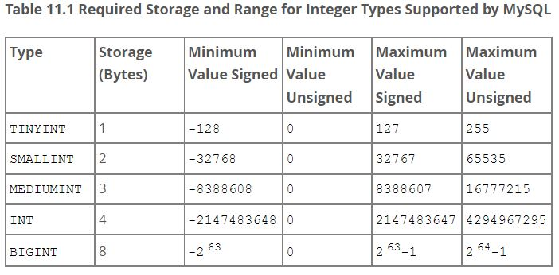

# MySQL 数据类型

MySQL 支持的数据类型可以分为以下几类：

+ 数值类型
+ 日期时间类型
+ 字符串类型
+ 空间类型（spatial types）
+ JSON 数据类型

## 1. 数值类型

MySQL 支持所有的标准 SQL 数值类型。

### 1）整数类型

MySQL 支持的整数类型及其需要的存储空间、表示范围如下图所示：



整数类型的语法格式如下所示：

```mysql
#以INTEGER为例，其他数据类型与之相似
INTEGER[(M)] [UNSIGNED] [ZEROFILL]
```

> 备注：
>
> + `INTEGER` 与 `INT` 同义；
> + MySQL 对于每个整数类型都提供了可选的 `unsigned` 属性，用于表示无符号整数；
> + MySQL 可以为整数类型指定显示宽度，如`int(5)`，显示宽度不会限制列中值的合法范围，也不会限制宽于列显示宽度的值正确显示，由应用程序决定是否使用此可选的显示宽度来显示整数值。
> + MySQL 中所有整数计算都会转换为 BIGINT 进行计算，即使在32位机器上也是如此；

### 2）定点类型（精确值）

> 计算机中存储小数时有两种表示方法：
>
> + 定点数：小数点的位置是固定的

DECIMAL 数据类型语法格式如下所示，其中 M 表示数字的总位数，D 表示小数点后的位数：

```sql
DECIMAL[(M[,D])] [UNSIGNED] [ZEROFILL]
```

> 备注：
>
> + 小数点和`-`符号（对于负数）不计入 M ；
> + M 取值范围：1~65，不指定时默认值为 10；
> + D 取值范围：0~30，不指定时默认值为 0；
> + MySQL 以二进制格式存储 `DECIMAL` 值

### 3）浮点类型（近似值）

MySQL 使用 4 个字节存储 FLOAT 值，使用 8 个字节存储 DOUBLE 值。

使用浮点类型的语法格式如下所示， M 表示数字的总位数，D 表示小数点后的位数：

```mysql
FLOAT[(M,D)] [UNSIGNED] [ZEROFILL]
DOUBLE[(M,D)] [UNSIGNED] [ZEROFILL]
```

> 备注：
>
> + MySQL 使用 `DOUBLE` 作为内部浮点计算的类型，如`DECIMAL`类型计算时会转换为 `DOUBLE` 类型；

### 4）数值类型属性

+ ZEROFILL 属性

  填充零，在插入数据时，当插入值的长度小于定义的显示宽度时，会在该值的前面补上相应的0；

  > 示例：如果某列声明为 `SMALLINT(3) `，插入值 5 时会自动填充为：`005`

  如果为数值类型列指定 `ZEROFILL`（即填充零），MySQL 会自动地为该列添加`UNSIGNED`属性；

  ```mysql
  `active` tinyint(1) unsigned zerofill 
  ```

## 2. 日期时间类型

MySQL 支持的日期时间类型如下所示：

|   类型    | 存储大小 ( 字节) |                       有效值范围                       |        零值         |        格式         |                   备注                   |
| :-------: | :--------------: | :----------------------------------------------------: | :-----------------: | :-----------------: | :--------------------------------------: |
|   DATE    |        3         |              `1000-01-01` 到 `9999-12-31`              |     0000-00-00      |     YYYY-MM-DD      | MySQL 允许使用字符串或数字给 DATE 列赋值 |
|   TIME    |        3         |             `'-838:59:59'`到`'838:59:59'`              |      00:00:00       |      hh:mm:ss       |                                          |
|   YEAR    |        1         |                  从 `1901` 到 `2155`                   |        0000         |        YYYY         |                                          |
| DATETIME  |        8         |     `1000-01-01 00:00:00` 到 `9999-12-31 23:59:59`     | 0000-00-00 00:00:00 | YYYY-MM-DD hh:mm:ss |                与时区无关                |
| TIMESTAMP |        4         | `1970-01-01 00:00:01 UTC` 到 `2038-01-19 03:14:07 UTC` | 0000-00-00 00:00:00 |  YYYYMMDD hh:mm:ss  |            显示的值与时区有关            |

MySQL 以标准输出格式检索给定日期或时间类型的值，如日期部分必须始终以年月日（例如`'1998-09-04'`）给出。

默认情况下，当 MySQL 遇到日期或时间类型的值超出范围或无效值时，会使用零值代替。

### 1）TIMESTAMP

定义 `TIMESTAMP` 类型的列时，MySQL 的处理方式取决于 `explicit_defaults_for_timestamp ` 系统变量的值（该系统变量已被弃用，其控制的时间戳行为也被弃用）：

+ 如果启用了`explicit_defaults_for_timestamp ` ，则不会将 `DEFAULT CURRENT_TIMESTAMP` 或 `ON UPDATE CURRENT_TIMESTAMP` 属性自动分配给任何 `TIMESTAMP`  列；
+ 如果禁用了 `explicit_defaults_for_timestamp ` （默认），如果未显式分配值，则 table 中的第一 `TIMESTAMP` 列被定义为自动更新为最新修改的日期和时间。

MySQL 将 TIMESTAMP 值从当前时区转换为 UTC 来存储，然后从 UTC 转换回当前时区以进行检索。

### 2）TIME

`TIME`类型不仅可以表示一天中的某个时间，也可以表示两个事件之间的时间间隔（可能比24小时大，也可能是负数）

> 特别备注：默认情况下，位于 `TIME` 范围之外但有效的值将被裁剪到该范围的最近端点，如 `850:00:00` 裁剪为 `838:59:59`，无效的 `TIME` 值将转换为`'00:00:00'`

### 3）自动初始化和更新策略

可以为 `TIMESTAMP` 和 `DATETIME` 列设置自动初始化或者自动更新为当前时间戳。

> 当插入一条记录时，未指定值时将自动初始化为当前时间戳；
>
> 当对行中的其他列值进行更新时，自动更新时间到当前时间戳；（如果其他列更新为其当前值，即更新操作后列的值不变，将不会自动更新时间）
>
> 为防止自动更新的列在其他列更改时更新，需要将其显式设置为当前值；

在列定义时使用 **`DEFAULT CURRENT_TIMESTAMP`** 和 **`ON UPDATE CURRENT_TIMESTAMP`**  为列指定自动初始化和更新到当前日期和时间。

```mysql
`update_time` timestamp NOT NULL DEFAULT CURRENT_TIMESTAMP ON UPDATE CURRENT_TIMESTAMP
```

> `CURRENT_TIMESTAMP` 的同义词（即可以使用其他词进行代替）：CURRENT_TIMESTAMP()、NOW()、LOCALTIME、 LOCALTIME()、LOCALTIMESTAMP、 LOCALTIMESTAMP()

### 3）时间值的小数秒

**MySQL 支持 TIME、DATETIME、TIMESTAMP类型的值包含<span style="color:red">小数秒</span>，精度可达微妙（6位数），要定义包含小数秒部分的列，使用语法`type_name(fsp)`，其中 fsp 表示小数秒精度，fsp 的取值范围为0~6。**

```mysql
create table test (t1 timestamp(3), t2 datetime(6));
```

将带有小数秒部分的值插入到相同类型的列中，如果插入列允许的小数位数较少，MySQL会进行舍入。

> MySQL5.7之前，如何存储比秒更小粒度的时间值？
>
> + 方式一：使用BIGINT类型存储微妙级别的时间戳
> + 方式二：使用DUOBLE存储秒之后的小数部分

## 3. 字符串类型

| 类型       | 空间大小（与编码无关）              | 备注                         |
| :--------- | :---------------------------------- | :--------------------------- |
| CHAR       | 最多 255 个字符                     | 定长字符串                   |
| VARCHAR    | 最多 65535 个字符                   | 变长字符串                   |
| TINYBLOB   | 最多 255 个字符                     | 二进制字符串                 |
| TINYTEXT   | 最多 255 个字符                     | 短文本字符串                 |
| BLOB       | 最多 65535 个字符，即 `2^16-1`      | 二进制形式的长文本数据       |
| TEXT       | 最多 65535 个字符                   | 长文本数据                   |
| MEDIUMBLOB | 最多 16777215 个字符，即 `2^24-1`   | 二进制形式的中等长度文本数据 |
| MEDIUMTEXT | 最多 16777215 个字符                | 中等长度文本数据             |
| LONGBLOB   | 最多 4294967295 个字符，即 `2^32-1` | 二进制形式的极大文本数据     |
| LONGTEXT   | 最多 4294967295 个字符              | 极大文本数据                 |

### 1）VARCHAR/CHAR

在定义 `CHAR` 和 `VARCHAR` 类型的列时，需要指定可以存储字符的最大长度，如 `CHAR(M)` 表示该列最多可存储 M 个字符。

`CHAR(M)` ：定长字符串。

> 存储值：如果插入数据的长度小于 char 的固定长度，会使用空格在字符串末尾填充；
>
> 由于长度固定，`char`的存取速度要比 `varchar` 快得多，方便程序的存储与查找，但也因为其长度固定，所以可能会占用多余的空间；

 `VARCHAR(M)` ：变长字符串。


## 优化数据类型

+ 尽量使用能够正确存储数据的最小数据类型；

  > 更小的数据类型通常处理速度更快，因为占用更少的磁盘、内存和CPU缓存。
  >
  > 如果存储的数据量很大，后期修改数据类型是一个非常耗时的操作。

+ 选择合适的数据类型

  + 整型比字符串的操作代价更低；
  + 使用日期时间类型存储日期和时间，而不是字符串；
  + 使用整型存储IP地址。


