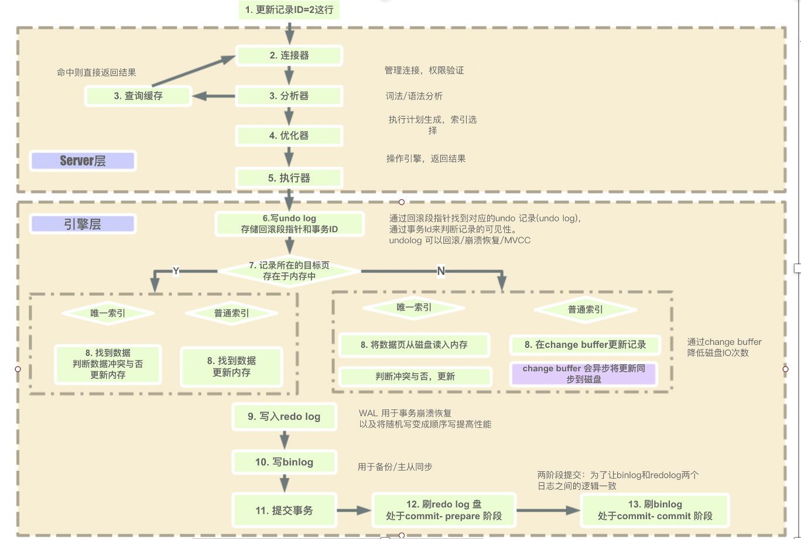

# 一条sql语句的执行过程

+ **连接器**

  + 负责与客户端的通信；MySQL 客户端与服务器之间的通信协议是“半双工”的，这意味着在任何一个时刻，要么是服务器向客户端发送数据，要么是客户端向服务器发送数据；
  + 身份认证；验证客户端的账户和密码是否正确；
  + 如果用户的账户和密码验证通过,会在mysql自带的权限表中查询当前用户的权限，之后在这个连接里的权限逻辑判断都是会依赖此时读取到的权限数据；

+ **查询缓存**（MySQL 8.0 版本后删除了缓存的功能）

  mysql的缓存主要的作用是为了提升查询的效率，缓存以key-value的哈希表形式存储，key是具体的sql语句，value是结果的集合。如果命中缓存就直接将结果返回给客户端；如果没有命中，执行后续操作；

  > MySQL 查询不建议使用缓存，因为查询缓存失效可能会非常频繁；

+ **分析器**

  对 SQL 语句进行解析，生成一棵“解析树”；

  验证 SQL 语句是否合法；

+ **优化器**

  一条 SQL 语句可能有多种执行方式，优化器的作用就是找到其中最好的执行计划（有很多原因会导致优化器选择错误的执行计划）

+ **执行器**

  经过优化器，MySQL 将生成查询对应的执行计划；

  由存储引擎负责执行；

  查询结束将结果返回给客户端；