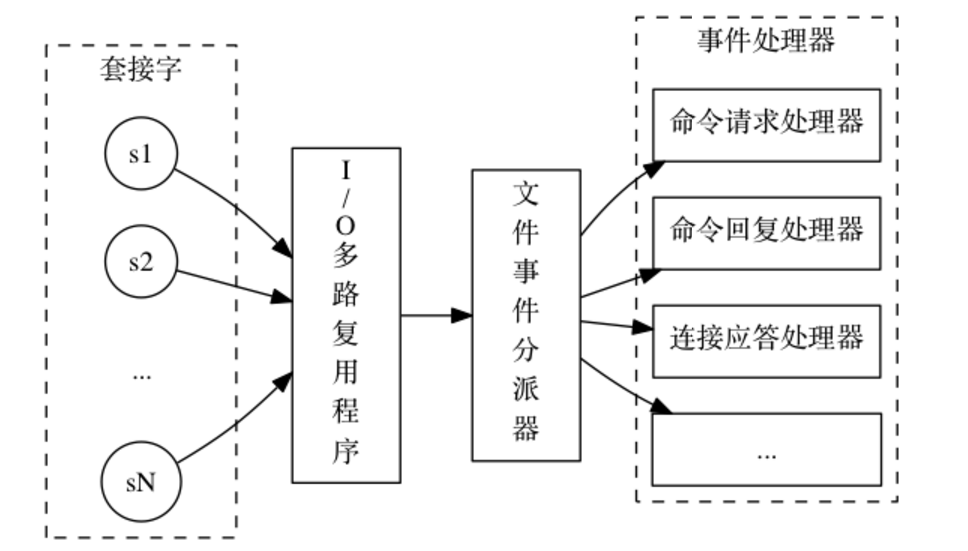

# Redis 单线程架构

Redis 使用 **单线程架构 + I/O 多路复用模型** 实现高性能的内存数据库服务；

> **单线程架构**：Redis 使用单线程处理命令，任意时刻都只会有一个命令被执行，所有命令从客户端到达服务端都会进入一个队列，然后逐个执行； 
>
> **I/O 多路复用模型**：
>
> + https://www.jianshu.com/p/397449cadc9a
> + IO 多路复用的本质是让单个进程监视多个文件描述符，一旦某个描述符就绪（读就绪或者写就绪），通知程序进行相应的读写操作。
> + Redis 客户端通过套接字与服务器端建立连接时，服务器端会生成一个对应的套接字描述符（文件描述符的一种）；I/O 多路复用程序将客户端对应的文件描述符注册到监听列表中，当客服端执行 read、write 等操作命令时，I/O 多路复用程序会将命令封装成一个事件。                                                                                                                                                                                                     
>
> Redis 使用多线程为什么还怎么快？
>
> + 纯内存访问，Redis 的数据都存储在内存中，读写速度非常快；
> + IO 多路复用技术同时监听多个客户端的请求；
> + 单线程避免了线程之间的切换与竞争；
>
> 注：Redis 6.0 之后在网络模型中选择了多线程 ；                       

## 1. 事件

**Redis 服务器是一个事件驱动程序**，服务器需要处理两类事件：

+ 文件事件：对套接字操作的抽象，每当一个套接字准备好执行连接应答（accept）、写入（write）、读取（read）、关闭（close）等操作时，就会相应产生一个文件事件。
+ 时间事件：Redis 服务器需要定时执行的操作；

### 1）文件事件

Redis 基于 Reactor 模式开发了文件事件处理器；

> 在处理web请求时，通常有两种体系结构，分别为：thread-based architecture（基于线程）、event-driven architecture（事件驱动）；
>
> + 基于线程
>
>   基于线程的体系结构通常会使用多线程来处理客户端的请求，每当接收到一个请求，便开启一个独立的线程来处理。
>
>   仅适用于并发访问量不大的场景，因为线程需要占用一定的内存资源，且操作系统在线程之间的切换也需要一定的开销，当线程数过多时显然会降低web服务器的性能。并且，当线程在处理I/O操作，在等待输入的这段时间线程处于空闲的状态，同样也会造成cpu资源的浪费。
>
> + 事件驱动
>
>   定义一系列的事件处理器来响应事件的发生，并且将服务端建立连接过程与对事件的处理分离。
>
> Reactor 模式：事件驱动架构的一种实现方式；

#### 文件事件处理器

文件事件处理器由四部分组成：套接字、IO多路复用程序、文件事件分派器、事件处理器；

+ I/O多路复用程序：负责监听多个套接字，将产生文件事件的套接字按顺序插入到一个队列中，由队列向文件事件分派器传送队列中套接字，它会当一个套接字事件被处理完毕后，会立马向文件事件分配器传送下一个套接字；
+ 文件事件分派器：接受队列传来的套接字，并根据套接字产生的事件类型，调用相应的事件处理器；
+ 事件处理器：
  + 连接应带处理器
  + 命令请求处理器
  + 命令回复处理器