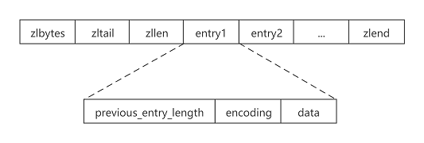
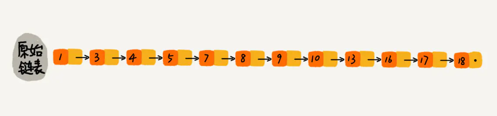
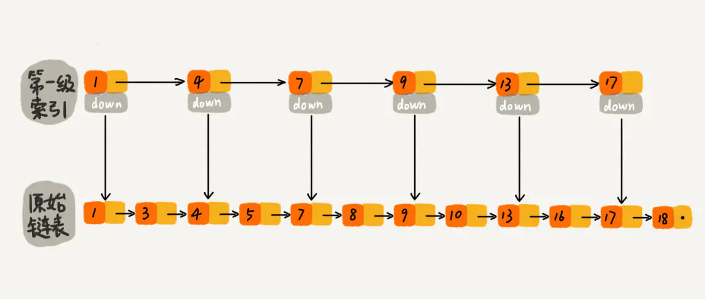
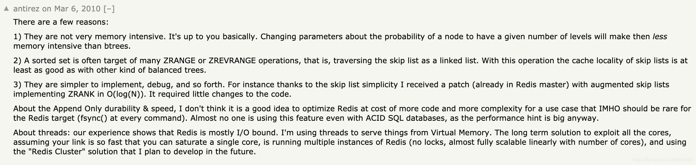

# Redis 底层数据结构

## 1. 简单动态字符串（simple dynamic string，SDS）

+ Redis 3.2 版本之后，针对不同长度的字符串引入了不同的SDS数据结构，节省内存；
+ SDS 存储了字符串的长度，获取字符串长度的时间复杂度为 O(1)；
+ SDS 减少了修改字符串时带来的内存重分配次数，通过空间预分配和惰性空间释放实现；

  + 空间预分配：当对字符串进行增长操作时，如果需要对 SDS 的空间进行扩展，Redis 不仅会为 SDS分配存储必须的空间时，还会为 SDS 分配额外的空闲空间；
  + 惰性空间释放：当对字符串进行缩短操作时，Redis 不会立即将这部分空闲空间释放，以便之后增长字符串时使用；
+ SDS 保留了 C 语言字符串以空字符结尾的惯例，分配内存时会多分配一个字节存储空字符，这样可以复用C语言<string.h> 函数库中的部分函数；

> **源码分析**
>
> + Redis 3.0 版本及之前版本 SDS 定义如下
>
>   ```c
>   struct sdshdr {
>       // 记录buf数组中已使用字节数量
>       unsigned int len;
>       // 记录buf数组中未使用的字节数量
>       unsigned int free;
>       // 字节数组，存储字符串
>       char buf[];
>   };
>   ```
>
> + Redis 3.2 版本之后，针对不同长度的字符串引入了 5 种不同的 SDS 数据结构
>
>   ```c
>   struct __attribute__ ((__packed__)) sdshdr5 {
>       unsigned char flags; /* 3 lsb of type, and 5 msb of string length */
>       char buf[];
>   };
>   struct __attribute__ ((__packed__)) sdshdr8 {
>       uint8_t len; 	// 记录buf数组中已使用字节数量
>       uint8_t alloc; 	// 记录当前字节数组总共分配的内存大小，不包括空终止符
>       unsigned char flags; // 低3位标识当前SDS的类型，其余5位未使用
>   
>       char buf[];
>   };
>   struct __attribute__ ((__packed__)) sdshdr16 {
>       uint16_t len; /* used */
>       uint16_t alloc; /* excluding the header and null terminator */
>       unsigned char flags; /* 3 lsb of type, 5 unused bits */
>       char buf[];
>   };
>   struct __attribute__ ((__packed__)) sdshdr32 {
>       uint32_t len; /* used */
>       uint32_t alloc; /* excluding the header and null terminator */
>       unsigned char flags; /* 3 lsb of type, 5 unused bits */
>       char buf[];
>   };
>   struct __attribute__ ((__packed__)) sdshdr64 {
>       uint64_t len; /* used */
>       uint64_t alloc; /* excluding the header and null terminator */
>       unsigned char flags; /* 3 lsb of type, 5 unused bits */
>       char buf[];
>   };
>   
>   // 5种不同的数据结构对应的 flag
>   #define SDS_TYPE_5  0
>   #define SDS_TYPE_8  1
>   #define SDS_TYPE_16 2
>   #define SDS_TYPE_32 3
>   #define SDS_TYPE_64 4
>   
>   // 针对不同长度的字符串选择对应的SDS类型
>   static inline char sdsReqType(size_t string_size) { // 获取类型
>       if (string_size < 1<<5)     // 32
>           return SDS_TYPE_5;
>       if (string_size < 1<<8)     // 256
>           return SDS_TYPE_8;
>       if (string_size < 1<<16)    // 65536 64k
>           return SDS_TYPE_16;
>       if (string_size < 1ll<<32)  // 4294967296 4GB
>           return SDS_TYPE_32;
>       return SDS_TYPE_64;
>   }
>   ```


## 2. 压缩列表(ziplist)

> 官方解释：The ziplist is a specially encoded dually linked list that is designed to be very memory efficient.

压缩列表的主要目的就是提高存储效率，通过对其中存储的每个节点进行特殊的编码实现；

压缩列表在逻辑上是一个双向链表，但使用连续内存进行存储；

一个压缩列表可以包含任意多个节点（entry），每个节点可以存储一个字符串或者一个整数；

压缩列表支持从列表两端进行push和pop操作，由于使用连续内存进行存储，所以对压缩列表进行插入或删除操作时，需要重新分配内存（重新申请一块满足长度的空间，然后释放原有的空间）；（如果有频繁更新list的操作，代价很大）

> 压缩列表因为每次插入或删除一个元素时操作都要重新分配内存导致的问题：**连锁更新**，但这种问题出现的几率不高；

+ **ziplist 结构**

  

  + zlbytes：记录整个压缩列表占用的内存字节数，对压缩列表进行内存重分配时使用；
  + zltail：记录压缩列表表尾节点距离压缩列表起始地址的偏移量，通过该偏移量可以直接确定表尾节点的地址，方便在尾部做push或pop操作；
  + zllen：记录压缩列表包含的节点数量（当节点个数大于65535时，节点的真实数量需要遍历整个压缩列表才能计算得出）；
  + entry：节点长度不定；
  + zlend：标记压缩列表的结尾；

+ 压缩列表节点（entry）结构

  + previous_entry_length：记录前一个 entry 的存储大小，根据当前节点的起始地址能够计算出前一个节点的起始地址，方便从后向前遍历；
  + encoding：记录节点的所保存数据的类型已经长度；

## 3. 链表

Redis 中链表实现为一个双向链表；

```c
// 链表节点定义
typedef struct listNode
{
    // 前置节点
    struct listNode * prev;
    // 后置节点
    struct listNode * next;
    // 节点值
    void * value;
}listNode;
// 链表定义
typedef struct list
{
    // 表头结点
    listNode * head;
    // 表尾结点
    listNode * tail;
    // 链表节点数量
    unsigned long len;    
}list;
```

## 4. 快速列表(quicklist)

> 官方解释："A doubly linked list of ziplists"，意思为 **quicklist 是由ziplist组成的双向链表**；

quicklist 结合了压缩列表与链表两者的优势，链表中的每一个节点都是一个压缩列表，既提高了存储效率，又减少了对压缩列表进行更新操作时的花销；

+ quicklist 结构

  ```c
  typedef struct quicklist {
      quicklistNode *head;
      quicklistNode *tail;
      
      // 所有压缩列表中节点的总个数
      unsigned long count;        /* total count of all entries in all ziplists */
      
      // 链表节点的个数
      unsigned long len;          /* number of quicklistNodes */
      
      // ziplist的大小设定，其中” : “是位运算符，表示fill占int类型32位中的16位, fill的值在redis.conf中配置，对应的配置项为：list-max-ziplist-size
      int fill : 16;
  } quicklist;
  
  // 快速链表节点结构定义
  typedef struct quicklistNode {
      // 前驱节点
      struct quicklistNode *prev;
      // 后继节点
      struct quicklistNode *next;
      // 压缩列表ziplist的存储大小
      unsigned int sz;             /* ziplist size in bytes */
      // ziplist中的节点数，占16 bits长度
      unsigned int count : 16;     /* count of items in ziplist */
  } quicklistNode;
  ```


## 5. 字典

字典使用哈希表做为底层实现；每个字典中包含两个哈希表，一个用于平时的存储，一个用于 rehash；

+ 解决哈希冲突方法

  链地址法；

  > 注：新键值对节点插入到链表的头部；

+ rehash

  为了维护哈希表的负载因子在一个合理的范围中，当哈希表存储的键值对数量过多或过少时，需要对哈希表进行相应的扩展或者收缩；

  rehash 步骤 ：

  + 为字典的 ht[1] 哈希表分配内存空间；
  + 将保存在 ht[0] 中的所有键值对 rehash 到 ht[1] 上；
  + 释放 ht[0]

+ 渐进式 rehash

  背景：如果哈希表 ht[0] 中的键值对比较多，一次性将这些键值对全部 rehash 到 ht[1]，需要花费大量时间，导致服务器在一段时间内停止服务，所以需要分多次渐进式的 rehash；

  实现方式：Redis 字典中定义了一个索引计数器变量 rehashidx 记录当前 rehash 的索引，每次对字典进行添加、删除、查找或更新操作时，Redis 会顺带将 rehashidx 索引下的键值对rehash到 ht[1] 中，然后将 rehashidx +1；

  rehash 期间的哈希表操作：字典的删除、查找、更新等操作会在两个哈希表上进行，添加操作在 ht[1] 上进行；

> **源码**
>
> ```c
> // 哈希表结构定义
> typedef struct dictht {
> // 哈希表数组，数组中的每个元素指向一个 dictEntry，每个dictEntry结构保存一个键值对
> dictEntry **table;
> // 哈希表大小
> unsigned long size;
> // 哈希表大小掩码，用于计算索引值，等于 size-1
> unsigned long sizemask;
> // 哈希表中键值对的数量
> unsigned long used;
> } dictht;
> 
> // 哈希表节点定义
> typedef struct dictEntry {
> void *key;
> union {
>   void *val;
>   uint64_t u64;
>   int64_t s64;
>   double d;
> } v;
> // 链地址法解决哈希冲突
> struct dictEntry *next;
> } dictEntry;
> 
> // 字典定义
> typedef struct dict {
> dictType *type;
> void *privdata;
> // 每个字典包含两个哈希表，一个哈希表用于存储，另一个在rehash时使用
> dictht ht[2];
> // 记录当前rehash的索引，如果当前没有在进行rehash，值为-1
> long rehashidx;
> // 
> int16_t pauserehash; 
> } dict;
> ```


## 6. 整数集合

+ **使用场景**

  当一个集合中的元素都是整数，且这个集合的元素数量不多时，Redis 使用整数集合做为集合的底层实现；

  ```bash
  127.0.0.1:6379> sadd nums 1 2 3 4
  (integer) 4
  127.0.0.1:6379> object encoding nums
  "intset"
  ```

+ **实现**

  ```c
  // 整数集合结构定义
  typedef struct intset {
      // 集合中存储的元素类型：INTSET_ENC_INT64、INTSET_ENC_INT32、INTSET_ENC_INT16
      uint32_t encoding;
      // 集合中元素的个数
      uint32_t length;
      // 存储数组，每个元素按照从小到大顺序排列
      // 注：数组虽然定义为 int8_t 类型，但数组存储的真正类型取决于encoding值
      int8_t contents[];
  } intset;
  ```

+ **整数集合升级**

  背景：当将一个新元素添加到整数集合时，如果新元素的类型比整数集合的类型（encoding值）长时，整数集合需要先升级，然后才能将新元素添加到整数集合中；

  升级过程：

  + 根据新元素的类型，为底层数组重新分配内存空间；
  + 将源整数集合中的元素移动到新的整数集合中；
  + 将新元素插入到新的整数集合中；

  注：整数集合不支持降级操作；


## 7. 跳跃表（skiplist）

> 参考博客：https://www.jianshu.com/p/9d8296562806
>
> 对于有序链表进行查询时，需要从头开始遍历链表，直到找到我们需要找的元素，时间复杂度为 o(n)；
>
> > 如查找元素10：从头开始遍历链表，查找路径：1、3、4、5、7、8、9、10，访问了8个节点；
>
> 
>
> 在单链表的基础上给每个链表节点增加一级索引；
>
> > 查找元素10：先在索引找 1、4、7、9，遍历到一级索引的 9 时，发现 9 的后继节点是 13，比 10 大，于是选择通过原始链表进行查询，然后再往后遍历找到了 10，访问了6个节点；
>
> 
>
> 再增加一层索引：
>
> 

跳跃表的本质：可以实现二分查找的有序链表；

跳跃表的核心思想：通过维护一个多级链表实现快速查询，支持平均 O(logN)、最坏 O(N) 复杂度查找到节点；

跳跃表插入操作：首先找到元素插入的位置，然后将元素插入链表中，时间复杂度为 o(logn)；

> 如果一直往链表中插入数据，但不更新索引，就可能出现两个索引节点之间数据非常多的情况，极端情况，跳表退化为单链表，所以在插入数据时要动态维护索引；
>
> 如何动态维护索引：每次插入新元素时，该元素有 1/2 的几率建立一级索引、1/4 的几率建立二级索引、1/8 的几率建立三级索引，以此类推，通过**概率算法**得到当前元素需要建立几级索引；

跳跃表删除操作：删除原始链表中元素的同时，删除索引中的该节点，时间复杂度为 o(logn)

+ **Redis 跳跃表实现**

  ```c
  // 跳跃表结构定义
  typedef struct zskiplist {
      // 指向当前跳跃表头节点和尾结点
      struct zskiplistNode *header, *tail;
      // 记录当前跳跃表中节点的个数（不包括表头节点）
      unsigned long length;
      // 记录当前跳跃表中层数最多的节点的层数
      int level;
  } zskiplist;
  
  // 跳跃表节点结构定义
  typedef struct zskiplistNode {
      // 元素
      sds ele;
      // 元素对应的分值
      double score;
      // 后退指针，指向当前节点的前一个节点，用于从后向前遍历
      struct zskiplistNode *backward;
      // level数组用于存储多个指向其他节点的指针
      struct zskiplistLevel {
          // 前进指针
          struct zskiplistNode *forward;
          // 跨度，记录当前节点与前进指针指向节点的距离，
          unsigned long span;
      } level[];
  } zskiplistNode;
  ```

  每次创建一个新跳跃表节点时，程序根据幂次定律（越大的数，出现的概率越小）随机生成一个介于 1 到 32 之间的值做为新节点的层高，即 level 数组的大小；

+ 为什么Redis选择使用跳表而不是平衡树或红黑树来实现有序集合？

  + Redis的作者的回答：

    

    + skiplist 更节省内存；
    + 有序集合包含大量的范围区间查找，跳跃链表性能高效；
    + skiplist 实现简单；