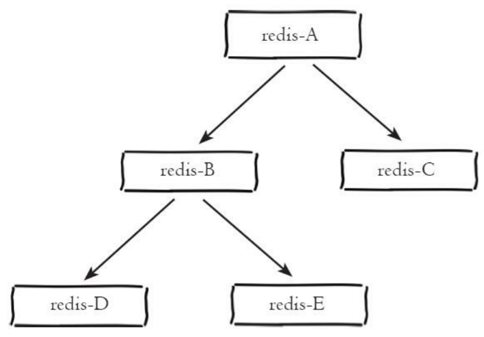

# 集群

## 1. 主从复制

用于解决 Redis 单点问题，将数据复制多个副本部署到其他机器，提供故障转移支持；

每个从节点只能有一个主节点，主节点可以同时具有多个从节点，复制的数据流是单向的，只能从主节点复制到从节点，所以从节点默认情况下应该配置为**只读模式**（对于从节点的任何修改主节点都无法感知，修改从节点会造成主从数据不一致）

+ 一主一结构

  用于主节点出现宕机时从节点提供故障转移支持；

+ 一主多从结构

  利用多个从节点实现读写分离；

  对于读占比较大的场景，可以把读命令发送到从节点来分担主节点压力；

  对于写并发量较高的场景，多 个从节点会导致主节点写命令的多次发送从而过度消耗网络带宽，同时也加重了主节点的负载影响服务稳定性。

+ 树状主从结构

  通过引入复制中间层，可以有效降低主节点负载和需要传送给从节点的数据量。

  

### 主从复制的流程

当主节点和从节点建立连接后，主从复制过程分为两个步骤：

+ 数据同步

  主节点将所有的数据发送给从节点；

+ 命令传播

  当主节点把当前的数据同步给从节点后，接下来主节点会执行的所有写命令都会发送给从服务器执行，从而保证主从服务器保存的数据一致；

### SYNC 命令和 PSYNC 命令

Redis 2.8 版本之前，从节点使用 SYNC 命令完成主从数据同步；

存在的问题：SYNC 命令只支持**全量复制**，每次都会将主节点的全部数据发送给从节点，对于断线后重新连接的从服务器，如果进行全量复制，会对主从节点和网络造成很大的开销，所以只需要将从服务器断开期间执行的写命令发送给从服务器；

Redis 2.8 版本之后，使用 PSYNC 命令完成主从数据同步，PSYNC 命令支持**全量复制**和**部分复制**两种模式，全量复制应用于初次复制场景，部分复制应用于从服务器断线后重新连接的场景；

部分复制：**主服务器只需要将从服务器断开期间执行的写命令发送给从服务器；**

部分复制功能由三部分实现：

+ 主从节点各自的复制偏移量

  通过对比主从节点的复制偏移量，可以判断主从节点数据是否一致；

+ 主节点复制积压缓冲区

  复制积压缓冲区是一个固定长度的队列，主服务器进行命令传播时不仅会将命令发送给所有从服务器，也会将命令写入复制积压缓冲区；

  从服务器断线重新连接时，如果从服务器复制偏移量之后的数据仍然保存在复制积压缓冲区中就进行部分重同步，否则需要进行完整重同步；

+ 主节点Id

  从服务器会保存主服务器的运行ID，当从服务器断线并重新连接一个主服务器时，会通过保存的运行ID判断之前连接的是否为该主服务器，如果是尝试部分重同步；

### 心跳检测

命令传播阶段，主从节点分别向对方发送消息用于心跳检测，主节点默认每隔10秒对从节点发送ping命令，判断从节点的存活性和连接状态，从节点每隔1秒向主节点发送一条命令，用于判断：

+ 检测主从服务器的网络连接状态
+ 上报自身复制偏移量，检查复制数据是否丢失；

### 主从复制存在的问题

主从复制过程是异步的，存在某一时刻主从节点数据不一致，所以可能读到的数据不是最新的数据或者已经过期的数据（从节点自身永远不会主动删除过期数据，需要等待主节点删除过期数据时将删除命令发送给从节点）；

从节点出现故障，需要在客户端维护可用从节点列表，当从节点故障时立刻切换到其他从节点或主节点上；

主从复制模式下，一旦主节点由于故障不能提供服务，需要人工将从节点晋升为主节点，同时还要通知应用方更新主节点地址，还需要命令其他从节点去复制新的主节点；

## 2. 哨兵

Redis Sentinel是 Redis 的高可用实现方案；

### 高可用

当主节点出现故障时，Redis Sentinel能自动完成故障发现和故障转移，并通知应用方，从而实现真正的高可用。

> Redis Sentinel是一个分布式架构，其中包含若干个哨兵节点和 Redis 数据节点，每个哨兵节点会对数据节点和其余哨兵节点进行监控，当它发现节点不可达时，会对节点做下线标识。如果被标识的是主节点，它还会和其他哨兵节点进行“协商”，当大多数哨兵节点都认为主节点不可达时，它们会选举出一个哨兵节点来完成自动故障转移的工作，同时会将这个变化实时通知给Redis应用方；

### 故障转移过程

+ 主节点出现故障，哨兵节点通过定期监控发现主节点出现了故障；
+ 当大多数哨兵节点都认为主节点不可达时，选举出一个哨兵节点来完成自动故障转移的工作；
+ 选出一个从节点成为新的主节点；
+ 通知应用方更新主节点地址；
+ 命令其他从节点去复制新的主节点；

### 哨兵节点

哨兵节点本身就是独立的Redis节点，只是不存储数据；

作用：

+ 哨兵节点会对主节点以及该主节点的所有从节点及其他哨兵节点进行监控；

  > 配置时只会配置监控主节点，但是哨兵节点会从主节点中获取有关从节点以及其余Sentinel节点的相关信息；
  >
  > 哨兵以每秒一次的频率向实例（主服务器、从服务器、其他哨兵）发送PING命令，来判断Redis数据节点和其余哨兵节点是否可达
  >
  > 当哨兵判断一个主服务器为主观下线时，它会向同样监视这个主服务器的其他哨兵进行询问，看他们是否同意这个主服务器已经进入主观下线状态；

+ 定期检测Redis数据节点、其余哨兵节点是否出现故障；

  > 对于节点的故障判断是由多个哨兵节点共同完成

+ 哨兵节点会将故障转移的结果通知给应用方；

+ 选择一个从节点晋升为主节点，并维持新的主从关系；

### 哨兵系统客户端

实现一个Redis Sentinel客户端基本步骤：

+ 遍历Sentinel节点集合获取一个可用的Sentinel节点，Sentinel节点之间可以共享数据，所以从任意一个Sentinel节点获取主节点信息都是可以的；
+ 从哨兵节点获取对应主节点的相关信息；
+ 验证当前获取的“主节点”是真正的主节点；

> Java 通过使用 Jedis 连接Redis Sentinel系统；
>
> Jedis 针对Redis Sentinel给出了一个 JedisSentinelPool；

## 3. 集群

Redis Cluster是Redis的**分布式解决方案**；

集群提供 **多个 Redis 节点之间的数据共享**、并提供**复制**和**故障转移**功能；

当遇到单机内存、并发、流量等瓶颈时，可 以采用Cluster架构方案达到负载均衡的目的；

> **分布式数据库**
>
> 分布式数据库首先要解决把整个数据集按照分区规则映射到多个节点的 问题，即把数据集划分到多个节点上，每个节点负责整体数据的一个子集。
>
> 常见的分区规则有哈希分区和顺序分区两种。
>
> Redis Cluster采用哈希分区规则；

### Redis 数据分区

Redis Cluser采用**虚拟槽分区**，一个 Redis 集群包含 `16384` 个哈希槽，集群中的每个节点负责处理一部分哈希槽；每个节点都会记录哪些槽分配给了自己，哪些槽分配给了其他节点；

所有的键根据哈希函数映射到0~16383整数槽内；

当所有槽都被分配给节点时，集群处于上线状态；如果有任何一个槽没有被分配，集群处于下线状态；

### 在集群中执行命令

节点在接到一个命令请求时，都会检查这个命令请求要处理的键属于哪个槽；然后检查这个槽是否属于自己；如果是，节点直接执行命令；如果不是，节点向客户端返回一个 MOVED错误，指引客户端转向至正确的节点，并再次发送之前的命令；

### 迁移槽

重新分片用于将已经分配给某个节点的槽重新分配给其他节点；

重新分片操作由集群管理软件redis-trib负责执行；

### ASK 错误

在进行重新分片期间，源节点向目标节点迁移一个槽的过程中，可能会出现一种情况：迁移槽的一部分键值对保存在源节点中，另一部分键值对保存在目标节点中；

此时当客户端向源节点发送一条与数据库键有关的命令时，如果数据库键属于正在被迁移的槽，源节点会先在自己的数据库中查找指定的键，如果存在，直接执行命令；如果不存在，源节点向客户端返回一个 ASK 错误，指引客户端转向至正在导入槽的目标节点，并再次发送之前的命令；

### 复制与故障转移

Redis 集群中的节点分为主节点和从节点，主节点用于处理槽，从节点负责复制某个主节点，并在主节点下线时，代替下线主节点继续处理命令请求；

## Redis 三种集群模式的区别

+ **主从复制**

  主节点通过将数据同步到从节点，实现故障转移支持和扩展主节点的读能力；

  存在的问题：

  + 一旦主节点出现故障，需要手动将一个从节点晋升为主节点，同时需要修改应用方的主节点地址，还需要命令其他从节点去复制新的主节点（导致服务高可用问题）；
  + 主节点的写能力受到单机的限制；
  + 主节点的存储能力受到单机的限制；

+ **哨兵**

  Redis Sentinel是 Redis 的高可用实现方案；

  在主从复制的基础上，增加了若干哨兵节点，保证服务的高可用性；

+ **集群**

  Redis Cluster是Redis的**分布式解决方案**；