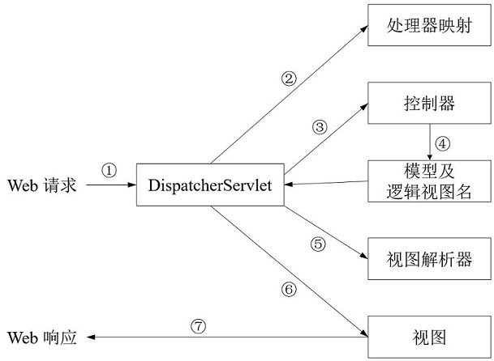

# Spring MVC

Spring MVC 基于模型-视图-控制器（Model-View-Controller，MVC）模式实现。

## 1. Spring MVC 处理 Web 请求过程



1.  Spring MVC 所有的请求首先都到达 `DispatcherServlet` ；

   >  `DispatcherServlet` ：前端控制器，作用是将请求发送给 Spring MVC 控制器 （controller）；

2.  DispatcherServlet 通过查询处理器映射（handler mapping）确定将请求发送给哪个控制器；

   > 处理器映射根据请求所携带的 URL 信息来进行决策；

3.  DispatcherServlet 将请求发送给控制器（controller），控制器对请求进行处理；

   > 一般控制器只处理很少甚至不处理工作，而是将业务逻辑委托给一个或多个服务对象进行处理；

4.  控制器完成逻辑处理后生成需要返回给用户的信息（这些信息被称为模型，即 model），除此之外，返回给用户的信息一般需要进行格式化，控制器会额外发送一个用于渲染输出的视图名给 DispatcherServlet ；

5.  DispatcherServlet 根据控制器返回的视图名，使用视图解析器（view resolver） 将逻辑视图名匹配为一个特定的视图实现（通常会是 JSP），然后使用视图渲染输出。

6.  将输出返回给客户端进行响应。

## 2. 控制器 controller

一个简单的控制器示例如下：

```java
@Controller
public class CustomerController {

    @Resource
    CustomerService customerService;

    @RequestMapping(value = "queryCustomer", method = RequestMethod.GET)
    @ResponseBody
    public Customer queryCustomer(String customerId) {
        Customer customer = customerService.queryCustomerById(customerId);
        return customer;
    }

}
```

### @Controller 注解

```java
/**
 * @Controller 注解定义
 */
@Target({ElementType.TYPE})
@Retention(RetentionPolicy.RUNTIME)
@Documented
@Component
public @interface Controller {
    @AliasFor(
        annotation = Component.class
    )
    String value() default "";
}
```

@Controller 注解基于 @Component 实现，两者等价，只是为了具有更强的表意性。

### @RequestMapping

`@RequestMapping` 注解既可以用于修饰方法，也可以用于修饰类。

修饰类时，表示将其应用到控制器的所有处理器方法上。

@RequestMapping 注解示例如下：

```java
@RequestMapping(value = "queryCustomer", method = RequestMethod.GET)
```

+ value 属性：指定了方法所要处理的请求路径；

  > 注：value 属性能够接受一个 String 类型的数组，用于映射多条请求路径

+ method 属性：指定所处理的 HTTP 方法；

## 3. 获取 web 请求的输入

Spring MVC 支持多种方式将客户端中的数据传送到控制器的处理器方法中：

+ 查询参数（Query Parameter）
+ 表单参数（Form Parameter）
+ 路径变量（Path Variable）

### 1）查询参数

通过使用 `@RequestParam` 注解实现。

 `@RequestParam`  用于将请求中的查询参数映射到处理器方法的参数上，该注解有以下几个属性：

+ value：请求中的查询参数的名字；
+ required：指定请求中是否一定要有相应的参数；
+ defaultValue：指定请求中没有该参数时的默认值

 `@RequestParam`  注解示例如下：

```java
/**
 * 这个处理器方法对应的请求url示例如下：
 * localhost:8080/queryCustomer?customerId=1
 */
@RequestMapping(value = "queryCustomer", method = RequestMethod.GET)
@ResponseBody
public Customer queryCustomer(@RequestParam(value = "customerId") String customerId) {
    Customer customer = customerService.queryCustomerById(customerId);
    return customer;
}
```

备注1：`@RequestParam`  注解可以不指定 value 属性，然后通过一个 Map 来接收所有参数。

```java
@RequestMapping(value = "test", method = RequestMethod.GET)
@ResponseBody
public Map<String, String > test(@RequestParam Map<String, String> paramMap) {
    return paramMap;
}
```

### 2）路径变量

Spring MVC 允许我们在 @RequestMapping 路径中添加占位符，占位符的名称用大括号`{}` 括起来。然后通过使用 `@PathVariable` 注解获取路径中的值。

```java
@RequestMapping(value = "queryCustomer/{customerId}", method = RequestMethod.GET)
@ResponseBody
public Customer queryCustomer(@PathVariable("customerId") String customerId) {
    Customer customer = customerService.queryCustomerById(customerId);
    return customer;
}
```

### 3）表单参数

```java
/**
 * 注册新用户
 *
 * @param customer 使用请求中同名的参数对Customer对象的属性进行赋值
 * @return
 */
@RequestMapping(value = "registCustomer", method = RequestMethod.POST)
@ResponseBody
public boolean registCustomer(Customer customer) {
    customerService.registCustomer(customer);
    return true;
}
```

> 表单校验：对表单中的数据进行校验，防止输入错误值或限制输入值的范围；
>
> 第一种方法：在 `registCustomer` 方法中添加代码来检查值的合法性（不推荐）；
>
> 第二种方法：使用 Java 校验 API（JSR-303），Java 校验 API 定义了多个注解，这些注解可以放到属性上，从而限制属性的值。除此之外，需要在待校验的对象上添加 `@Valid ` 注解，告知 Spring 需要确保这个对象满足校验限制。
>
> ```java
> // 常用注解如下：
> @NotNull	所注解元素的值必须不能为 null
> @Null		所注解元素的值必须为 null	
> @Max		所注解的元素必须是数字，并且它的值要小于或等于给定的值
> @Size		所注解的元素的值必须是 String、集合或数组，并且它的长度要符合给定的范围，如@Size(min=5, max=25)
> ```
>
> 如果有校验出现错误的话，那么这些错误可以通过 Errors 对象进行访问。