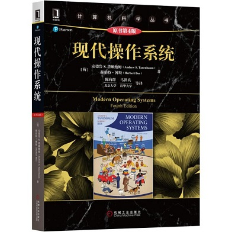
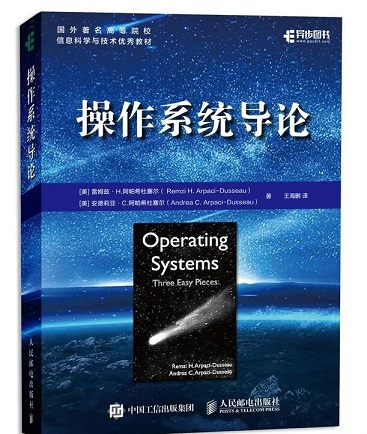

比较重要的操作系统相关的问题比如**进程管理**、**内存管理**、**虚拟内存**等等操作系统：

# 一、操作系统基础

## 1. 什么是操作系统

操作系统本质上是一个运行在计算机上的软件程序 ，用于控制和管理计算机硬件和软件资源，组织调度计算机的工作与资源的分配；

## 2. 操作系统的特征

### 并发

并发是指**在同一时间间隔内**能同时运行多个程序；

操作系统通过引入进程和线程，使得程序能够并发运行；

### 共享

共享是指系统中的资源可以被多个并发执行的进程共同使用。

有两种共享方式：互斥共享和同时共享。

互斥共享的资源称为临界资源，在同一时刻只允许一个进程访问，需要用同步机制来实现互斥访问；

### 虚拟

虚拟技术是指把一个物理实体转换为变为若干个逻辑上的对应物；

主要有两种虚拟技术：时分复用技术和空分复用技术。

### 异步

异步指进程不是一次性执行完毕，而是走走停停，以不可知的速度向前推进。

## 3. 什么是系统调用

程序在执行过程中，将 **CPU 的状态** 划分为 **用户态** 和 **核心态** 两种，用户态相比于核心态有较低的的执行权限，大多数时间程序都是运行在用户态下，但是如果程序需要执行一些用户态没有权限的操作时就会切换到核心态，例如申请内存；

+ **系统调用**

  **进程由用户态主动切换到内核态**的一种方式；

  在程序运行过程中，凡是与资源有关的操作都必须通过系统调用方式向操作系统提出服务请求，并由操作系统代为完成；

  系统调用按功能大致可分为如下几类：

  - 设备管理。完成设备的请求或释放，以及设备启动等功能。
  - 文件管理。完成文件的读、写、创建及删除等功能。
  - 进程控制。完成进程的创建、撤销、阻塞及唤醒等功能。
  - 进程通信。完成进程之间的消息传递或信号传递等功能。
  - 内存管理。完成内存的分配、回收以及获取作业占用内存区大小及地址等功能。

  系统调用是使用操作系统为用户特别开放的一个中断来实现，如Linux的int 80h中断。

+ 异常

  当 cpu在执行运行在用户态下的程序时，发生了一些没有预知的异常，这时会触发由当前运行进程切换到处理此异常的内核相关进程中，也就是切换到了内核态，如缺页异常；

+ 外围设备的中断

  当外围设备完成用户请求的操作后，会向CPU发出相应的中断信号，这时CPU会暂停执行下一条即将要执行的指令而转到与中断信号对应的处理程序去执行，如果前面执行的指令是用户态下的程序，那么转换的过程自然就是由用户态到内核态的切换。如硬盘读写操作完成，系统会切换到硬盘读写的中断处理程序中执行后边的操作等。

# 二、进程管理

## 1. 进程和线程的区别

+ **根本区别**：进程是操作系统进行资源分配的基本单位，线程是处理器任务调度和执行的基本单位；

    > 操作系统有哪些资源：
    >
    > + 硬件资源：CPU、内存、外部IO设备、外部存储

+ 内存空间：每个进程都有自己独立的内存空间；一个进程中的多个线程共享父进程的内存空间；

+ 进程上下文切换开销大，线程开销小；

    > 进程间切换的开销？

+ 线程不能独立存在，必须依存在进程中。

## 2. 进程有几种状态

一般把进程大致分为 5 种状态：

- **创建状态(new)** ：进程正在被创建，尚未到就绪状态。
- **就绪状态(ready)** ：进程已处于准备运行状态，进程获得了除处理器之外的一切所需资源，一旦得到处理器资源(处理器分配的时间片)即可运行。
- **运行状态(running)** ：进程正在处理器上运行(单核 CPU 下任意时刻只有一个进程处于运行状态)。
- **阻塞状态(waiting)** ：又称为等待状态，进程正在等待某一事件而暂停运行（如等待某资源为可用或等待 IO 操作完成），即使处理器空闲，该进程也不能运行。
- **结束状态(terminated)** ：进程正在从系统中消失。可能是进程正常结束或其他原因中断退出运行。

## ★3. 进程间的通信方式

每个进程都有自己独立的内存空间，**进程之间交换数据必须通过内核**，在内核中开辟一块缓冲区，进程1把数据从用户空间写到内核缓冲区，进程2再从内核缓冲区读取数据，内核提供的这种机制称为**进程间通信**；

有 7 种常见的进程间通信方式：

+ **管道/匿名管道(pipe)** 

  只能用于父子进程或者兄弟进程之间（由于没有名字）；

  管道是半双工的，数据只能单向流动；双方通信时，需要建立起两个管道；

  管道的实质是一个**内核缓冲区**；

  

  管道局限

  + 只支持单向数据流；
  + 只能用于具有亲缘关系的进程之间；
  + 管道的缓冲区是有限的；
  + 管道所传送的是无格式字节流，这就要求管道的读出方和写入方必须事先约定好数据的格式；

+ **有名管道(Names Pipes)** 

  由于匿名管道没有名字，只能用于具有亲缘关系的进程间通信；为了克服这个缺点，提出了有名管道；

  有名管道严格遵循先进先出(FIFO，对匿名管道及有名管道的读总是从开始处返回数据，对它们的写则把数据添加到末尾)；

  有名管道以磁盘文件的方式存在，可以实现本机任意两个进程通信；

+ **信号(Signal)** 

  是Linux系统中用于进程间互相通信或者操作的一种机制，信号可以在任何时候发给某一进程；

  用于通知接收进程某个事件已经发生；

+ **消息队列(Message Queuing)** 

  消息队列是存放在内核中的消息链表；

  与管道不同的是消息队列存放在内核中，只有在内核重启(即操作系统重启)或者显示地删除一个消息队列时，该消息队列才会被真正的删除。

  消息队列可以实现消息的随机查询,消息不一定要以先进先出的次序读取,也可以按消息的类型读取.比 FIFO 更有优势。

  **消息队列克服了信号承载信息量少，管道只能承载无格式字节流以及缓冲区大小受限等缺限。**

+ **信号量(Semaphores)** 

  信号量是一个计数器，用于控制多进程对共享数据的访问，信号量的意图在于进程间同步；

+ **共享内存(Shared memory)** 

  使得多个进程可以访问同一块内存空间，不同进程可以及时看到对方进程中对共享内存中数据的更新。

+ **套接字(Sockets)** :

  套接字是一种通信机制，此方法主要用于在客户端和服务器之间通过网络进行通信。
  

## ★4. 进程间的同步方式

+ 信号量
+ 互斥量
+ 管程
+ 进程间通信

## 5. 线程间的同步方式

+ **临界区**：在任意时刻只允许一个线程对共享资源进行访问；

+ **互斥量**：只有拥有互斥对象的线程才有访问公共资源的权限；
+ **信号量(Semphares)** ：它允许同一时刻多个线程访问同一资源，但是需要控制同一时刻访问此资源的最大线程数量；
+ **事件(Event)** ：通过通知操作的方式来保持多线程同步，Wait/Notify机制，；

## ★6. 进程的调度算法

- **先到先服务(FCFS)调度算法** : 从就绪队列中选择一个最先进入该队列的进程执行；

  优点：算法简单；

  缺点：效率低，对长作业比较有利，对短作业不利，有利于 CPU 密集型任务，不利于 IO 密集型任务；

- **短作业优先(SJF)的调度算法** : 从就绪队列中选出一个估计运行时间最短的进程执行；

  优点：对短作业有利；

  缺点：对长作业不利，可能会出现饥饿现象；

- **时间片轮转调度算法** :

  从就绪队列中选择一个最先进入该队列的进程，为其分配一个时间片执行；进程间轮流执行；

   时间片轮转调度是一种最古老，最简单，最公平且使用最广的算法；

- **多级反馈队列调度算法** ：

  设置多个就绪队列，并为每个队列分配优先级；分配各个队列中进程执行的时间片，优先级越高的队列，每个进程运行的时间片就越短；一个进程进入内存后，将他放到第一级队列的末尾，按照先来先服务调度算法等待调度，当轮到该进程执行时，若它不能在一个时间片内执行结束，将其放到第二级队列的末尾，按照先来先服务调度算法等待调度；知道该进程进入第 n 级队列后，按照时间片轮转的方式等待调度；

  仅当第一级队列为空时，调度程序才能调度第2级队列中的进程执行，依次类推；

  优势：短作业优先、长作业不会长期得不到执行；

- **优先级调度** ：为每个进程分配优先级，从就绪队列中选择一个优先级最高的进程进行执行；

## 7. 线程死锁

死锁是指多线程执行过程中，线程与线程之间因为争夺共享资源而造成的一种互相等待的现象；

+ 互斥条件：某一时刻只能有一个线程访问共享资源；
+ 请求与保持条件：一个线程因请求资源被阻塞后，对已获得的资源保持不放；
+ 不剥夺条件：线程已获得的资源在末使用完之前不能被其他线程强行剥夺；
+ 循环等待条件：

# 三、内存管理

## 1. 内存管理的作用

+ 记录正在使用或者空闲的内存区域，在进程需要时为其分配内存，在进程使用完后释放内存；

## 2. 地址空间

### 2.1 无存储器抽象

早期的计算机并没有存储器抽象，**每一个程序都是直接访问物理内存**。

存在的问题：

+ 如果用户程序可以访问内存的每个字节，将很容易危害操作系统；

+ 通常同一个时刻内存中只能有一个用户程序运行

  > 多个程序同时运行时，如果不存在对每个程序的内存进行保护，一个程序会访问到另一个程序的内存地址，导致程序之间互相影响，甚至程序会直接崩溃。

+ 如果要在“无存储器抽象”的情况下实现多个程序同时运行，可以有如下方式：
  + 第一种方式：操作系统将当前内存中的所有内容保存到磁盘文件中，然后再把另一个程序读入内存中运行（只要某一时刻内存只有一个程序在运行，就不会有冲突的情况发生）
  + 第二种方式：将内存进行分块（不想看，不看）

### 2.2 存储器抽象—地址空间

什么是地址空间：操作系统对物理内存的一种抽象；

地址空间是一个进程用来寻址内存的地址集合，每个进程都有一个自己的地址空间，并且这个进程空间独立于其他进程的地址空间。

实现地址空间的方法：

#### 基址寄存器+界限寄存器

> 思路：将每个程序装载到**内存中的连续位置**；每个CPU拥有两个寄存器，当一个进程运行时，将程序的起始物理地址装载到基址寄存器中，程序的长度装载到界限寄存器中；进程访问内存读取指令或者数据时，CPU 都会自动将基址值加到进程生成的地址值上，然后再将其发送到内存总线上。同时，它检查程序提供的地址是否大于或等于界限寄存器中的值，如果访问的地址超过了界限，就会产生错误并中止访问。

#### 交换技术

背景：如果需要多个程序同时运行，但是此时物理内存无法容纳所有的程序；

解决该问题有两种种办法：一是交换技术，另一个时虚拟内存；

交换技术：当一个进程需要运行时，把该进程存储到内存中，当该进程空闲时将其存储到磁盘，所以就避免了进程空闲时还占用内存；

虚拟内存：**只需要将程序的一部分装入内存中程序就可以运行**；（在虚拟内存技术出现之前，一个程序运行时需要将整个程序装入内存中程序才能运行）

#### 内存分配机制

为一个进程分配内存，有两种分配机制：

+ 连续内存分配
+ 非连续内存分配

连续内存分配是为一个用户程序分配一个连续的内存空间

内存分配分为**连续分配方式**和**非连续分配方式**两种；

连续分配方式是为一个用户程序分配一个连续的内存空间，常见的如固定分区分配（将内存空间划分为若干个固定大小的区域，每个分区只包含一个进程） 。

非连续分配方式可以将非连续的内存空间分配给一个应用程序，；非连续分配方式**根据分区的大小是否固定**分为 **分页存储管理方式**和**分段存储管理方式**；

### ★分页存储管理方式

把主存空间划分为大小相等且固定的页，页相对较小；进程以页为单位申请内存空间；

**分页存储管理方式的优点**：

+ 每个进程只产生半个块左右的内存碎片，**提高了内存的利用率**；

#### 页表

**为了便于在内存中找到进程的每个页面所对应的物理块，系统为每个进程建立一张页表，记录每个页面在内存中对应的物理块号**；

**页表用于实现从页号到物理块号的地址映射；**

页表由页表项组成，页表项包括两部分：页号与对应的物理内存中的块号；

地址转换（将逻辑地址转换为物理地址）：若页表全部放在内存中，**存取一条数据或一条指令至少要访问两次内存**：一次是访问页表（确定数据和指令的物理地址）；第二次根据获得的物理地址存取数据或指令；

#### 快表

为了加快逻辑地址转换为物理地址的速率，避免每次读取数据都需要两次访存，引入了快表；

快表是一个具有并行查找能力的**高速缓冲存储器**，存放当前访问的若干页表项；

**使用快表的地址转换流程**：

将逻辑地址转换为物理地址时，首先从快表中查找页号，如果查找成功，就可以直接得到数据的物理地址，然后只需要一次访存就可以存取数据；如果查找失败，从主存中的页表中进行查找，在读出页表项后，同时将其存入快表；若快表已满，按照一定的算法对页表项进行替换；

#### 多级页表

引入多级页表的主要目的是为了**避免将全部页表存储在内存中占用过多空间**。

### 分段存储管理方式

分段存储管理方式 **按照用户进程中的自然段划分逻辑空间**，每个段的长度不固定，**段是有实际意义的**，如主程序段、子程序段、数据段等；

段表：每个进程都有一张逻辑空间与内存空间映射的段表；每一个段表项对应进程中的一个段，段表项记录了该段在内存中的起始地址和短的长度；

**分段存储管理方式的优点**：

+ 反映程序的逻辑结构；有利于段的共享；

### 段页式存储管理方式

结合段式管理和页式管理的优点，首先将主存分为若干个逻辑段，然后再将每一段分成固定大小的页；

每个进程都有一个段表，每个段表都有一张页表；

### 分页机制和分段机制的共同点和区别

1. 共同点

   + 都属于非连续内存分配管理方式；

   - 分页机制和分段机制都是为了提高内存利用率，减少内存碎片。

2. 区别

   - 页的大小是固定的，由操作系统决定；而段的大小不固定，取决于我们当前运行的程序。
   - **分页仅仅是为了满足操作系统内存管理的需求**，而分页能够体现程序的逻辑结构；

虚拟内存与地址空间映射关系
虚拟内存是操作系统为每个进程提供的一种抽象，每个进程都有属于自己的、私有的、地址连续的虚拟内存，当然我们知道最终进程的数据及代码必然要放到物理内存上，那么必须有某种机制能记住虚拟地址空间中的某个数据被放到了哪个物理内存地址上，这就是所谓的地址空间映射，也就是虚拟内存地址与物理内存地址的映射关系，那么操作系统是如何记住这种映射关系的呢，答案就是页表，页表中记录了虚拟内存地址到物理内存地址的映射关系。有了页表就可以将虚拟地址转换为物理内存地址了，这种机制就是虚拟内存。

## 1. 内存管理的功能

+ **内存空间的分配与回收**；
+ **地址转换**（将逻辑地址转换成相应的物理地址）
+ **内存空间的扩充**（利用虚拟存储技术，从逻辑上扩充内存）
+ **存储保护**（保证各进程在各自的存储空间运行，互不干扰）

### **为什么需要逻辑地址**

如果直接通过物理地址读写数据，可能会对操作系统造成严重危害，或者影响内存中其他程序的运行；

连续的逻辑地址空间可以映射到不连续的物理地址空间中；

每个程序都有自己的逻辑地址空间，程序之间互不影响；

## 3. 虚拟内存管理

传统的内存存储管理方式，具有两个特征：

+ 一次性（程序必须一次性全部装入内存才能开始运行，如果程序太大不能装入内存，程序将无法运行；）
+ 驻留性（程序被装入内存后，就一直驻留在内存中，知道执行结束才会被换出）

虚拟内存：基于局部性原理，可以将程序的一部分装入内存就可以运行；程序执行过程中，如果需要访问的页面不在内存中，将页面读入内存程序继续运行；如果读入页面时内存已满，则进行页面置换；

### 虚拟内存的实现

虚拟内存的实现建立在非连续分配内存管理方式的基础上；

 虚拟内存的实现有以下三种方式：

+ **请求分页存储管理**

  建立在分页管理之上，为了支持虚拟存储器功能而增加了 **请求调页功能** 和 **页面置换功能**。

+ **请求分段存储管理** 

  建立在分段存储管理之上，增加了**请求调段**功能、**分段置换**功能。

+ **请求段页式存储管理**

### 页面置换算法

程序运行时，如果访问的页面不再内存中，就需要将其读入内存，但是如果此时内存已满，就需要进行页面置换；

- **OPT 页面置换算法（最佳页面置换算法）** ：最佳页面置换算法所选择的被淘汰页面将是以后永不使用的，或者是在最长时间内不再被访问的页面,这样可以保证获得最低的缺页率。但由于人们目前无法预知进程在内存下的若千页面中哪个是未来最长时间内不再被访问的，因而该算法无法实现。一般作为衡量其他置换算法的方法。
- **FIFO（First In First Out） 页面置换算法（先进先出页面置换算法）** : 总是淘汰最先进入内存的页面，即选择在内存中驻留时间最久的页面进行淘汰。
- **LRU （Least Currently Used）页面置换算法（最近最久未使用页面置换算法）** ：LRU算法赋予每个页面一个访问字段，用来记录一个页面自上次被访问以来所经历的时间 T，当须淘汰一个页面时，选择现有页面中其 T 值最大的，即最近最久未使用的页面予以淘汰。
- **LFU （Least Frequently Used）页面置换算法（最少使用页面置换算法）** : 该置换算法选择在之前时期使用最少的页面作为淘汰页。

### 局部性原理

局部性原理是虚拟内存技术的基础，正是因为程序运行具有局部性原理，才可以只装入部分程序到内存就开始运行；

局部性原理表现在以下两个方面：

1. **时间局部性** ：如果程序中的某条指令一旦执行，不久以后该指令可能再次执行；如果某数据被访问过，不久以后该数据可能再次被访问。产生时间局部性的典型原因，是由于在程序中存在着大量的循环操作。
2. **空间局部性** ：一旦程序访问了某个存储单元，在不久之后，其附近的存储单元也将被访问，即程序在一段时间内所访问的地址，可能集中在一定的范围之内，这是因为指令通常是顺序存放、顺序执行的，数据也一般是以向量、数组、表等形式簇聚存储的。

# 参考书籍

> 参考知乎问题：[学习操作系统的知识，看哪本书好？](https://www.zhihu.com/question/27871198)

+ **现代操作系统**（第四版）

  

+ **操作系统导论**

  微信读书可以看

  

