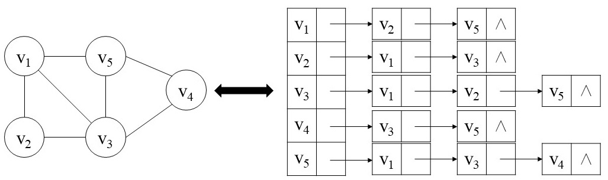

图由顶点集（VertexSet）和边集（EdgeSet）组成，可以将一个图记为 G=(V, E)​。

# 1. 图的表示方法

## 1.1 邻接链表

适用场景：1）表示稀疏图；2）预先不知道图的顶点个数，图动态生成（如果此时使用邻接矩阵，每增加或者删除一个顶点都需要改变邻接矩阵的大小，效率很低）。

> 稀疏图：对于图 G=(V, E)，边的条数 |E| 远小于 |V|的平方。

邻接链表：使用一维数组存储图中的所有顶点，每个顶点指向该顶点所有相邻结点构成的单链表的头结点。

```java
/**
 * 使用邻接链表实现图
 */
public class Graph {

    // 存储顶点的数组
    private VertextNode[] vertextNodes;

    // 顶点的实际个数
    private int vertextSize;

    /**
     * 初始化底层顶点数组     
     * @param numOfVertext 初始化数组大小
     */
    public Graph(int numOfVertext) {
        vertextNodes = new VertextNode[numOfVertext];
    }

    /**
     * 插入顶点
     * @param data 顶点值
     */
    public void insertVertext(int data) {
        VertextNode node = new VertextNode(data);
        vertextNodes[vertextSize++] = node;
    }

    /**
     * 插入边
     * @param vertext1 顶点在数组中对应的索引
     * @param vertext2
     * @return
     */
    public boolean insertEdge(int vertext1, int vertext2) {
        if (vertext1 < 0 || vertext2 < 0 || vertext1 >= vertextSize || vertext2 >= vertextSize) {
            return false;
        }
        AdjacencyNode node1 = new AdjacencyNode(vertext1);
        node1.setNext(vertextNodes[vertext2].getNode());
        vertextNodes[vertext2].setNode(node1);

        AdjacencyNode node2 = new AdjacencyNode(vertext2);
        node2.setNext(vertextNodes[vertext1].getNode());
        vertextNodes[vertext1].setNode(node2);

        return true;
    }


    /**
     * 顶点定义
     */
    class VertextNode {

        // 顶点信息
        int data;
        // 当前顶点的所有邻接顶点构成的单链表的头结点
        AdjacencyNode node;

        public VertextNode(int data) {
            this.data = data;
        }

        public void setData(int data) {
            this.data = data;
        }

        public void setNode(AdjacencyNode node) {
            this.node = node;
        }

        public AdjacencyNode getNode() {
            return node;
        }
    }

    /**
     * 相邻结点定义
     */
    class AdjacencyNode {

        // 邻接顶点编号，即数组中该顶点的下标
        int adjvex;
        // 边的权重值
        int weight;
        // 下一个邻接顶点
        AdjacencyNode next;

        public AdjacencyNode(int adjvex) {
            this.adjvex = adjvex;
        }

        public void setNext(AdjacencyNode next) {
            this.next = next;
        }
    }
}
```

## 1.2 邻接矩阵

适用场景：一般用于表示稠密图或者需要快速判断两个结点之间是否有边连接时。

# 2. 广度优先搜索

**思想**：给定图  G=(V,E)​ 和一个起始结点 ​S​，广度优先搜索从结点 S 开始，访问该结点的所有相邻结点，并将访问过的结点进行标记，然后继续访问其相邻结点的所有未访问的相邻节点，依此类推，直到所有结点都被访问。

**适用场景**：

+ 寻找从结点 S 到每个可到达结点的最短路径（最少的边数）

**实现**：

```java
// 标记顶点是否被访问过
private boolean[] marked;
// 记录从结点S到当前结点最短路径的上一个顶点
private int[] edgeTo;

/**
 * 广度优先搜索
 * 
 * @param s 开始结点对应的索引
 */
public void bfs(int s) {
    marked = new boolean[vertextSize];
    edgeTo = new int[vertextSize];
    Queue<Integer> queue = new LinkedList<>();
    marked[s] = true;	// 标记起点
    queue.add(s);	// 起点入队
    while (!queue.isEmpty()) {
        int temp = queue.remove();
        AdjacencyNode node = vertextNodes[temp].getNode();
        while (node != null) {
            int adjvex = node.adjvex;
            if (!marked[adjvex]) {
                queue.add(adjvex);
                marked[adjvex] = true;
                edgeTo[adjvex] = temp;
            }
            node = node.next;
        }
    }
}
```

# 3. 深度优先搜索

**使用场景**：

+ 图的连通性：两个指定的顶点是否连通？图中有多少个连通子图？

**实现**：

```java
private boolean[] marked;
private int[] edgeTo;
/**
 * 深度优先搜索
 *
 * @param s
 */
public void depthFirstSearch(int s) {
    marked = new boolean[vertextSize];
    edgeTo = new int[vertextSize];
    dfs(s);
}

private void dfs(int s) {
    System.out.println(s);
    marked[s] = true;
    AdjacencyNode node = vertextNodes[s].getNode();
    while (node != null) {
        if (!marked[node.adjvex]) {
            edgeTo[node.adjvex] = s;
            dfs(node.adjvex);
        }
        node = node.next;
    }
}
```


LeetCode相关题目：

