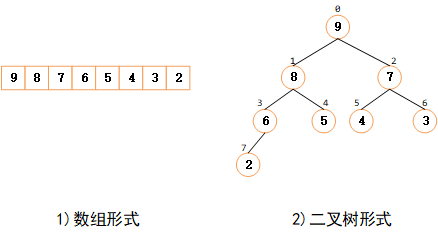

# 数组排序

## 1.1 快速排序

### 1.1.1 思想

快速排序**基于分治思想**实现：

+ **将大问题分解为小问题**：以数组中某一元素为基准，将数组 $nums[l...r]$ 划分为两个子数组 $nums[l...i-1]$ 和 $nums[i+1...r]$ ，使得 $nums[l...i-1]$ 中的元素都小于等于 $nums[i]$ ， $nums[i+1...r]$ 中的元素都大于等于 $nums[i]$ ；
+ **解决小问题**：递归对左右子数组 $nums[l...i-1]$ 和 $nums[i+1...r]$ 分别进行排序；
+ **合并小问题结果**：因为子数组是原地排序，所以不需要进行合并操作， $nums[l...r]$ 已有序；

一趟排序能确定一个元素的最终位置；

### 1.1.2 实现

**第一种方法：随机化快排**

算法步骤：对于数组 $nums[l...r]$ 

1. 选择基准元素：从数组中随机选择一个元素，将其与最后一个元素交换，然后将最后一个元素作为基准元素；
2. 寻找基准元素的最终位置：从左往右遍历数组，将小于基准的元素交换到数组的前半部分；
3. 递归对左右子数组进行快速排序；

```java
public void quickSort(int[] nums) {
    quickSort(nums, 0, nums.length - 1);
}

public void quickSort(int[] nums, int l, int r) {
    // 递归终止条件
    if (r <= l) return;
    int i = randomPartition(nums, l, r);
    quickSort(nums, l, i - 1);
    quickSort(nums, i + 1, r);
}

public int randomPartition(int[] nums, int l, int r) {
    // 生成一个随机数，该随机数处于[l,r]范围内，random.nextInt(int n)返回一个处于[0,n)范围的值
    int i = new Random().nextInt(r - l + 1) + l;
    swap(nums, r, i);
    return partition(nums, l, r);
}

private int partition(int[] nums, int l, int r) {
    int key = nums[r];      // 以最右侧元素作为基准
    int temp = l - 1;
    for (int i = l; i < r; i++) {
        if (nums[i] < key && ++temp != i) {
            swap(nums, temp, i);
        }
    }
    swap(nums, ++temp, r);
    return temp;
}

private void swap(int[] nums, int i, int j) {
    int temp = nums[i];
    nums[i] = nums[j];
    nums[j] = temp;
}
```

### 1.1.3 性能

原地排序，空间复杂度为 $O(1)$ ；

平均时间复杂度为 $O(nlgn)$；

快速排序最好情况下是每趟排序都正好能将数组平分，最坏情况是每次都以最大元素或者最小元素作为基准元素，此时时间复杂度为 $O(n^2)$，所以如何选择基准元素对快速排序的性能影响比较大；

### 1.1.4 稳定性

快速排序出于性能上的考虑，牺牲了算法的稳定性；（快速排序可以通过改变交换的规则使得算法具有稳定性，但当一个序列中存在大量重复的元素时为了维护稳定性将会增加许多不必要的交换，所以一般将快速排序实现为不具有稳定性）

### 1.1.5 优化

+ **排序小数组时使用插入排序**

  对于小数组，快速排序比插入排序慢；

  可以将sort()中的语句：if( right <= left ) return;

  替换成下面这条语句来对小数组使用插入排序：

  if( right<=left+M) { insertSort(a, left, right); return;}

  参数M的最佳值是和系统相关的，但是5~15之间的任意值在大多数情况下都能令人满意的；

+ **三取样切分**

  使用子数组的一小部分元素的中位数来切分数组。这样做得到的切分更好，但代价是需要计算中位数。人们发现将取样大小设为3并用大小居中的元素切分的效果最好；


## 1.2 归并排序

### 1.2.1 思想

归并排序**基于分治思想**实现：

+ **将大问题分解为小问题**：将待排序数组分解为两个子数组；
+ **解决小问题**：使用归并排序递归的排序两个子数组；
+ **合并小问题结果**：合并两个有序的子数组；

需要注意的问题：

+ 当子数组中只有一个元素时，表示该子数组已有序，不需要再分解；
+ 合并两个有序的子数组时，需要使用一个辅助数组；

### 1.2.2 实现

```java
// 辅助数组
private int[] temp;

public void mergeSort(int[] nums) {
    temp = new int[nums.length];
    mergeSort(nums, 0, nums.length - 1);
}

public void mergeSort(int[] nums, int l, int r) {
    if (r <= l) {
        return;
    }
    int mid = l + (r - l) / 2;
    mergeSort(nums, l, mid);
    mergeSort(nums, mid + 1, r);
    merge(nums, l, mid, r);
}

private void merge(int[] nums, int l, int mid, int r) {
    // 将数组 nums[l...r] 中的元素复制到辅助数组中
    for (int i = l; i <= r; i++) {
        temp[i] = nums[i];
    }
    // 合并两个有序数组 temp[l...mid] 与 temp[mid+1...r]
    int i = l, j = mid + 1;
    for (int k = l; k <= r; k++) {
        if (i > mid) {
            nums[k] = temp[j++];
        } else if (j > r) {
            nums[k] = temp[i++];
        } else if (temp[i] <= nums[j]) {
            nums[k] = temp[i++];
        } else {
            nums[k] = temp[j++];
        }
    }
}
```

### 1.2.3 性能

需要一个辅助数组序，空间复杂度为 $O(n)$ ；

对于长度为N的任意数组，时间复杂度为 $O(nlgn)$；

### 1.2.4 稳定性

稳定

### 1.2.5 优化

+ 对小规模子数组使用插入排序；

+ 测试两个待归并的子数组是否已经有序：添加一个判断条件，如果a[mid]小于等于a[mid+l]，我们就认为数组已经是有序的并跳过merge()方法；


## 1.3 堆排序

堆排序是利用“堆”数据结构设计的一种排序算法；

### 1.3.1 堆（二叉堆）

**堆本质上是一棵完全二叉树，使用数组进行存储；**



堆分为两种：大根堆、小根堆；

> 大根堆：每个节点的值大于或等于其子节点的值；
>
> 小根堆：每个节点的值小于或等于其子节点的值；

在堆排序算法中，使用大根堆；在创建优先级队列时，使用小根堆；

### 1.3.2 实现

```java
    /**
     * 堆排序算法步骤：构建初始大顶堆+交换堆顶元素和末尾元素并重新调整为大根堆
     */
    public void heapSort(int[] nums) {
        buildMaxHeap(nums, nums.length);
        for (int i = nums.length - 1; i > 0; i--) {
            swap(nums, 0, i);
            maxHeapify(nums, 0, i);
        }
    }

    /**
     * 构建初始大根堆：
     * 1.将数组看做一棵完全二叉树
     * 2.自底向上，从第一个非叶子节点开始，将以该节点为根节点的子树调整为大根堆
     * 注：索引为i的节点的左右子节点的索引分别为2*i+1，2*i+2（如果存在）
     */
    public void buildMaxHeap(int[] nums, int heapSize) {
        for (int i = heapSize / 2 - 1; i >= 0; --i) {
            maxHeapify(nums, i, heapSize);
        }
    }

    /**
     * 调整过程：
     * 1. 比较当前节点与其两个子节点中的最大值
     * 2. 如果子节点大于根节点，将对应的子节点与根节点交换，并递归对交换了的子节点为根节点的子树进行调整
     */
    public void maxHeapify(int[] nums, int i, int heapSize) {
        int l = i * 2 + 1;
        int r = i * 2 + 2;
        // 记录当前节点及其两个子节点的中最大的节点对应的索引
        int largest = i;
        if (l < heapSize && nums[l] > nums[largest]) {
            largest = l;
        }
        if (r < heapSize && nums[r] > nums[largest]) {
            largest = r;
        }
        if (largest != i) {
            swap(nums, i, largest);
            maxHeapify(nums, largest, heapSize);
        }
    }

    private void swap(int[] a, int i, int j) {
        int temp = a[i];
        a[i] = a[j];
        a[j] = temp;
    }
```


### 1.3.3 性能

对于长度为N的任意数组，时间复杂度为 $O(nlgn)$；

### 1.3.4 稳定

不稳定


## 插入排序

运行时间和输入有关，插人排序**对于部分有序的数组**十分高效，也很适合**小规模数组排序**；数据有序程度越高，越有效；

**该算法是稳定的；**

### 1）算法思想

将一个元素插入到已经有序的子数组的适当位置；

### 2）算法步骤


### 3）算法实现

```java
public static void insertSort(Comparable[] a)
{
    int n = a.length;
    for (int i = 1; i < n; i++)
    {
        Comparable temp = a[i];
        int j;
        // 当temp元素比当前元素小，当前元素后移
        for (j = i - 1; j >= 0 && temp.compareTo(a[j]) < 0; j--)
        {
            a[j + 1] = a[j];
        }
        // 注意此时temp赋值的索引为 j+1
        a[j + 1] = temp;
    }
}
```

### 4）算法性能

对于长度为N的数组，最坏情况下（初始数组倒序）需要比较次数和移动次数：
$$
(N^2-N)/2
$$
最好情况下（初始数组元素正序）需要N-1次比较和0次移动；

时间复杂度：O(N^2)

空间复杂度：O(1)

## 希尔排序（缩小增量排序）

是插入排序算法的一种更高效的改进版本；

**该算法不稳定；**

适用场景：适用于大量数据排序；

### 1）增量序列及其时间复杂度

希尔排序的复杂度和增量序列是相关的；

增量选取目前还是一个数学难题，迄今为止没有人找到一种最好的增量序列；


### 2）算法步骤

根据增量序列对整个数组元素进行分组，对每个子数组分别进行插入排序；


### 3）算法实现

```java
public static void shellSort(Comparable[] a)
{
    int N = a.length;
    // 首先选择一个增量序列
    // 计算递增序列的增量有两种方式，1.实时计算递增序列；2.将递增序列存储到一个数组中；
    // 本次实现采用Sedgewick增量序列：1，5，19，41，109...
    int[] h = {1, 5, 19, 41, 109, 209, 505, 929, 2161, 3905, 8929};
    //确定第一次排序的增量h
    int i = 0;
    while (h[i] < N / 2) i++;
    //将数组变为h有序
    while (i >= 0)
    {
        //temp存储每一次排序的增量
        int temp = h[i];
        for (int j = temp; j < N; j++)
        {
            Comparable t = a[j];
            int k;
            for(k = j-temp; k>=0&&t.compareTo(a[k])<0;k-=temp)
            {
                a[k+temp] = a[k];
            }
            a[k+temp]= t;
        }
        i--;
    }
}
```


## 选择排序

该算法是不稳定的；（比如排序：5 8 5 2 9）

### 1）算法思想

不断地选择数组尚未排序元素之中的最小者，每次遍历能确定一个元素的最终位置；

### 2）算法步骤

首先，找到数组中最小的那个元素，将它和数组的第一个元素交换位置（如果第一个元素就是最小元素那么它就和自己交换）；

再次，在剩下的元素中找到最小的元素，将它与数组的第二个元素交换位置；

如此往复，直到将整个数组排序；

### 3）算法实现

```java
public static void selectSort(Comparable[] a)
{
    int N = a.length;
    for (int i = 0; i < N; i++)
    {
        int min = i;
        for (int j = i + 1; j < N; j++)
        {
            if (a[j].compareTo(a[min]) < 0) min = j;
        }
        exch(a, i, min);
    }
}

//交换元素位置
private static void exch(Comparable[] a, int i, int j)
{
    Comparable t = a[i];
    a[i] = a[j];
    a[j] = t;
}
```

### 4）算法性能

对于长度为N的数组，每次遍历一趟元素确定一个最小元素，所以一共需要交换N次，每次都要与数组未排序的元素进行比较，所以需要比较的次数如下：
$$
(N-1)+(N-2)+⋯+1=(N^2-N)/2≈N^2/2
$$


## 外部排序

当待排序的文件比内存的可使用容量还大时，文件无法一次性放到内存中进行排序，此时需要借助外部存储器，所以称为外部排序；

外部排序算法由两个阶段构成：

+ 按照内存大小，将大文件分成内存可以容纳的子文件，然后将各个子文件依次读入内存，使用适当的内部排序算法对其进行排序（排好序的子文件统称为“归并段”或者“顺段”），将排好序的归并段重新写入外存，为下一个子文件排序腾出内存空间；
+ 对得到的归并段进行合并，直至得到整个有序的文件为止；

> 在归并的过程中，由于内存容量的限制不能满足同时将 2 个归并段全部完整的读入内存进行归并，只能不断地取 2 个归并段中的每一小部分进行归并，通过不断地读数据和向外存写数据，直至 2 个归并段完成归并变为 1 个大的有序文件；

**对于外部排序算法来说，影响整体排序效率的因素主要取决于读写外存的次数，即访问外存的次数越多，算法花费的时间就越多，效率就越低**；

对于同一个文件来说，对其进行外部排序时访问外存的次数同归并的次数成正比，即归并操作的次数越多，访问外存的次数就越多；

想要达到减少归并次数从而提高算法效率的目的，可以从两个角度实现：

- 增加 k-路平衡归并中的 k 值，也就是**多路平衡归并算法**；
- 尽量减少初始归并段的数量 m，即增加每个归并段的容量，也就是**置换-选择排序算法**；


