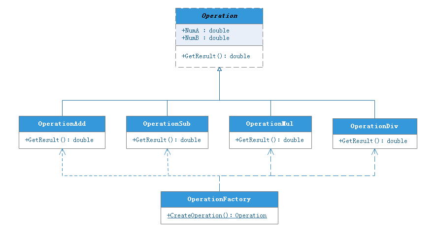

可维护

- 可复用
- 可扩展
- 灵活性好

## 一、简单工厂模式

### 1.1 用途

**定义一个工厂类，根据参数的不同，创建不同类的实例**，其中这些类继承了相同的父类或实现了某一接口；

### 1.2 示例

对于加减乘除四种操作，首先定义一个抽象类 Operation，然后对于加减乘除四种操作分别定义子类去实现其具体操作，最后定义一个工厂类 OperationFactory，根据运算符的不同选择创建对应的实例去计算结果；



```java
public static Operation createOperation(String operation) {
    Operation oper = null;
    switch (operation) {
        case "+":
            oper = new OperationAdd();
            break;
        case "-":
            oper = new OperationSub();
            break;
        case "*":
            oper = new OperationMul();
            break;
        case "/":
            oper = new OperationDiv();
            break;
    }
    return oper;
}
```

### 1.3 优缺点

优点：

+ 无须知道所创建的具体产品类的类名，只需要知道具体产品类所对应的参数即可；

缺点：

+ 增加系统中类的个数，在一定程序上增加了系统的复杂度和理解难度；
+ 违背开闭原则，一旦添加新产品时需要修改工厂逻辑；
+ 产品类型较多时，会造成工厂逻辑复杂，不利于系统的扩展和维护；

### 1.4 Spring 应用

**BeanFactory**：根据传入的 beanName 来获得 Bean 对象；


## 二、工厂方法模式


## 三、单例模式

## 四、适配器模式

## 五、装饰器模式

## 六、代理模式

## 七、观察者模式

## 八、模板方法模式

## 九、策略模式

